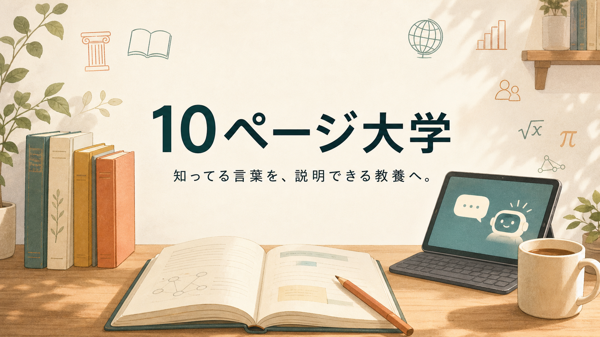

# 10ページ大学へようこそ

知ってる言葉を、説明できる教養へ。

いまは、大学で学ぶようなことも、AIに聞けば学べる時代です。

でも、AIの答えを読むだけでは、自分で考えられるようにはなりません。

大事なのは、AIに問い、自分の頭でたしかめながら学べること。

聞いたことのある言葉を、なんとなく知っているで終わらせないことです。

意味や仕組みを、自分の言葉で説明できるようになる。

それが、AI時代の「考える力」につながります。

10ページ大学は、そのための小さな入口です。

ニュースで聞く言葉、仕事で見かける言葉、どこかで知った気になっていた言葉。

その裏側を、図解と比喩で少しずつ見に行きます。

専門家になるためではなく、世界の見え方を少し増やすために。

読み終わったあとに「それ、ちょっと説明できるかも」と思えたら、そこから先は自分で進めます。

AIにも、本にも、動画にも聞きながら、学びを続けられる。

10ページ大学は、知識を増やすだけの場所ではありません。

自分で学べる手応えをつくる、最初の足場です。
