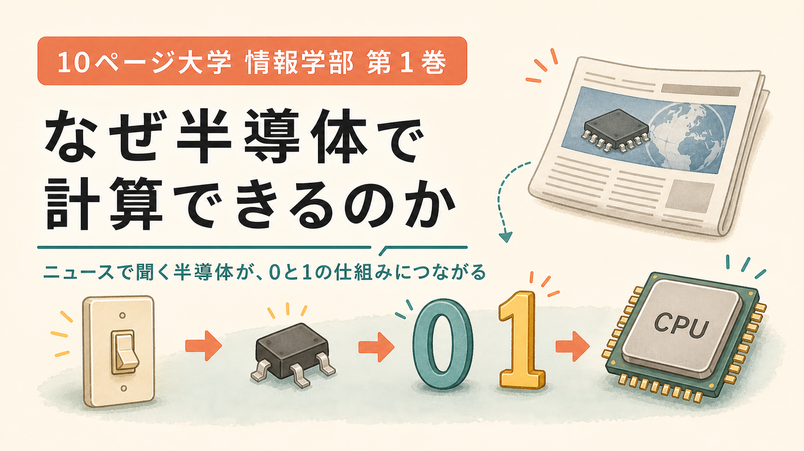

# 10ページ大学 情報学部 第１巻



## はじめに

半導体とか、CPUとか、メモリとか。

言葉としては、たぶん聞いたことがあります。

ニュースでも出てくるし、スマホやパソコンの話でも出てくる。

でも、「じゃあ半導体って何をしてるの」「CPUはどうやって計算してるの」と聞かれると、急に話が遠くなります。

名前は知っている。

でも、裏側は知らない。

この巻で扱うのは、そういう話です。

知らない言葉をゼロから覚えるというより、聞いたことのある言葉の裏側を、少しのぞきに行きます。

この巻で大事にするのは、用語の暗記よりも、仕組みの見え方です。

まずは、

「半導体って、要するに小さなスイッチの話から始まるのか」

と見えるところまで行きます。

そこまで見えれば、入口としてはかなり強いです。

この巻では、コンピュータをものすごく雑に、でも大事なところは外さずに見ます。

出発点は、こうです。

コンピュータの中には、小さなスイッチが山ほど入っている。

そのスイッチが、ついたり消えたりする。

その「ついた」「消えた」を、1と0として使う。

そこから計算が始まる。

[ここに「小さなスイッチが集まってコンピュータになる」図を入れる]

専門用語は、あとから名前を貼れば追いつきます。

まずは、コンピュータを「小さなスイッチをものすごい数だけ並べた機械」と思ってください。

入口では、この見方がよく効きます。

そのスイッチで数を作り、足し算を作り、覚える場所を作り、命令を順番にこなす。

ここまで見えれば、半導体もコンピュータも、いきなり遠い世界ではなくなります。

「ああ、名前だけ知ってたけど、中ではそういうことをしてたのか」

そこまで行ければ、この10ページの役目はかなり果たせています。

そして、できればもう一つ。

次にニュースで「半導体不足」「CPU」「メモリ」と聞いたときに、ただのカタカナではなく、「ああ、あの小さなスイッチの話の先か」と少しニヤッとできる。

この巻は、その入口を作るための一冊です。

---

## 1ページ目: 半導体でスイッチが作れる

まず、スイッチです。

部屋の電気をつけるスイッチを思い浮かべてください。

押せば明かりがつく。

もう一度押せば消える。

これなら、誰でもわかります。

[ここに「部屋のスイッチ: オンで電気がつく / オフで消える」図を入れる]

コンピュータの中にも、この「つく」「消える」に似たものがあります。

ただし、人間が指で押すかわりに、電気の信号で切り替わります。

電気の信号で動く、とても小さなスイッチです。

この小さなスイッチを作るために、半導体が使われます。

半導体という名前は、字面だけ見ると少し硬いです。

まずは「電気を流したり止めたりしやすい材料」と見てみます。

電気をよく通すものがあります。たとえば金属です。

電気をほとんど通さないものもあります。たとえばゴムです。

半導体は、その中間にいて、条件を変えると電気の流れ方を変えられます。

[ここに「金属=通す / ゴム=通さない / 半導体=条件で変えられる」の図を入れる]

半導体を使うと、電気の流れを操作できる。

これが大事です。

この半導体で作る代表的な部品が、トランジスタです。

トランジスタは、よく「電気で動くスイッチ」と言われます。

小さな電気信号を入れると、別の電気の流れを通したり、止めたりできる。

つまり、手で押さなくても、電気でスイッチを切り替えられるのです。

[ここに「小さな電気信号で、別の電気の流れをオン・オフするトランジスタ」の図を入れる]

では、その小さなスイッチは、誰が押しているのでしょう。

箱の中に小さな係員はいません。

前のスイッチから出てきた電気信号が、次のスイッチを押す役目をします。

たとえば、あるトランジスタの出口がオンになる。

その信号が、次のトランジスタの入口へ行く。

すると次のトランジスタが、またオンになったり、オフのままだったりする。

[ここに「前のスイッチの出力信号が、次のスイッチを押す」の図を入れる]

つまり、スイッチがスイッチを動かします。

これができると、スイッチをただ並べるだけでなく、「こういう時だけ通す」「こういう時は止める」というルールを作れるようになります。

たとえば、AとBの両方から信号が来たときだけ通す。

これはANDです。

逆に、信号が来ていないときだけ通す。

これはNOTです。

[ここに「スイッチの組み合わせでANDとNOTを作る入口」の図を入れる]

細かい回路図は、あとで見たくなったら見ればいいところです。

大事なのは、前の0と1が、次のスイッチの動きに伝わっていくことです。

これだけ聞くと、まだ地味です。

でも、この地味なスイッチがものすごく大事です。

なぜなら、スイッチには2つの状態があるからです。

オン。

オフ。

流れる。

流れない。

高い電圧。

低い電圧。

これを、コンピュータでは0と1として使います。

[ここに「オフ=0 / オン=1」の図を入れる]

ここで、ちょっと面白いことが起きています。

電気が流れた、流れない。

ただそれだけの物理現象に、人間が「これは1」「これは0」と名前をつけています。

たとえば、店ののれんを思い浮かべてください。

のれんが出ていれば「営業中かな」と読む。

のれんがしまわれていれば「今日は終わりかな」と読む。

のれんは黙っています。

人間が、その状態に意味をつけて読んでいます。

[ここに「のれんの出ている/しまわれている状態を、人間が意味として読む」図を入れる]

コンピュータの0と1も、これに少し似ています。

電気は、ただ流れたり止まったりしています。

流れている、流れていない。

その状態を、こちらが0と1として読んでいるのです。

つまり、コンピュータの数字は、電気の状態にあとから意味をつけたものです。

電気の状態を、数字として読んでいるのです。

ここで、コンピュータの世界に最初の橋がかかります。

電気のオン・オフを、0と1として読む。

半導体でスイッチを作れるから、0と1を作れる。

0と1を作れるから、計算の入口に立てる。

ここまで来ると、最初の一段が見えてきます。

---

## 2ページ目: 1 + 1 = 2を計算してみよう。スイッチと2進数

私たちはふだん、10進数で暮らしています。

10進数とは、0から9まで使って、次に10になる数え方です。

指が10本あるので、人間にはなじみやすい数え方です。

[ここに「10進数は0から9まで使って、次に10へ進む」図を入れる]

でも、スイッチには指が10本ありません。

スイッチにあるのは、オンとオフだけです。

だから、コンピュータは基本的に0と1で数を表します。

これが2進数です。

2進数は、0と1しか使わない数え方です。

[ここに「10進数は10種類、2進数は0と1の2種類」の比較図を入れる]

0の次は1。

では、1の次はどうなるか。

2進数では「2」という数字を使えません。

だから、次の桁へ進みます。

```text
0
1
10
11
100
```

ここで大事なのは、2進数の `10` を「じゅう」と読まないことです。

2進数の `10` は、10進数でいう2です。

[ここに「2進数の10は、10進数の2」の図を入れる]

ここで「なんで10なのに2なんだよ」と思ったら、かなり正常です。

10進数に慣れすぎているので、`10` を見ると反射的に「じゅう」と読んでしまう。

でも、同じ文字でも、ルールが変われば意味は変わります。

たとえばホテルで「312号室」と書いてあったら、312番目の部屋というより、「3階の12号室」と読むことが多いです。

同じ `312` でも、部屋番号のルールで読むと、「3階」と「12号室」に分かれます。

数字は、見た目だけで意味が決まるより、読むルールとセットで意味が決まります。

どのルールで読むかが大事です。

[ここに「312号室は3階の12号室。数字は読むルールで意味が変わる」図を入れる]

数の見え方を支えているのは、位のルールです。

どの位が何倍を表すかが変わると、同じ見た目の `10` でも意味が変わります。

なぜそうなるのか。

10進数では、右から順に、1の位、10の位、100の位です。

2進数では、右から順に、1の位、2の位、4の位、8の位です。

[ここに「2進数の位: 8の位・4の位・2の位・1の位」の図を入れる]

だから、2進数の `10` はこう見ます。

```text
2の位が1
1の位が0
```

つまり、10進数で2です。

では、`1 + 1` はどうなるでしょう。

10進数なら、

```text
1 + 1 = 2
```

です。

でも2進数では、2という数字をそのまま書けません。

だから、桁が上がります。

```text
1 + 1 = 10
```

[ここに「1と1を足すと、次の桁へ上がって10になる」図を入れる]

この話をスイッチに戻します。

スイッチ1個なら、オフかオンです。

```text
オフ = 0
オン = 1
```

[ここに「スイッチ1個で0か1を表す」図を入れる]

スイッチ2個なら、組み合わせが増えます。

```text
00
01
10
11
```

[ここに「スイッチ2個で4通りを表せる」図を入れる]

スイッチを増やせば、もっと多くの数を表せます。

つまり、コンピュータの中の数は、スイッチのオン・オフの並びとして表せるのです。

紙に書いた数字ではなく、電気の状態としての数字です。

ここが少し気持ちいいところです。

数字は、紙の上にも、電気のオン・オフの中にも置ける。

電気のオン・オフの並びとして、機械の中にも置ける。

これが見えると、コンピュータが「数字を持つ」という言い方が少し具体的になります。

---

## 3ページ目: 小学校で習った筆算を思い出そう。ケタ上がりとは？

計算というと、難しく感じます。

でも、ここで使うのは、まず筆算です。

小学校でやった、あの縦に書く計算です。

たとえば、

```text
  8
+ 7
---
 15
```

[ここに「8+7の筆算」の図を入れる]

8と7を足すと15です。

でも、一の位には5だけを書きます。

そして、1を十の位に持っていきます。

これがケタ上がりです。

ケタ上がりとは、ひとことで言えば「この桁に入りきらなかった分を、隣の桁に渡すこと」です。

[ここに「一の位から十の位へ1を渡す」図を入れる]

もう少し生活っぽく言うと、両替に近いです。

1円玉が10枚たまったら、10円玉1枚に替えられる。

一の位に置いておける量を超えたので、十の位へ形を変えて渡す。

ケタ上がりは、計算の中で起きる小さな両替です。

[ここに「1円玉10枚が10円玉1枚に両替される」図を入れる]

この考え方は、2進数でも同じです。

ただし、2進数は0と1しか使えません。

だから、すぐにケタが上がります。

2進数で `1 + 1` をすると、

```text
  1
+ 1
---
 10
```

[ここに「2進数の1+1で、1を次の桁へ渡す」図を入れる]

一の位には0を書く。

次の桁に1を渡す。

これで `10` になります。

ここで、足し算を少し分解します。

1桁の足し算では、見るべきものが2つあります。

この桁に書く答え。

次の桁へ渡すケタ上がり。

2進数で1桁だけ足すと、全部で4パターンです。

```text
0 + 0 = 0、ケタ上がり0
0 + 1 = 1、ケタ上がり0
1 + 0 = 1、ケタ上がり0
1 + 1 = 0、ケタ上がり1
```

[ここに「2進数1桁の足し算4パターン」の表を入れる]

この4パターンを見てください。

やっていることは、毎回決まっています。

入力がこうなら、答えはこう。

入力がこうなら、ケタ上がりはこう。

つまり、足し算は「決まったルール」で処理できます。

ここがコンピュータにつながります。

ここで一回、見方を変えます。

足し算は、頭のよさではなく、場合分けです。

`0+0` ならこう。

`0+1` ならこう。

`1+0` ならこう。

`1+1` ならこう。

この表をちゃんと作れれば、あとは同じことをくり返すだけです。

人間は筆算でルールを使います。

コンピュータは回路でルールを使います。

[ここに「人間の筆算」と「回路の足し算」を並べる図を入れる]

コンピュータは、気合いでひらめく機械というより、ルールを積み上げる機械です。

決まったルールを、ものすごい速さで実行しているのです。

---

## 4ページ目: スイッチング回路と2進数の足し算

さっきの4パターンを、もう一度見ます。

```text
0 + 0 = 0、ケタ上がり0
0 + 1 = 1、ケタ上がり0
1 + 0 = 1、ケタ上がり0
1 + 1 = 0、ケタ上がり1
```

このルールを、スイッチで作れれば、足し算回路になります。

まず、2つの入力を考えます。

AとBです。

AもBも、0か1です。

ほしい結果は2つです。

この桁の答え。

次の桁へ渡すケタ上がり。

[ここに「AとBを入れると、答えとケタ上がりが出る箱」の図を入れる]

表にすると、こうです。

```text
A  B  答え  ケタ上がり
0  0    0       0
0  1    1       0
1  0    1       0
1  1    0       1
```

[ここに「半加算器の表」を図として入れる]

この表を見ると、ケタ上がりはわかりやすいです。

ケタ上がりが1になるのは、AもBも1のときだけです。

こういう「両方が1なら1」というルールを、ANDと呼びます。

[ここに「AND: 両方が1のときだけ1」の図を入れる]

ANDは、日常の言い方なら「両方そろったらOK」です。

たとえば、鍵と暗証番号の両方が合っていたら開く。

鍵だけでもだめ。

暗証番号だけでもだめ。

両方そろったときだけ、次へ進める。

[ここに「鍵と暗証番号が両方そろったら開くAND」の図を入れる]

次に、この桁の答えを見ます。

答えが1になるのは、AとBのどちらか片方だけが1のときです。

```text
0 + 1
1 + 0
```

この「片方だけが1なら1」というルールを、XORと呼びます。

[ここに「XOR: 片方だけが1のときだけ1」の図を入れる]

XORは少し変わったやつです。

「どちらか片方だけならOK。でも両方来たら違う」というルールです。

たとえば、1人分の席にAさんかBさんのどちらかが座るならよい。

でも2人同時には座れない。

この「片方だけ」という感覚が、2進数の足し算ではその桁の答えになります。

[ここに「1人席に片方だけ座れるXOR」の図を入れる]

名前は少し硬いですが、感触はシンプルです。

ANDは「両方」。

XORは「片方だけ」。

これで1桁の足し算が作れます。

```text
答え       = 片方だけが1なら1
ケタ上がり = 両方が1なら1
```

この回路を、半加算器と呼びます。

半加算器は、1桁の足し算の入口です。

[ここに「半加算器: AとBから答えとケタ上がりを出す」図を入れる]

本当の筆算では、前の桁からケタ上がりが来ることがあります。

そのケタ上がりまで一緒に足せる回路を、全加算器と呼びます。

[ここに「半加算器と全加算器の違い」の図を入れる]

名前はあとで何度でも見返せます。

大事なのは、足し算が回路で作れることです。

スイッチを組み合わせると、0と1のルールが作れる。

0と1のルールを組み合わせると、足し算が作れる。

ここで、スイッチが計算に変わりました。

足し算は、紙と鉛筆から、電気のスイッチへ引っ越せる。

「片方だけ」「両方」という単純なルールに分けると、電気のスイッチでも作れてしまう。

小学校の筆算が、半導体の中へ引っ越したようなものです。

---

## 5ページ目: 掛け算の筆算を思い出そう。掛け算とビットシフト

足し算ができるなら、次は掛け算です。

掛け算も、筆算に戻すと急に手触りが出てきます。

まず、筆算を思い出します。

```text
  23
x 12
----
  46
 230
----
 276
```

[ここに「23×12の筆算」の図を入れる]

ここで起きていることを、言葉にするとこうです。

23に2をかける。

23に10をかける。

それを足す。

つまり掛け算は、「ずらして、足す」と見ることができます。

[ここに「掛け算は、ずらしたものを足す」の図を入れる]

掛け算は、ものすごく偉そうな顔をしています。

でも筆算として見ると、やっていることはかなり地道です。

相手の桁に合わせてずらす。

必要な分だけ足す。

つまり、掛け算は「足し算の親戚」です。

[ここに「掛け算は偉そうに見えるが、中身はずらして足す作業」の図を入れる]

10進数では、左に1桁ずらすと10倍です。

```text
23 -> 230
```

では、2進数ではどうでしょう。

2進数では、左に1桁ずらすと2倍です。

たとえば、2進数の `101` を見ます。

これは10進数で5です。

左に1桁ずらすと、

```text
1010
```

になります。

これは10進数で10です。

[ここに「101を左にずらすと1010になり、5が10になる」図を入れる]

このように、0と1の並びを左右にずらす操作を、ビットシフトと呼びます。

ビットとは、0か1の1桁のことです。

左に1つずらすと、だいたい2倍。

左に2つずらすと、だいたい4倍。

右に1つずらすと、だいたい半分。

[ここに「左シフト=2倍、右シフト=半分」の図を入れる]

右にずらすと余りが消える場合もあります。まずは、大きな動きを見ます。

まずは「2進数では、桁をずらすと2倍や半分になる」と見てください。

2進数の掛け算では、相手の桁が1なら足します。

相手の桁が0なら足しません。

そして、桁の位置に合わせてずらします。

[ここに「2進数の掛け算は、1の桁だけ足す」の図を入れる]

すると、掛け算はこう見えます。

足し算。

ずらす。

また足す。

これで掛け算に近づきます。

もちろん、実際のCPUの中では、もっと速くするための工夫があります。

入口では、「掛け算は足し算とビットシフトの組み合わせ」と見えるだけで、だいぶ景色が変わります。

ここまでで、計算の感じが少し変わります。

コンピュータの中では、小さな単純作業がものすごい速さで組み合わさっています。

居酒屋で言えば、料理が急に空中から出てくるのではなく、

切る、焼く、混ぜる、盛る。

小さな作業を、速く、正確に、順番にやっている。

コンピュータの計算も、それに近い見方ができます。

---

## 6ページ目: 数字を記憶しよう。色んな記憶素子の紹介

計算には、覚えておく場所が必要です。

たとえば、筆算をするときも、途中の数字を紙に書きます。

買い物の暗算でも、「ここまでで700円」と頭の中に一度置きます。

コンピュータも同じです。

[ここに「筆算の途中メモと、コンピュータの記憶」を並べる図を入れる]

ここで大事なのは、「覚える」という言葉にだまされすぎないことです。

コンピュータの「覚える」は、人間が昔のことを思い出す感じとはかなり違います。

0か1の状態を、消えないように保っているだけです。

人間の記憶というより、札を裏向きにするか表向きにするか、スイッチを上げておくか下げておくかに近いです。

[ここに「表向き/裏向きの札で0と1を保つ」図を入れる]

足し算や掛け算ができても、途中の数字を覚えられなければ、少し複雑な計算はできません。

では、コンピュータはどうやって覚えるのか。

基本は、0か1の状態を保つことです。

この「0か1を覚える仕組み」を、記憶素子と呼びます。

まず、フリップフロップというものがあります。

フリップフロップは、1ビットを覚える基本的な回路です。

1ビットとは、0か1を1つだけ表す単位です。

[ここに「フリップフロップが0または1を1つ保持する」図を入れる]

フリップフロップは、CPUの中でよく使われます。

すぐ使う値を覚えるのに向いています。

次に、SRAMがあります。

SRAMは速いメモリに使われます。

速いけれど、たくさん作るには場所を取りやすい。

次に、DRAMがあります。

DRAMは、パソコンやスマートフォンのメインメモリによく使われます。

SRAMより遅いですが、たくさんの情報を置きやすいです。

ただし、電源を切ると中身は消えます。

さらに、電源が入っていても、ときどき中身を保つための手入れが必要です。

DRAMは、ざっくり言うと「放っておくと薄れていくメモ」です。

だから、電源が入っている間も、ときどき内容を読み直して保ちます。

この手入れをリフレッシュと呼びます。

名前は爽やかですが、やっていることは「消えないように見回り」です。

[ここに「DRAMは定期的に見回って中身を保つ」の図を入れる]

最後に、フラッシュメモリがあります。

USBメモリ、SSD、スマートフォンの保存領域などに使われます。

電源を切っても中身が残ります。

[ここに「フリップフロップ・SRAM・DRAM・フラッシュメモリのざっくり比較表」を入れる]

ここで見たいのは、名前の一覧よりも役割分担です。

記憶にも役割分担があります。

すごく速いけれど小さい場所。

そこそこ速くて大きい場所。

電源を切っても残る場所。

[ここに「速いが小さい / 大きいが遅い / 電源を切っても残る」の階層図を入れる]

人間で言えば、手元のメモ、机の上、書類棚のようなものです。

コンピュータでは、紙のかわりに0と1の状態を保ちます。

計算も0と1。

記憶も0と1。

ここでも、根っこは同じです。

ここで「覚える」という言葉の見え方が少し変わります。

コンピュータが覚えるとは、0か1の状態を保ち続けることです。

それを大量に並べると、数字も、文章も、写真も、プログラムも置けるようになります。

---

## 7ページ目: ALUとレジスターとメモリ

ここまでで、計算する話と、覚える話をしました。

次は、それがCPUの中でどう役割分担されているかを見ます。

まず、ALUです。

ALUは、計算する場所です。

正式には Arithmetic Logic Unit といいます。

日本語では算術論理演算装置です。

名前だけ見ると、もう帰りたくなります。

名前は急に硬いですが、まずは「計算係」と思ってください。

[ここに「ALU=計算係」の図を入れる]

ALUは、足し算、引き算、ANDやXORのような論理演算をします。

次に、レジスターです。

レジスターは、CPUの中にある小さくて速い記憶場所です。

計算にすぐ使う数字を置いておく、手元のメモのような場所です。

ここは、台所で考えるとわかりやすいです。

メモリは冷蔵庫や棚です。

材料はたくさん置けるけれど、いちいち取りに行く必要があります。

レジスターは、まな板の上です。

今すぐ切る材料だけを置く。

ALUは、包丁やフライパンです。

実際に切る、焼く、混ぜる場所です。

[ここに「メモリ=棚、レジスター=まな板、ALU=包丁とフライパン」の図を入れる]

最後に、メモリです。

メモリは、レジスターより大きな記憶場所です。

プログラムやデータを置きます。

[ここに「ALU・レジスター・メモリの位置関係」の図を入れる]

ざっくり言うと、こうです。

```text
ALU       = 計算係
レジスター = CPUの中の手元メモ
メモリ     = たくさん置ける保管場所
```

たとえば、`3 + 5` を計算するとします。

まず、3と5が必要です。

それはメモリに置かれているかもしれません。

CPUは、その数字をレジスターに持ってきます。

そして、ALUで足します。

結果の8を、またレジスターに置きます。

必要なら、メモリに戻します。

[ここに「3+5を計算するときの流れ: メモリ -> レジスター -> ALU -> レジスター -> メモリ」の図を入れる]

この流れを見ると、計算にはいくつかの役割が必要だとわかります。

数字を置く場所。

すぐ使うために持ってくる場所。

実際に計算する場所。

CPUを「頭脳」と呼ぶことがあります。

それは入口としては悪くありません。

でも、もう一歩だけ具体的に見るなら、CPUの中には計算係と手元メモがあります。

それがALUとレジスターです。

つまりCPUの中には、役割を持った場所があります。

計算する係がいて、すぐ使うメモがあって、外の大きな保管場所から材料を持ってくる。

ちょっとした作業場のように見ると、急に親しみが出ます。

---

## 8ページ目: メモリーのアドレスとは何か

メモリには、たくさんの情報が置かれます。

でも、ただ置いてあるだけでは困ります。

どこに置いたかがわからないと、取り出せません。

そこで出てくるのが、アドレスです。

アドレスとは、メモリ上の場所を示す番号です。

ロッカーを思い浮かべてください。

大量のロッカーが並んでいて、それぞれに番号がついている。

[ここに「番号付きロッカーとしてのメモリ」の図を入れる]

12番のロッカーを開ける。

20番のロッカーに入れる。

このように、番号があるから場所を指定できます。

逆に、番号がなかったら大変です。

「たしか、あのへんのロッカーに入れた気がする」と言われても、探す側は困ります。

コンピュータは、雰囲気で探すのが苦手です。

だから「何番を読め」「何番に書け」と、場所を数字で指定します。

[ここに「番号がないロッカー列で困る人と、番号付きで迷わないCPU」の図を入れる]

メモリも同じです。

```text
アドレス100番にある値を読む
アドレス200番に値を書き込む
```

[ここに「アドレス100番を読む / アドレス200番へ書く」の図を入れる]

ここでの「読む」は、中身を取り出すことです。

「書く」は、中身を入れることです。

CPUは、メモリに対してこの読み書きをくり返します。

ここで大事な話があります。

メモリには、データだけでなく、プログラムも置かれます。

データとは、計算に使う数字や文字などです。

プログラムとは、CPUに何をさせるかを書いた命令の集まりです。

[ここに「メモリの中にデータとプログラムが並んでいる」図を入れる]

どちらも、コンピュータの中では0と1の並びです。

CPUは、アドレスを使って必要なものを取りに行きます。

「この場所の数字を読め」

「この場所に結果を書け」

「次はこの場所の命令を読め」

こんな動きを、ものすごい速さで続けています。

メモリには番号付きの場所があり、CPUは番号を指定して読み書きします。

ここがわかると、「メモリ」という言葉が少し変わります。

メモリは、大きな袋というより、番号で呼び出せるロッカーの列です。

だからCPUは、必要なものを「だいたいこのへん」ではなく、「何番」と指定して取りに行けます。

---

## 9ページ目: 命令とはなにか

計算する場所がある。

覚える場所もある。

では、CPUはどうやって「次に何をするか」を知るのでしょうか。

ここで命令が出てきます。

命令とは、CPUへの小さな指示です。

人間の言葉で書くなら、たとえばこんな感じです。

```text
メモリから数字を読む
2つの数字を足す
結果をメモリに書く
次の命令へ進む
```

[ここに「人間向けの命令」と「CPU向けの命令」の対応図を入れる]

CPUが読める形は、0と1です。

命令も、0と1の並びで表されます。

[ここに「命令も0と1の並びでできている」図を入れる]

CPUは、その0と1の並びを見て、

「これは足し算の命令だ」

「これはメモリから読む命令だ」

「これは別の場所へ進む命令だ」

というふうに解釈します。

[ここに「命令の0と1が、CPU内の動きに対応している」の図を入れる]

ここは、食券で考えると少し近いです。

食券に「ラーメン」と書いてあれば、厨房では麺をゆで、スープを入れ、具をのせます。

厨房は、その券を見て「何をすればいいか」に変換します。

CPUの命令も、それに似ています。

その並びが、「ALUで足せ」「メモリから読め」「結果を書け」といった動きに対応しています。

[ここに「食券と厨房の比喩で、命令が動きに変わる」の図を入れる]

命令の0と1は、CPUの中の具体的な動きと対応しています。

命令には、いろいろな種類があります。

たとえば、

```text
読み込み: メモリからレジスターへ値を持ってくる
演算: ALUで計算する
書き込み: 結果をメモリへ戻す
分岐: 条件によって次に進む場所を変える
```

[ここに「読み込み・演算・書き込み・分岐」の4種類を並べた図を入れる]

分岐は少し大事です。

分岐とは、「もしこうなら、こっちへ行く」という動きです。

たとえば、点数が80点以上なら合格と表示する。

ボタンが押されたら、別の画面へ進む。

雨が降っていたら傘を持つ。

降っていなければそのまま出る。

これも、かなり日常的な分岐です。

[ここに「雨なら傘、晴れならそのまま出る分岐」の図を入れる]

こういう動きの土台になります。

CPUの基本動作は、かなり単純に言えばこうです。

命令を読む。

意味を解釈する。

実行する。

次の命令へ進む。

[ここに「命令を読む -> 解釈する -> 実行する -> 次へ進む」の循環図を入れる]

まずは、命令とはCPUへの小さな指示であり、プログラムとはその命令の並びだと見てください。

ソフトウェアは、ふわっとしたものに見えます。

でも、実行されるときには、CPUが読める命令として扱われます。

そして、その命令も0と1です。

ここでまた、ひとつ裏側が見えます。

プログラムは、人間には文字やコードに見えます。

でもCPUから見ると、命令の列です。

そして、その命令も0と1でできている。

つまり、ソフトウェアも最後は半導体の上で読まれる「0と1の指示書」になります。

---

## 10ページ目: フォンノイマン型コンピュータとは何か

最後に、ここまでの部品をひとつの形にします。

その名前が、フォンノイマン型コンピュータです。

名前は長いです。

人の名前がついているので、よけいに偉そうに見えます。

でも、考え方はこうです。

命令とデータをメモリに置く。

CPUがそれを順番に取り出して実行する。

これがフォンノイマン型コンピュータの基本です。

[ここに「フォンノイマン型コンピュータ: CPU・メモリ・入力・出力」の図を入れる]

これは、同じ厨房でいろいろな料理を出せる話に少し似ています。

厨房の設備を毎回作り替えなくても、レシピを変えれば別の料理が作れます。

コンピュータも、機械そのものを毎回作り替えるのではなく、プログラムを入れ替えることで別の仕事ができます。

電卓にもなる。

文章を書く道具にもなる。

動画を見る道具にもなる。

[ここに「同じ厨房でレシピを変えると料理が変わる。コンピュータもプログラムで仕事が変わる」図を入れる]

CPUの中には、計算するALUがあります。

すぐ使う値を置くレジスターもあります。

メモリには、データも命令も置かれます。

CPUは、メモリから命令を読みます。

命令に従って、データを読みます。

ALUで計算します。

結果をレジスターやメモリに置きます。

そして、次の命令へ進みます。

[ここに「メモリから命令を取り出し、CPUで実行し、結果を戻す」図を入れる]

この「命令を読んで実行する」を、何度も何度もくり返します。

ここで重要なのは、命令もデータもメモリに置かれることです。

これを、プログラム内蔵方式と呼びます。

[ここに「同じメモリに命令とデータが入っている」図を入れる]

ここまで来ると、なぜ同じコンピュータがいろいろな仕事をできるのかも見えてきます。

専用の機械を毎回作らなくても、命令の並びを変えるだけで、同じ箱が別の仕事を始めます。

半導体のスイッチの集まりが、プログラムによって「今日は文章を書く道具」「今日は動画を見る道具」と役目を変える。

さっきの厨房の話で言えば、レシピを差し替えただけでメニューが変わるようなものです。

もちろん、現代のコンピュータはもっと複雑です。

でも、最初の地図としては、ここまででかなり見えます。

[ここに「半導体スイッチ -> 0と1 -> 足し算 -> 掛け算 -> 記憶 -> 命令 -> コンピュータ」の総まとめ図を入れる]

もう一度、最初からつなげます。

半導体で、小さなスイッチを作る。

スイッチのオン・オフを、0と1として使う。

0と1で、2進数の数を表す。

2進数の筆算を、スイッチング回路で作る。

足し算とビットシフトで、掛け算の入口が見える。

記憶素子で、数字や命令を覚える。

メモリには、場所を示すアドレスがある。

CPUは、命令を読み、実行する。

この流れが、半導体で計算できる理由です。

半導体そのものが考えているというより、

半導体で作った小さなスイッチを大量に並べて、0と1を作り、決まったルールで動かしています。

その積み重ねが、コンピュータの計算です。

難しい言葉が出てきたら、いったん置き場所を探します。

「これはスイッチの話か」

「これは0と1の話か」

「これは記憶の話か」

「これは命令の話か」

そうやって場所を探せるようになれば、もう入口には立っています。

半導体も、CPUも、メモリも、今までは名前だけ知っている言葉だったかもしれません。

でも、裏側にある流れを少し見ると、ニュースの言葉がただのカタカナではなくなります。

「あれは、あのスイッチと0と1の話の先にあるんだな」

そう思えたら、学び直しはかなり楽になります。

---

## まとめ

- 半導体で作ったトランジスタは、電気で動く小さなスイッチとして使える。
- スイッチのオン・オフを0と1として扱うと、2進数の足し算、掛け算、記憶を回路で作れる。
- ALU、レジスター、メモリ、アドレス、命令を組み合わせると、フォンノイマン型コンピュータの基本が見えてくる。

---

## 重要用語10個

丸暗記用ではなく、「人に説明するとしたらこう言う」ための用語集です。

1. 半導体  
   電気の流れを条件によって変えられる材料。コンピュータでは、小さなスイッチを作る土台になる。

2. トランジスタ  
   電気で動く小さなスイッチ。手で押すスイッチではなく、電気信号でオン・オフを切り替える。

3. 0と1  
   電気の状態を人間が数字として読んだもの。電気が数字を知っているのではなく、こちらが意味をつけている。

4. 2進数  
   0と1だけで数を表す方法。`10` は「じゅう」ではなく、2進数のルールでは10進数の2になる。

5. ビット  
   0か1の1桁。スイッチ1個ぶんの情報と思うと入口としてわかりやすい。

6. ケタ上がり  
   その桁に入りきらない分を、隣の桁へ渡すこと。計算の中の小さな両替。

7. 論理回路  
   ANDやXORのような「こう来たらこう返す」ルールを、スイッチの組み合わせで作ったもの。

8. ALU  
   CPUの中の計算係。足し算、引き算、ANDやXORなどを担当する。

9. レジスター  
   CPUの中の小さくて速いメモ。台所で言えば、今使う材料を置くまな板の上。

10. メモリアドレス  
    メモリ上の場所を示す番号。CPUは「だいたいこのへん」ではなく「何番」と指定して読み書きする。

---

## 巻末クイズ

答えは、自分の言葉で言えたら勝ちです。

1. 半導体でスイッチが作れるとは、どういう意味ですか。
2. スイッチのオン・オフと、0と1はどうつながりますか。
3. 2進数で `1 + 1 = 10` になる理由を説明してください。
4. ケタ上がりとは何ですか。
5. 足し算が「場合分け」として見られるのはなぜですか。
6. ANDは、どんなときに1になりますか。
7. XORは、どんなときに1になりますか。
8. 掛け算とビットシフトは、どうつながりますか。
9. レジスターとメモリの違いを、手元メモとロッカーの比喩で説明してください。
10. フォンノイマン型コンピュータを、ひとことで説明してください。

---

## ChatGPTで深掘りするためのプロンプト

ここから先は、読み終わったあとにChatGPTで掘り下げるための質問例です。

使い方はかんたんです。

まず、下の「最初に貼るプロンプト」をChatGPTに貼ります。

そのあとで、気になるテーマのプロンプトをひとつ選んで貼ってください。

たとえば、トランジスタをもう少し知りたければ「1. トランジスタをもう少し知る」を貼ります。

2進数を練習したければ「2. 2進数を練習する」を貼ります。

一度に全部貼るより、ひとつずつ聞くほうが、会話しながら理解しやすくなります。

### 最初に貼るプロンプト

```text
あなたは、大人の学び直しを手伝う先生です。
私は「なぜ半導体で計算できるのか」を学び始めたばかりです。
難しい専門用語をいきなり並べず、身近なたとえから説明してください。
ただし、雑な嘘にはしないでください。
説明の最後に、私が理解できたか確認する質問を3つ出してください。
```

### 1. トランジスタをもう少し知る

```text
トランジスタが「電気で動くスイッチ」と呼ばれる理由を、部屋の電気スイッチの比喩から説明してください。
そのあとで、この比喩では説明しきれない点も教えてください。
```

### 2. 2進数を練習する

```text
2進数を、10進数と比べながら説明してください。
特に、2進数の10がなぜ10進数の2になるのかを、位取りの考え方で説明してください。
練習問題を5問出してください。
```

### 3. ケタ上がりと加算器

```text
2進数の足し算でケタ上がりがどう起きるかを説明してください。
そのあと、半加算器と全加算器の違いを、専門用語を使いすぎずに説明してください。
```

### 4. 掛け算とビットシフト

```text
掛け算が「ずらして足す」計算だと見られる理由を、10進数の筆算から説明してください。
次に、2進数では左に1桁ずらすと2倍になる理由を説明してください。
```

### 5. 記憶素子の違い

```text
フリップフロップ、SRAM、DRAM、フラッシュメモリの違いを、手元メモ、机、書類棚のような比喩で説明してください。
速度、容量、電源を切ったら残るか、の3点で整理してください。
```

### 6. CPUの中の流れ

```text
CPUが 3 + 5 を計算するとき、メモリ、レジスター、ALUがどう関わるかを、料理の作業場にたとえて説明してください。
```

### 7. メモリアドレス

```text
メモリアドレスを、番号付きロッカーにたとえて説明してください。
CPUが値を読む、値を書く、命令を取りに行く、という3つの動きを例にしてください。
```

### 8. 命令とは何か

```text
CPUにとっての命令とは何かを説明してください。
人間向けの指示と、CPUが読む0と1の命令の違いも説明してください。
```

### 9. フォンノイマン型コンピュータ

```text
フォンノイマン型コンピュータとは何かを、CPUとメモリの関係を中心に説明してください。
命令とデータが同じメモリに置かれるとはどういうことかも教えてください。
```

### 10. 次に何を学ぶべきか

```text
「半導体でスイッチを作り、0と1で計算し、CPUが命令を実行する」という入口を学びました。
次に学ぶと理解が深まるテーマを、順番つきで5つ提案してください。
各テーマについて、なぜ次に学ぶとよいのかも説明してください。
```

---

## さいごに

半導体って、すごい材料というより、まずは「電気で動く小さなスイッチ」を作るための土台なんです。

そのスイッチがオンかオフかを、コンピュータは0と1として読む。

で、その0と1を組み合わせると、足し算も、記憶も、命令も作れる。

つまりコンピュータは、ものすごく小さなスイッチを、とんでもない数と速さで動かしている機械なんです。
