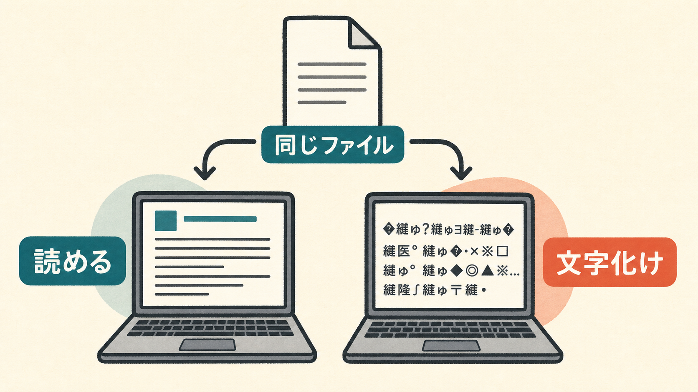
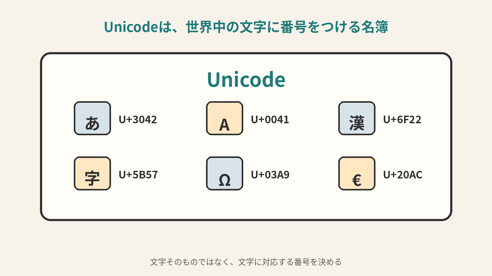
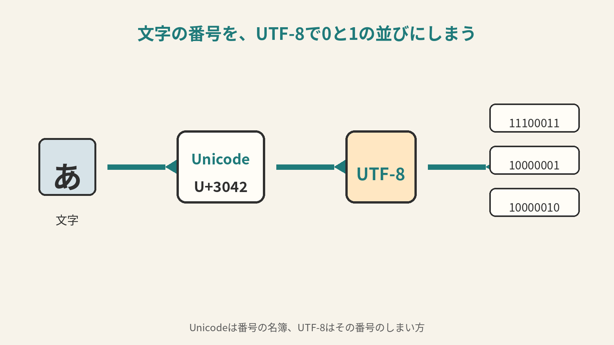
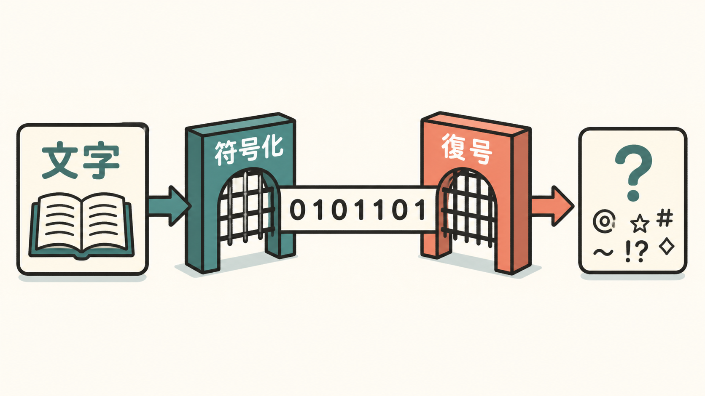
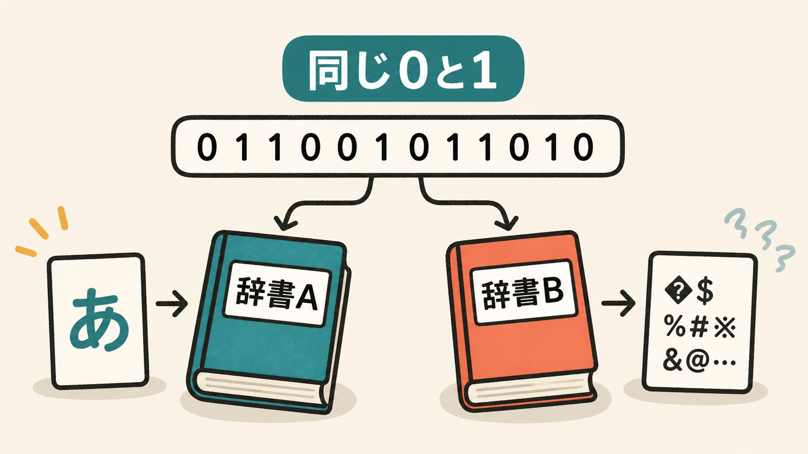

# 2ページ目：文字コードと符号化：文字化けは読み方のズレで起こる

## 同じファイルが違って読まれる

宿題ファイルを開いたら、文字化けしていました。

友だちの画面では、ちゃんと読めています。

自分のパソコンだけ、変な記号の列になっています。

このとき、文字そのものが壊れたように見えます。

ここで起きているのは、同じ0と1を、違う約束で読んでいるズレです。

## 文字には番号表がある

1ページ目では、小さな「あいうえお表」を使いました。

`1` は「あ」。

`2` は「い」。

`3` は「う」。

そう決めれば、数字の並びを文字として読めます。

この考え方を、実際のコンピュータでも使います。

文字に番号をつけるのです。

その番号の表を、文字コードと呼びます。

本物の表は、あいうえおだけでは足りません。

ひらがなも、漢字も、アルファベットも必要です。

記号も、世界中の文字も、絵文字も出てきます。

そこで使われる大きな文字の名簿が、Unicode（ユニコード）です。

Unicodeでは、たくさんの文字に番号がついています。

「あ」にも、「A」にも、「♡」にも番号があります。

## 番号をファイルへしまう

ここで、ひとつ疑問が出ます。

文字に番号があるなら、その番号をそのまま保存すればよさそうです。

けれど、名簿の番号は「どの文字か」を指す番号です。

ファイルの中に入るのは、最後には0と1の並びです。

だから、文字の番号を、0と1の列へどうしまうかまで決めます。

大きな番号もあります。

小さな番号もあります。

どこで1文字が終わるのかも必要です。

この「しまい方」を決める作業を、符号化と呼びます。

文字を、コンピュータに入る形へ変えることです。

反対に、0と1を文字として読み戻すこともあります。

それを、復号と呼びます。

入れるときが符号化。

読むときが復号です。

UTF-8は、そのための代表的な方式です。

Unicodeの番号を、0と1の並びとしてしまう方法です。

Unicodeは、文字の名簿です。

UTF-8は、その番号のしまい方です。

## 文字化けは約束の取り違え

ここで大事なのは、入れ方と読み方がそろうことです。

UTF-8で入れた文字を、UTF-8として読む。

それなら、元の文字に戻せます。

けれど、違う約束で読んでしまうと困ります。

同じ0と1の並びなのに、違う文字として読まれます。

日本語のファイルでは、UTF-8でしまった文字を、Shift_JIS（シフトJIS）の約束で読む取り違えが典型例です。

Shift_JISは、昔から使われてきた日本語向けの文字の約束です。

UTF-8とは、番号表やしまい方の前提が違います。

だから、同じ0と1を読んでも、違う文字として組み立ててしまうことがあります。

それが、文字化けです。

データが必ず壊れているわけではありません。

読み方の約束が、ずれている場合があるのです。

直すときは、まず読み方の約束を見ます。

このファイルは、UTF-8として読むのか。

Shift_JISとして読むのか。

そこが合うと、急に読めることがあります。

ここまでで、文字の番号としまい方を見ました。

最後に、画面に出る形も見ます。

文字コードは、どの文字かを決めます。

UTF-8は、その番号を0と1へしまいます。

でも、それだけでは画面の字の形は決まりません。

同じ「あ」でも、明朝体なら細い筆のように見えます。

ゴシック体なら太く角ばって見えます。

ここで働くのが、フォントです。

名簿で誰かを決めても、写真や似顔絵がなければ顔は見えません。

文字コードは名簿に近い役割です。

フォントは、その文字を画面に描くための字形集です。

## 0と1は約束とセットで意味になる

文字のデータは、0と1だけで意味が決まるわけではありません。

文字の番号表があります。

その番号を0と1にしまう方法があります。

その番号を字形として描くフォントがあります。

そして、読み戻すときの約束があります。

文字化けは、その約束の大事さが表に出た現象です。
