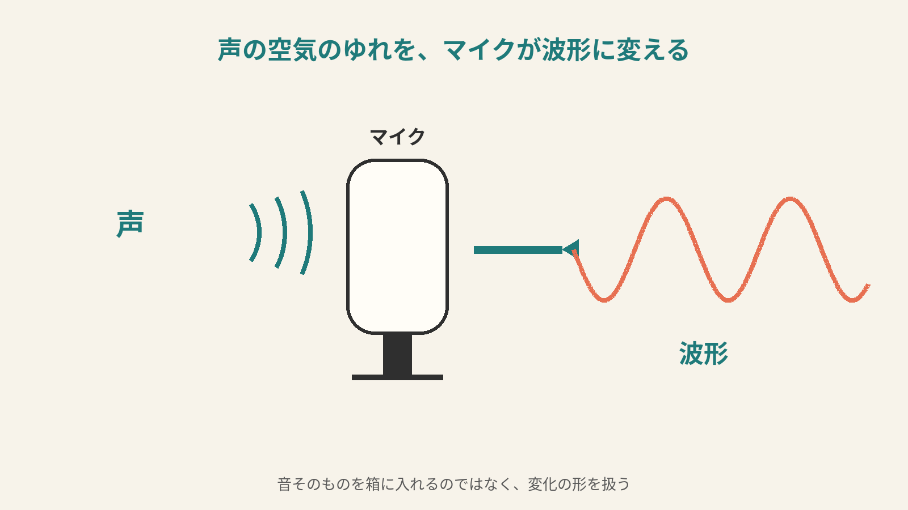
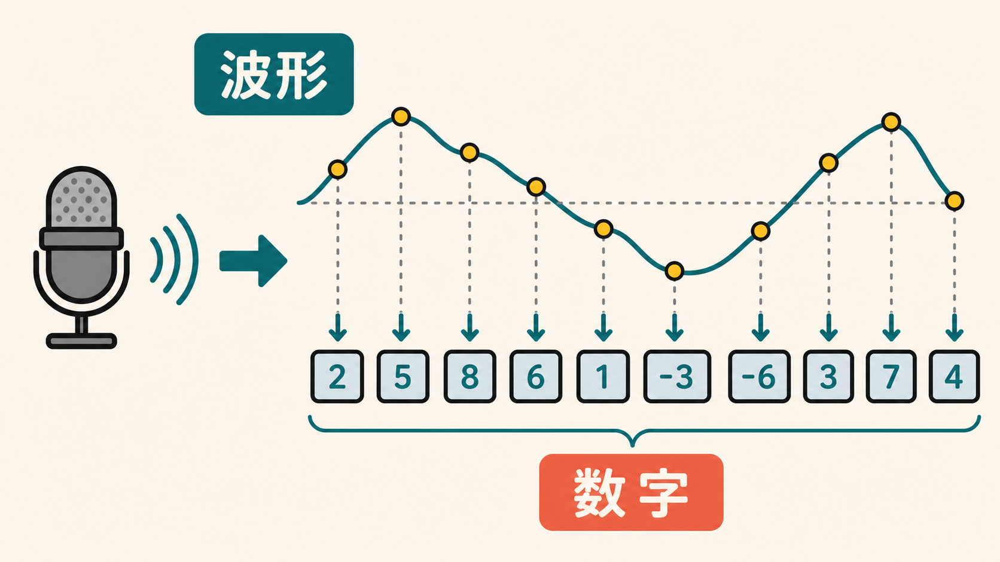
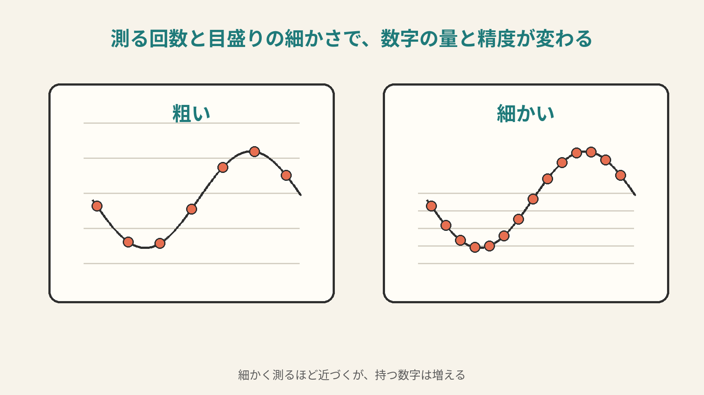
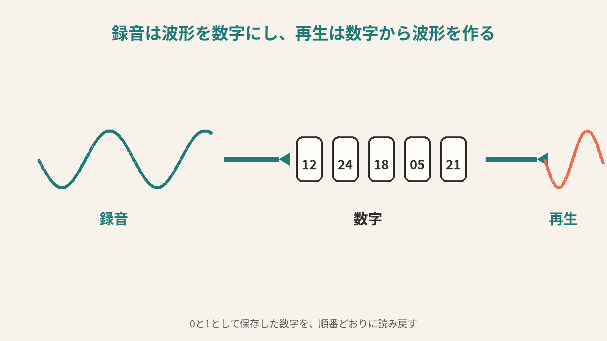
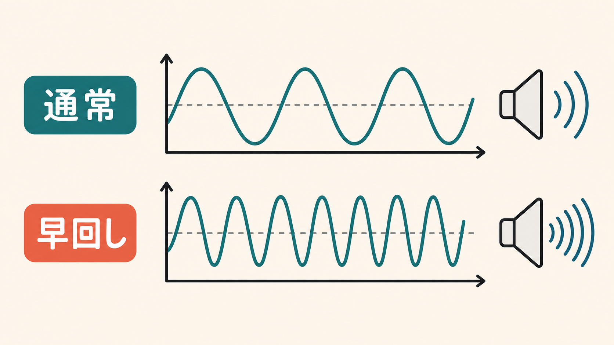

# 5ページ目：音声データ：波形を時間ごとの数値として記録する

## 音は空気のゆれから始まる

音は、空気のゆれです。

人が声を出すと、空気が細かく押されたり戻ったりします。

そのゆれが耳に届くと、声として聞こえます。

マイクは、そのゆれを電気の変化に変えます。

時間にそって上下する変化です。

その形を、波形と呼びます。

## 波形を時刻ごとの数字にする

波形は、なめらかにつながっています。

でも、コンピュータに保存するには数字にします。

ここで、4ページ目の標本化を使います。

一定の間隔で、波形の高さを測ります。

今はこの高さ。

少しあとでは、この高さ。

さらに少しあとでは、この高さ。

そうやって、時刻ごとの数値を並べます。

音声データは、この数値の列として持てます。

数字の列だけを見ると、波の絵は出ていません。

でも、数字は時刻の順番に並んでいます。

どの時刻に、どの高さだったか。

それを順番に持っているので、あとで波形に戻せます。

## 測る回数と目盛りの細かさ

1秒に何回測るかを、サンプリング周波数と呼びます。

音楽では、1秒に何万回も測ることがあります。

測る回数が多いほど、波形の動きを細かく追えます。

そのかわり、並ぶ数字の数も増えます。

波形の高さは、決められた段階の数値で持ちます。

その段階の細かさを、ビット深度と呼びます。

目盛りが細かいほど、小さな音量の違いまで残せます。

ここでも、4ページ目の量子化が出てきます。

たとえば、音楽データで見かける44.1kHzは、1秒に44100回測るという意味です。

16bitは、波形の高さを65536段階で読むという意味です。

スペック表の数字も、波形をどの細かさで測ったかを表しています。

音声のきれいさは、耳のよさだけで決まる話ではありません。

どれだけ細かく測るか。

どれだけ細かい目盛りで読むか。

そこに、データとしての設計があります。

## 数字から音へ戻す

音量も、音の高さも、波形の形として表れます。

大きな音は、波形のふれ幅が大きくなります。

高い音は、波のくり返しが速くなります。

数字を見れば、その違いも扱えます。

再生するときは、逆のことをします。

保存してある数値を順番に読みます。

その数値に合わせて、スピーカーを動かします。

スピーカーが空気を押したり戻したりします。

すると、また音として聞こえます。

録音は、波形を数値にすることです。

再生は、数値から波形を作ることです。

## 早回しで声が高く聞こえる理由

動画を早回しすると、声が高く聞こえることがあります。

これは、同じ波形の変化を短い時間に押し込むからです。

波の山と山の間隔が短くなります。

耳には、より高い音として届きます。

アプリによっては、声の高さを変えずに速く再生できます。

その場合は、ただ急いで読むだけではありません。

音の数値を計算し直して、聞こえ方を調整しています。

便利な機能の下には、波形と数字の扱いがあります。

## 音も約束どおりに読み戻す

音声ファイルは、声を箱に入れたものではありません。

空気のゆれを波形にし、波形を時刻ごとの数値にします。

その数値を、決めた回数と目盛りで保存します。

再生するときは、同じ約束で数値から波形を作ります。

音も、約束どおりに読み戻しているのです。
