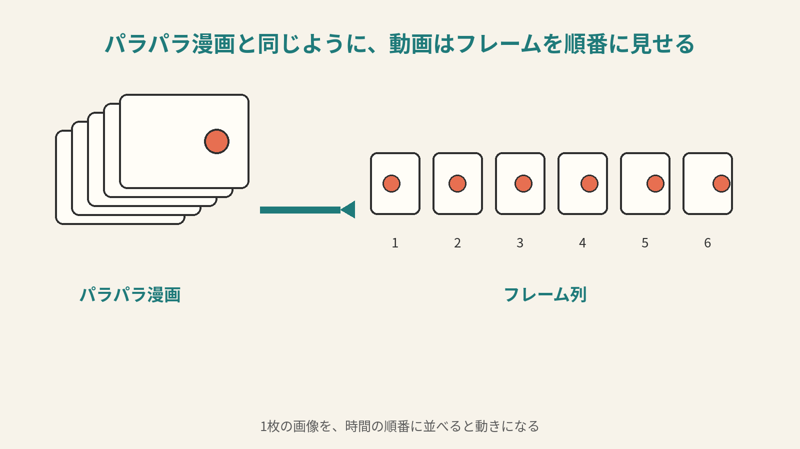
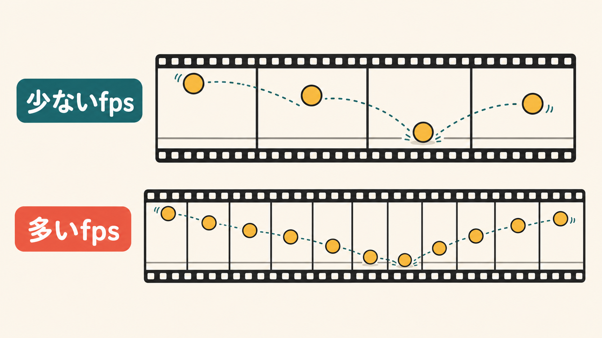
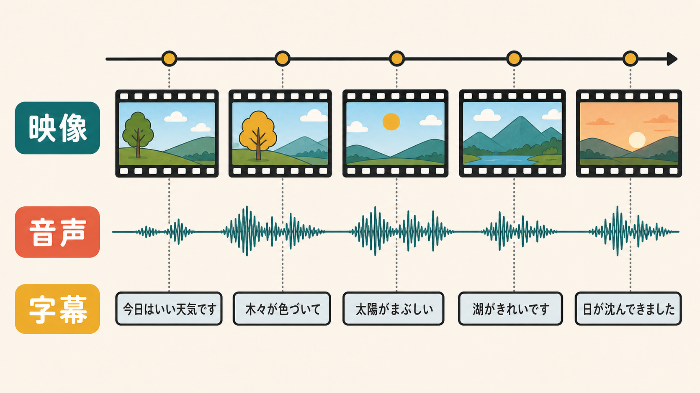
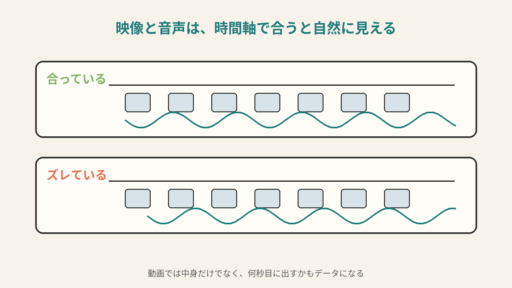

# 6ページ目：動画データ：フレームと音声を時間軸で束ねる

## 動画は画像の連続から始まる

動画は、動いている絵に見えます。

でも、中身を考えると、まずは画像の連続です。

パラパラ漫画で考えます。

少しずつ違う絵を、すばやくめくります。

すると、絵が動いて見えます。

動画でも、同じ考え方を使います。

1枚1枚の画像を、フレームと呼びます。

## 1秒に何枚見せるか

フレームは、1枚の画像です。

だから、3ページ目のRGBの考え方がそのまま使えます。

1枚のフレームには、ピクセルの色の数字があります。

動画は、そのフレームを時間の順番に並べます。

1秒に何枚のフレームを見せるかも決めます。

これをフレームレートと呼びます。

たとえば、1秒に30枚なら30fpsです。

fpsは、frames per secondの略です。

1秒あたりのフレーム数、という意味です。

枚数が少なすぎると、動きがカクカク見えます。

枚数が多いと、動きはなめらかに見えます。

そのかわり、必要なデータは増えます。

## 音声と字幕を時間で合わせる

動画には、音も入っています。

人が話す動画なら、口の動きと声が合う必要があります。

音楽動画なら、映像と音のタイミングが大事です。

つまり動画ファイルは、画像の列だけでは足りません。

フレームの列があります。

音声の数値列があります。

字幕が入ることもあります。

それらを、時間の上でそろえる必要があります。

動画は、いくつものデータを時間軸で束ねたものです。

時間軸があるので、ただ並べるだけでは足りません。

このフレームは、何秒目に出すのか。

この音は、何秒目から鳴らすのか。

そういう時刻の情報も必要です。

もし音が少し遅れると、違和感が出ます。

口はもう閉じているのに、声だけがあとから聞こえます。

逆に、声が先に聞こえることもあります。

このズレは、見る人にはすぐわかります。

動画では、データの中身だけでなく順番と時刻も重要です。

何秒目に、どのフレームを出すのか。

何秒目に、どの音を鳴らすのか。

そこまで含めて、動画として成り立ちます。

## 動画は大きくなりやすい

動画は、写真を何十枚も毎秒使います。

そのため、データ量は増えます。

そこに音声も加わります。

長い動画なら、さらに増えます。

だから動画では、保存の形式や圧縮がとても大事になります。

圧縮とは、同じ内容をできるだけ短く表す工夫です。

詳しくは8ページ目で扱います。

何度も似たようなフレームが続くこともあります。

似ているフレームを毎回まるごと持つと、すぐ重くなります。

そこで、基準になるフレームを置き、次のフレームでは変わった部分だけを持つ考え方を使います。

基準になるフレームを、キーフレームと呼びます。

変わった部分だけを見る考え方を、差分と呼びます。

パラパラ漫画でも、全ページを描き直すかわりに、「腕だけ少し上げる」と書ければ短くなります。

どのように入れるか。

どのように小さくするか。

どのように再生時刻を合わせるか。

## 形式と圧縮へつながる

動画データは、文字、画像、音声の考え方が重なった場所にあります。
