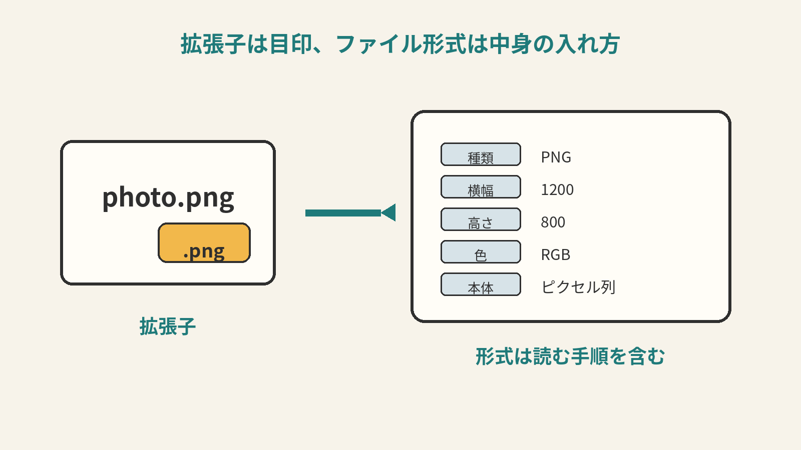
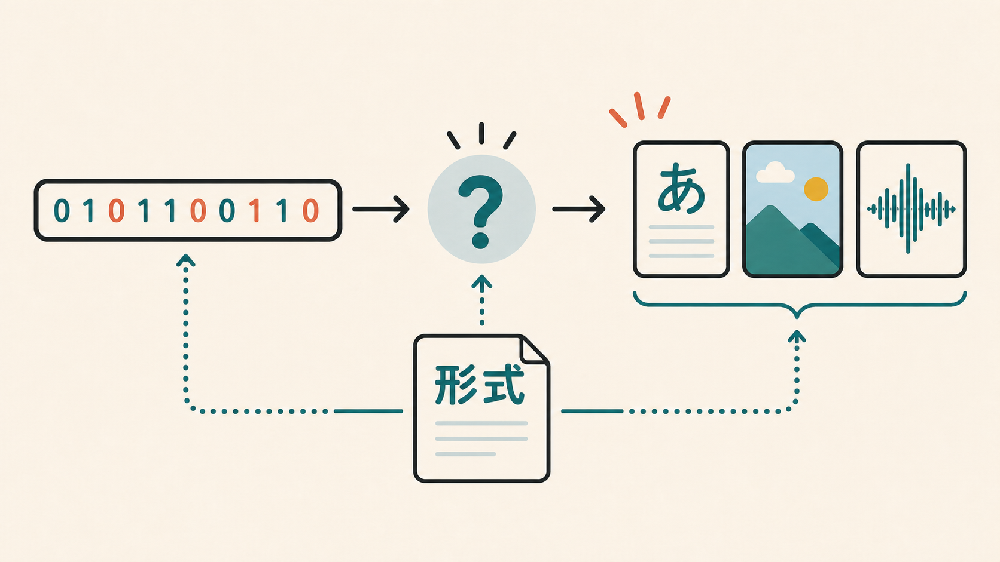
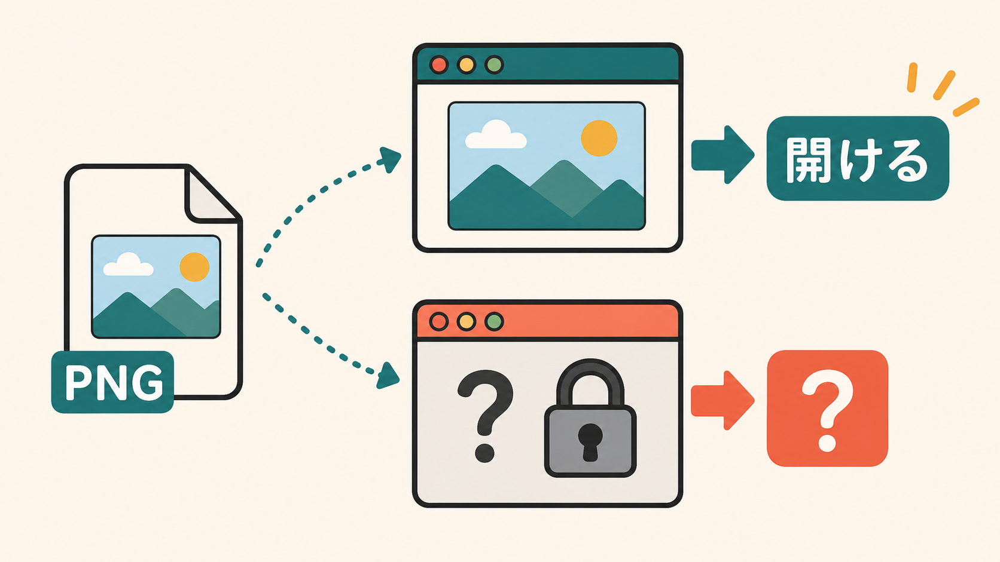
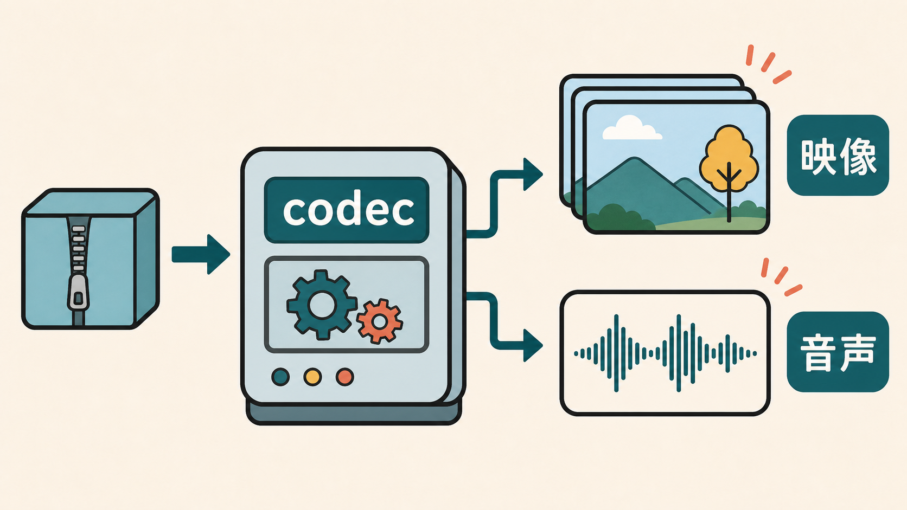
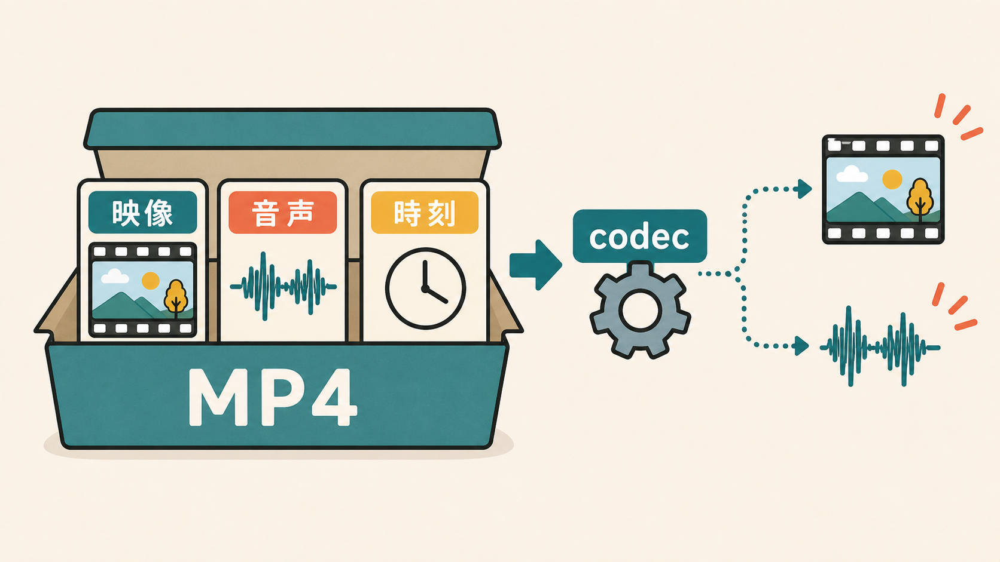

# 7ページ目：ファイル形式とコーデック：データには読み方の説明がいる

## 拡張子は入口の目印

パソコンやスマホでは、いろいろなファイルを見ます。

`.txt`、`.png`、`.jpg`、`.mp3`、`.mp4`。

名前の最後についている部分を、拡張子と呼びます。

拡張子は、そのファイルの種類を表す目印です。

ただし、拡張子そのものが中身を作るわけではありません。

ここで見るのは、ファイル形式です。

ファイル形式は、データの入れ方の約束です。

ファイルの中には、種類を示す情報が入ることもあります。

どこから画像データが始まるのか。

横幅や縦幅はいくつなのか。

そうした手がかりも、形式の一部です。

## ファイル形式は中身の読ませ方

文字のページでは、読み方の約束がずれると文字化けしました。

画像や音声でも、同じことが起こります。

0と1の列だけを見ても、何のデータかわかりません。

これは文字なのか。

画像なのか。

音声なのか。

動画なのか。

さらに、どんな順番で入っているのか。

どんな方法で小さくしてあるのか。

それを知る必要があります。

## アプリは形式に合わせて読む

ファイル形式は、その手がかりを与えます。

PNGなら、画像をこの約束で読む。

MP3なら、音声をこの約束で読む。

MP4なら、動画や音声をこの約束でまとめて読む。

アプリは、形式に合わせて読み方を変えます。

だから、対応していない形式は開けません。

中身が消えたのではありません。

そのアプリが読み方を知らないのです。

人間なら、紙を見て「これは写真だ」とわかります。

でもコンピュータは、約束を知らないと判断できません。

どこをどう読めば画像になるのかを、形式からたどります。

## コーデックは戻し方の方法

ここで、コーデックという言葉も出てきます。

コーデックは、符号化と復号をする方法です。

英語のcodecは、coderとdecoderを合わせた言葉です。

入れる方法と、読み戻す方法の組です。

音声や動画を戻す説明で出てくる言葉です。

動画ファイルを開くとき、再生アプリは中身をほどきます。

圧縮された映像を、画面に出せるフレームへ戻します。

圧縮された音声を、鳴らせる波形へ戻します。

そのときに使うのがコーデックです。

## 箱と中身は分けて見る

MP4のような形式は、箱に近い働きをすることがあります。

箱の中に、映像データがあります。

音声データもあります。

字幕や時刻の情報が入ることもあります。

箱の形と、中身のたたみ方は別です。

だから、同じMP4でも使っているコーデックが違う場合があります。

たとえば、MP4という箱の中に、映像はH.264、音声はAACという方法で入っていることがあります。

この場合、MP4は箱です。

H.264は映像のたたみ方と戻し方です。

AACは音声のたたみ方と戻し方です。

そのせいで、ある機器では再生できないこともあります。

## データには読み方の説明がいる

0と1は材料で、ファイル形式は箱の作り方、コーデックは中身のたたみ方と戻し方です。こうした約束がそろうと、データとして読めます。
