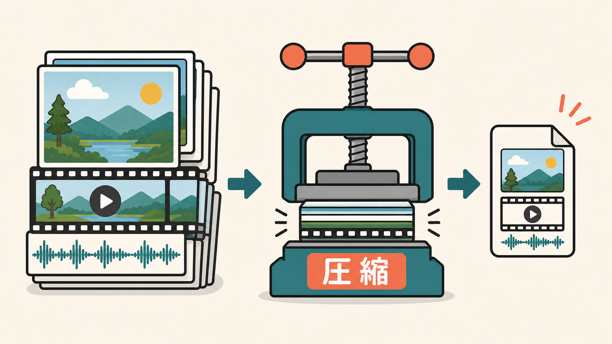
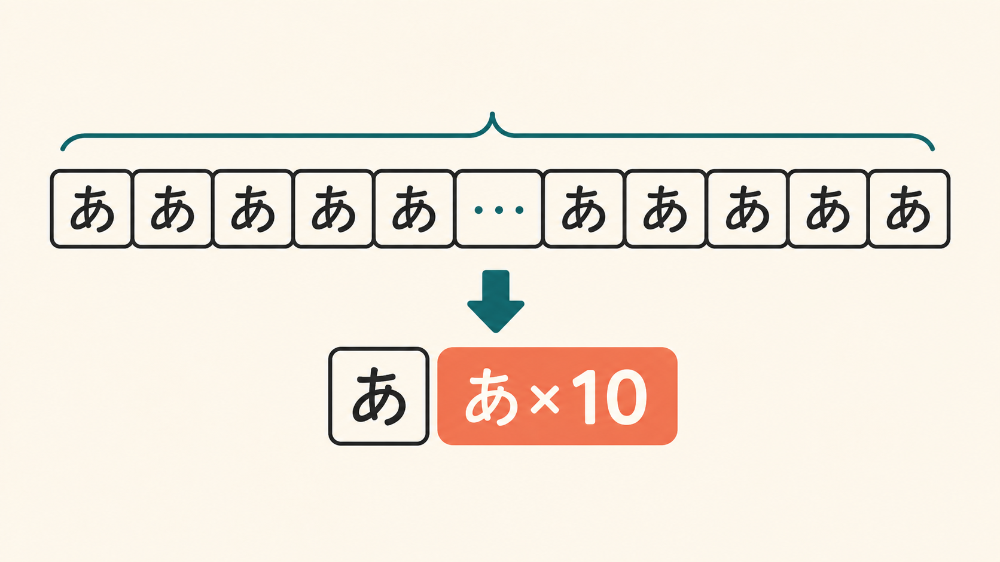
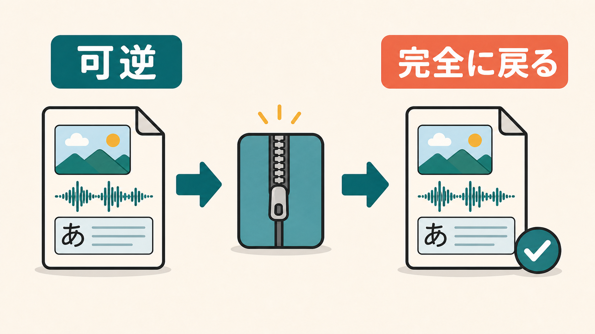
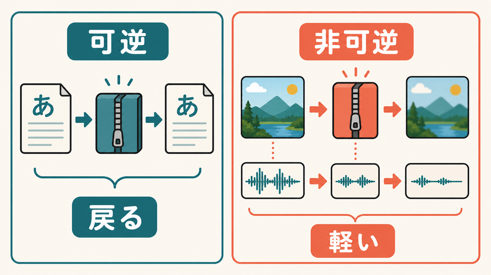
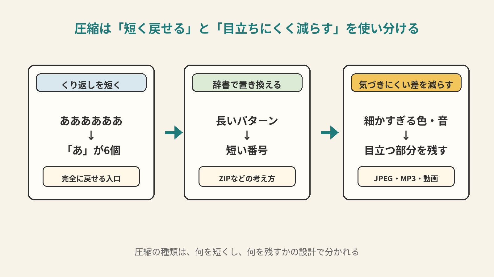

# 8ページ目：圧縮：同じ情報を少ないビットで表す

## 大きなデータを短くする

写真や動画は、そのままではとても大きなデータになります。

画像は、たくさんのピクセルを持っています。

動画は、その画像を毎秒何枚も持っています。

音声も、時間ごとの数値を大量に持っています。

このまま送ると、時間がかかります。

保存する場所もたくさん使います。

そこで使われるのが、圧縮です。

スマホで写真を送れるのも、動画を流せるのも、圧縮のおかげです。

旅行カバンに荷物を詰める場面で考えると、少し見えやすくなります。

服をきれいに畳めば、同じ服を小さく入れられます。

これは、戻したときに同じ服が出てくる圧縮です。

一方で、見返す予定のない紙袋やタグを置いていけば、荷物はもっと軽くなります。

こちらは、元の荷物を全部そのまま持っていく方法とは違います。

## くり返しを短く言う

圧縮は、同じ内容を短く表す工夫です。

たとえば、同じ文字が続くとします。

`ああああああああああ`

これを、そのまま10文字持つ方法もあります。

でも、「あが10個」と書けば短くなります。

戻すときは、「あ」を10個並べれば元に戻ります。

これは、くり返しを短く言う考え方です。

## 辞書で置き換える

実際の圧縮は、くり返しだけを見ているわけではありません。

長いデータの中には、何度も出てくる並びがあります。

そのたびに長く書くかわりに、短い番号へ置き換えます。

たとえば、長い名前を毎回書くかわりに、名簿番号で呼ぶようなものです。

読む側も同じ名簿を持っていれば、番号から元の長い名前へ戻せます。

ZIPファイルのような圧縮では、このように、よく出る並びを短く表す考え方が使われます。

ここで大事なのは、戻したときに元と同じになることです。

このように、完全に元へ戻せる圧縮を、可逆圧縮と呼びます。

書類やプログラムでは、1文字でも変わると困ります。

だから、完全に戻せることが大事です。

PNG画像も、この考え方に近い例です。

## 見えにくい差を減らす

写真や音楽では、少し違う考え方も使えます。

人間の目や耳には、気づきやすい差と気づきにくい差があります。

細かすぎる色の違い。

聞き取りにくい音の成分。

動きの中で目立ちにくい差。

こうした部分を減らすと、データを大きく減らせます。

ただし、完全に元へ戻す圧縮とは性質が違います。

減らした情報は、あとから完全には戻りません。

このような圧縮を、非可逆圧縮と呼びます。

JPEG画像やMP3音声では、この考え方が使われます。

動画のコーデックでも、人間の見え方や聞こえ方を使ってデータを減らします。

## 何を短くし、何を残すか

圧縮には、いくつもの方法があります。

くり返しを短くする。

よく出る並びを辞書で置き換える。

人間に目立ちにくい差を減らす。

目的は同じです。

少ないビットで、扱いやすいデータにすることです。

強く圧縮しすぎると、目に見えて荒れます。

写真に四角いにじみが出ることがあります。

音がこもることもあります。

動画がにじんだり、細部がつぶれたりすることもあります。

ここで出てくるのが、設計です。

完全に戻すのか。

人間に目立ちにくい部分を減らすのか。

どれくらい軽くするのか。

圧縮は、何を短くし、何を残すかを決める技術なのです。
