# 10ページ大学 情報学部 第2巻

文字・画像・音はなぜ0と1で表せるのか

デジタルデータの正体を、10ページでつかむ

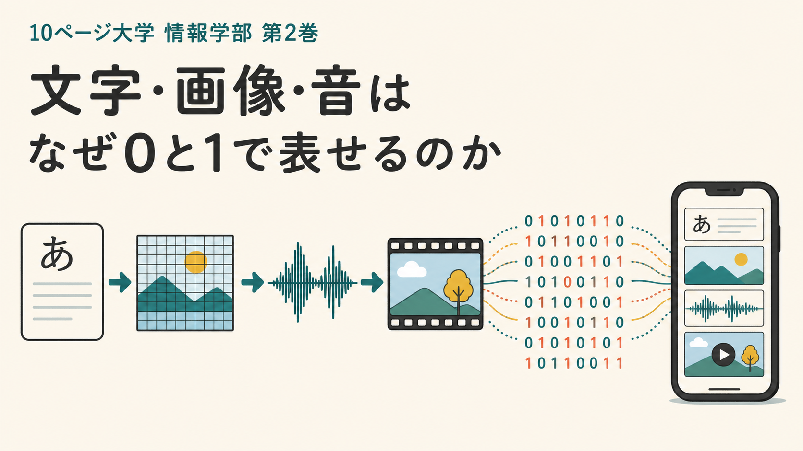

---

## はじめに

こんなシーンを想像してみてください。


> 学校から届いた宿題ファイルを開いたら、文字化けしていた。
>
> 友だちにメッセしたら、「私は開けたよ？」との返事。同じファイルなのに。
>
> 文字化けした画面をスマホで撮って送ったら、友達のお兄さんが直し方を教えてくれた。
>
> 直った画面をもう一度スマホで撮って写真に「ありがとう」とハートマークを乗せて送った。

このシーンのように、私達は普段何気なく文字や画像や動画などのデジタルデータを使っていますが、スマホやパソコンの中ではどのような仕組みで動いてるのでしょうか？

この巻では、デジタルデータの裏側をわかりやすく説明します。

---

## 1ページ目：文字も画像も、最後は一列に並べられる

### スイッチからビットへ

第1巻では、半導体で小さなスイッチを作りました。

そのオンとオフを、0と1として読むのでした。

オフなら0。

オンなら1。

この0か1のどちらか1個ぶんの情報を、ビットと呼ぶのでした。

ビットは小さすぎるので、実際にはいくつかまとめて扱うことが多くなります。

8個のビットをまとめた単位を、バイトと呼びます。

ファイルサイズで見るKBやMBのBは、このバイトです。

このあと出てくるUTF-8でも、文字を何バイトでしまうかが関係します。

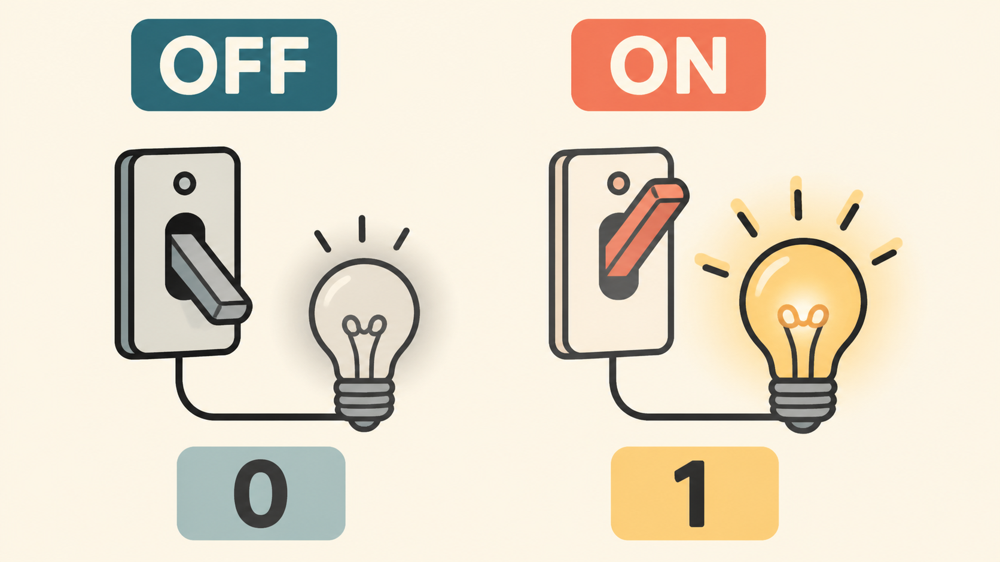

### 文字は番号で読める

まず、文字です。

ものすごく小さな「あいうえお表」を作ってみます。

```text
1 = あ
2 = い
3 = う
4 = え
5 = お
```

この表を使うなら、`1 2 3` は「あいう」と読めます。

`5 4 1` なら「おえあ」です。

数字の並びなのに、表を当てると文字になります。

実際のコンピュータでは、こんな小さな表では足りません。

ひらがな、カタカナ、漢字、アルファベット、記号、絵文字まで扱います。

表はずっと大きくなります。でも、入口の考え方は同じです。

文字に番号をつける。

その番号を0と1の並びとして持つ。

画面に出すときは、番号をまた文字として読み直す。

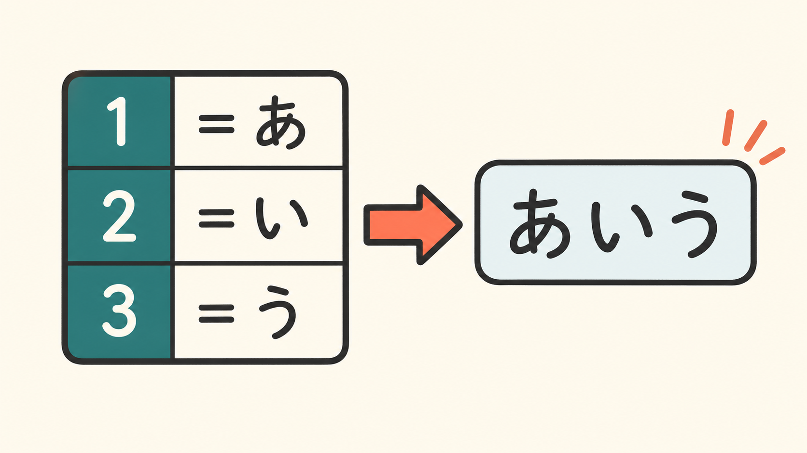

### 文も順番に並べる

文字について説明したので、次は文や文章について説明します。

文は、文字が並んだものです。

たとえば画面では、こんな2行の文章に見えます。

```text
あいう
えお
```

でも、コンピュータの中では、順番に並べて持てます。

```text
あ → い → う → 改行 → え → お
```

1行の文であれば、それは文字の並びです。

文字は、さっきの「あいうえお表」の番号で表せるのでした。

だから、1行の文も番号の並びで表せます。

では、2行の文章はどうでしょう。

2行の文章も、1行の文のように順番に並べられます。

ただ順番に並べただけなら、どこで行が変わるのかわかりません。

そこで使われるのが、改行です。

画面では、ただ行が変わったように見えます。

けれどファイルの中では、改行も印として入っています。

「ここで行を変える」という印です。

つまり、改行にも番号があります。

文字と改行の番号を順番に並べれば、2行の文章も表せます。

こうして、文章をコンピュータで表せます。

つまり、文章をデジタルデータとして表現できるのです。

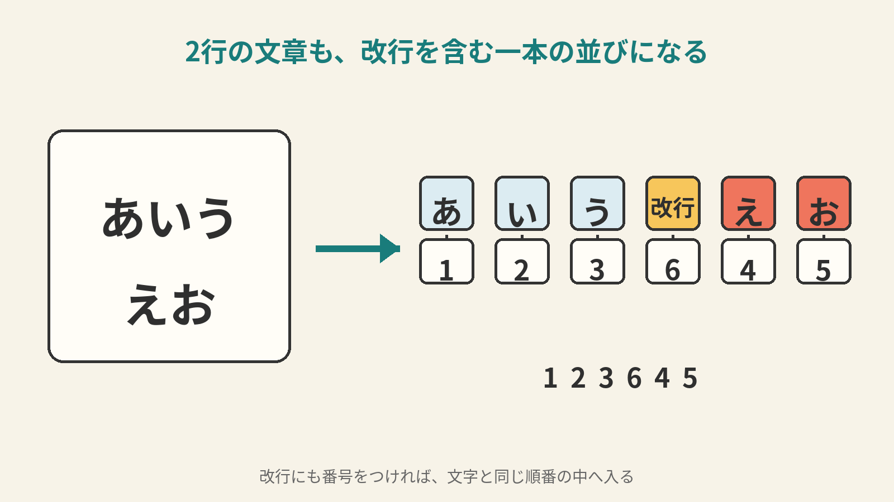

### 画像も上から順に読む

次は、画像です。

白黒のドット絵を考えてみます。白を0、黒を1と決めます。

```text
0 0 1 0 0
0 1 1 1 0
1 1 1 1 1
0 0 1 0 0
0 0 1 0 0
```

画面では、縦5マス、横5マスの絵に見えます。

でも、この絵も、数字の並びにできます。

上の行から順番に読みます。

1行目を左から右へ読む。

次に2行目を左から右へ読む。

それを5行目まで続けます。

```text
0 0 1 0 0  0 1 1 1 0  1 1 1 1 1  0 0 1 0 0  0 0 1 0 0
```

この並びだけを見ると、ただ0と1が続いているだけです。

一列にしただけでは、もう絵に見えません。

でも、「横5マス、縦5マスの画像です」とわかっていれば、絵に戻せます。

5個読んだら1行目。次の5個が2行目。

そうやって折り返すと、さっきの白黒ドット絵に戻ります。

縦と横のサイズは、ただの飾りではありません。

一列に並んだ数字を、どこで折り返すかを決める情報です。

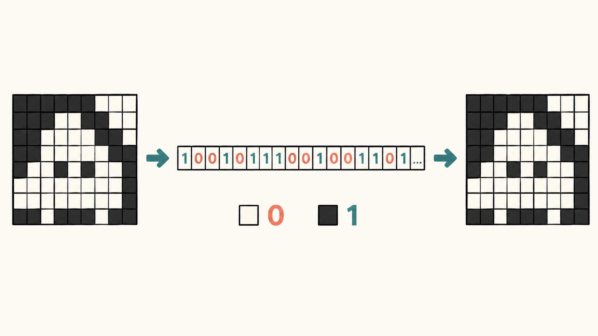

### 数字の並びと読み方の約束

文字も画像も、画面で見るとまったく別のものです。でも、コンピュータの中では、どちらも順番に並んだ数値として扱えます。

文は、文字や改行につけた番号を順番に読む。画像は、縦横のサイズを決めて、色の数字を順番に読む。

見えている形そのものを保存するのではありません。

数字の並びを、読み方の約束で文字や画像に戻しているのです。

---

## 2ページ目：文字コードと符号化：文字化けは読み方のズレで起こる

### 同じファイルが違って読まれる

宿題ファイルを開いたら、文字化けしていました。

友だちの画面では、ちゃんと読めています。

自分のパソコンだけ、変な記号の列になっています。

このとき、文字そのものが壊れたように見えます。

ここで起きているのは、同じ0と1を、違う約束で読んでいるズレです。


### 文字には番号表がある

1ページ目では、小さな「あいうえお表」を使いました。

`1` は「あ」。

`2` は「い」。

`3` は「う」。

そう決めれば、数字の並びを文字として読めます。

この考え方を、実際のコンピュータでも使います。

文字に番号をつけるのです。

その番号の表を、文字コードと呼びます。

本物の表は、あいうえおだけでは足りません。

ひらがなも、漢字も、アルファベットも必要です。

記号も、世界中の文字も、絵文字も出てきます。

そこで使われる大きな文字の名簿が、Unicode（ユニコード）です。

Unicodeでは、たくさんの文字に番号がついています。

「あ」にも、「A」にも、「♡」にも番号があります。


### 番号をファイルへしまう

ここで、ひとつ疑問が出ます。

文字に番号があるなら、その番号をそのまま保存すればよさそうです。

けれど、名簿の番号は「どの文字か」を指す番号です。

ファイルの中に入るのは、最後には0と1の並びです。

だから、文字の番号を、0と1の列へどうしまうかまで決めます。

大きな番号もあります。

小さな番号もあります。

どこで1文字が終わるのかも必要です。

この「しまい方」を決める作業を、符号化と呼びます。

文字を、コンピュータに入る形へ変えることです。

反対に、0と1を文字として読み戻すこともあります。

それを、復号と呼びます。

入れるときが符号化。

読むときが復号です。

UTF-8は、そのための代表的な方式です。

Unicodeの番号を、0と1の並びとしてしまう方法です。

Unicodeは、文字の名簿です。

UTF-8は、その番号のしまい方です。


### 文字化けは約束の取り違え

ここで大事なのは、入れ方と読み方がそろうことです。

UTF-8で入れた文字を、UTF-8として読む。

それなら、元の文字に戻せます。

けれど、違う約束で読んでしまうと困ります。

同じ0と1の並びなのに、違う文字として読まれます。

日本語のファイルでは、UTF-8でしまった文字を、Shift_JIS（シフトJIS）の約束で読む取り違えが典型例です。

Shift_JISは、昔から使われてきた日本語向けの文字の約束です。

UTF-8とは、番号表やしまい方の前提が違います。

だから、同じ0と1を読んでも、違う文字として組み立ててしまうことがあります。

それが、文字化けです。

データが必ず壊れているわけではありません。

読み方の約束が、ずれている場合があるのです。


直すときは、まず読み方の約束を見ます。

このファイルは、UTF-8として読むのか。

Shift_JISとして読むのか。

そこが合うと、急に読めることがあります。


ここまでで、文字の番号としまい方を見ました。

最後に、画面に出る形も見ます。

文字コードは、どの文字かを決めます。

UTF-8は、その番号を0と1へしまいます。

でも、それだけでは画面の字の形は決まりません。

同じ「あ」でも、明朝体なら細い筆のように見えます。

ゴシック体なら太く角ばって見えます。

ここで働くのが、フォントです。

名簿で誰かを決めても、写真や似顔絵がなければ顔は見えません。

文字コードは名簿に近い役割です。

フォントは、その文字を画面に描くための字形集です。

### 0と1は約束とセットで意味になる

文字のデータは、0と1だけで意味が決まるわけではありません。

文字の番号表があります。

その番号を0と1にしまう方法があります。

その番号を字形として描くフォントがあります。

そして、読み戻すときの約束があります。

文字化けは、その約束の大事さが表に出た現象です。

---

## 3ページ目：ピクセルとRGB：画像は色の数値表でできている

### 写真を小さな点で見る

文字は、番号の並びとして表せました。

では、画像はどうでしょう。

写真やイラストは、文字よりずっと複雑に見えます。

文字を番号で表したように、画像も小さな点の数字で表せます。

画面を大きく拡大すると、小さな四角が並んでいます。

その1つ1つを、ピクセルと呼びます。

画像は、ピクセルを縦横に並べたものです。


### 白黒から色へ

1ページ目では、白黒のドット絵を使いました。

白なら0。

黒なら1。

それだけでも、簡単な絵は作れます。

ただし、ふつうの写真は白黒だけでは足りません。

赤い夕焼けもあります。

青い空もあります。

肌の色も、服の色も、影の色もあります。

そこで、1つのピクセルに色の数値を持たせます。

### RGBは光の強さの数字

このページでは、色をRGBという3つの数字で見ます。

RGBは、赤、緑、青の光の強さです。

赤を英語でRed。

緑をGreen。

青をBlue。

その頭文字でRGBです。

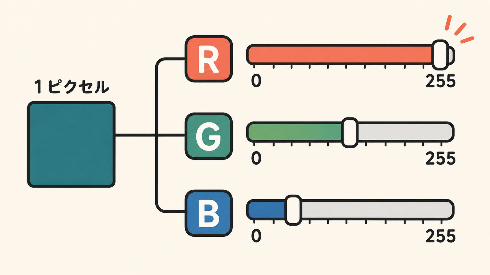

たとえば、赤だけ強くすれば赤く見えます。

緑だけ強くすれば緑です。

青だけ強くすれば青です。

3つを全部強くすれば白に近づきます。

全部弱くすれば黒に近づきます。

実際には、強さを数字で持ちます。

たとえば、`255, 0, 0` なら赤です。

`0, 255, 0` なら緑です。

`0, 0, 255` なら青です。

`255, 255, 255` なら白です。

`0, 0, 0` なら黒です。

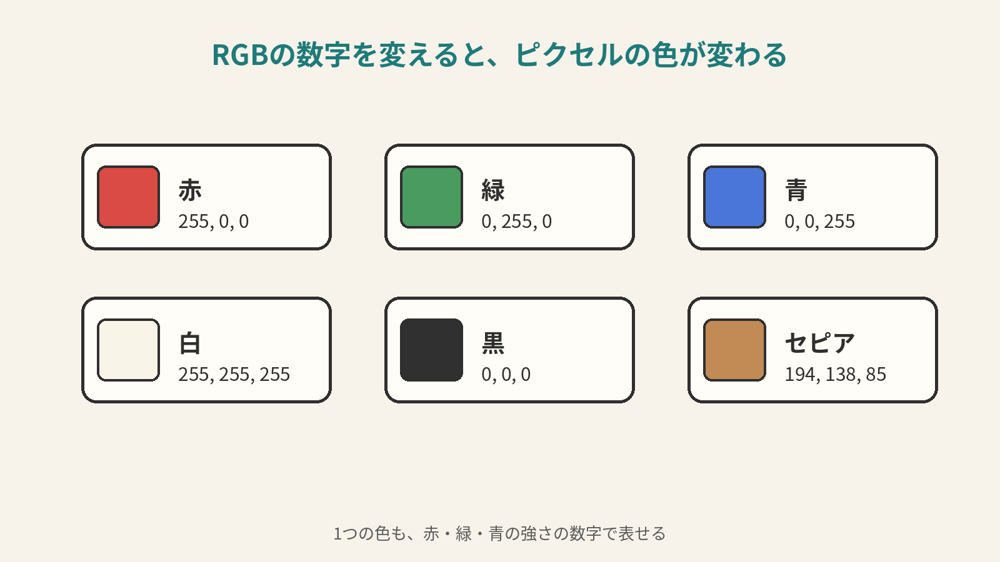

ここでも、数字だけで終わりません。

RGBの数字を、どんな色として光らせるかという約束があります。

その代表的な約束の1つが、sRGBです。

Webやスマホの画像では、sRGBを前提にすることが多くあります。

同じ `255, 0, 0` でも、どの色の約束で読むかがそろうから、画面上で赤として扱えます。

### 画像は色の数値表

画像全体は、この色の数値表です。

横に何個、縦に何個のピクセルがあるかを決めます。

この縦横の細かさを、解像度と呼びます。

同じ写真でも、細かいマスで持てばなめらかに見えます。

大きなマスで持てば、粗い画像に見えます。

そのかわり、細かいほど数字の数は増えます。

その1つ1つに、RGBの数字を置きます。

左上から右へ、順番に読んでいきます。

1行目が終わったら、2行目を読みます。

それを最後の行まで続けます。

すると、画像も数字の並びとして持てます。

見た目は平面でも、中身は順番に読めるのです。

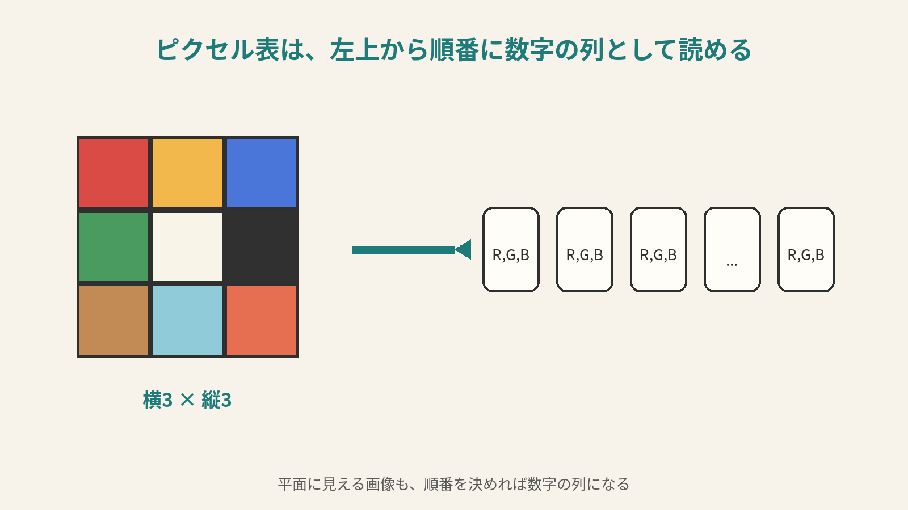

### フィルターは数値を変える

スマホのフィルターも、この考え方で見えます。

セピア調にすると、写真が古い紙のような色になります。

でも、写真の中で小さな職人が色を塗っているわけではありません。

ピクセルのRGBの数字を、別の数字へ変えているのです。

赤みを少し増やす。

青みを少し減らす。

明るさを少し変える。

そういう計算を、たくさんのピクセルに行います。

ひとつのピクセルで見れば、元のRGB値が、別のRGB値に置き換わります。

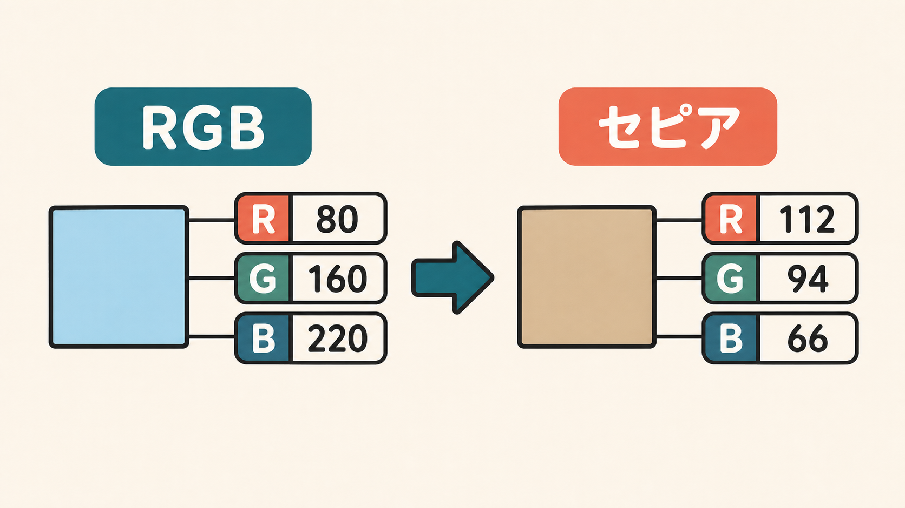

### 写真も数字の表として戻る

写真は、絵の形のまましまわれているわけではありません。

縦横に並んだピクセルがあります。

それぞれのピクセルに、色の数字があります。

その数字を読み直すと、画面に写真が戻ってきます。

---

## 4ページ目：標本化と量子化：信号を数字列に変換する

### なめらかな変化を測る

文字は、文字の番号として扱えました。

画像は、ピクセルの色の数字として扱えました。

では、音や明るさのように、時間の中で変わるものはどうでしょう。

声は、空気のゆれです。

光の明るさも、時間や場所で変わります。

温度も、少しずつ上がったり下がったりします。

こうした変化する量を、信号と呼びます。

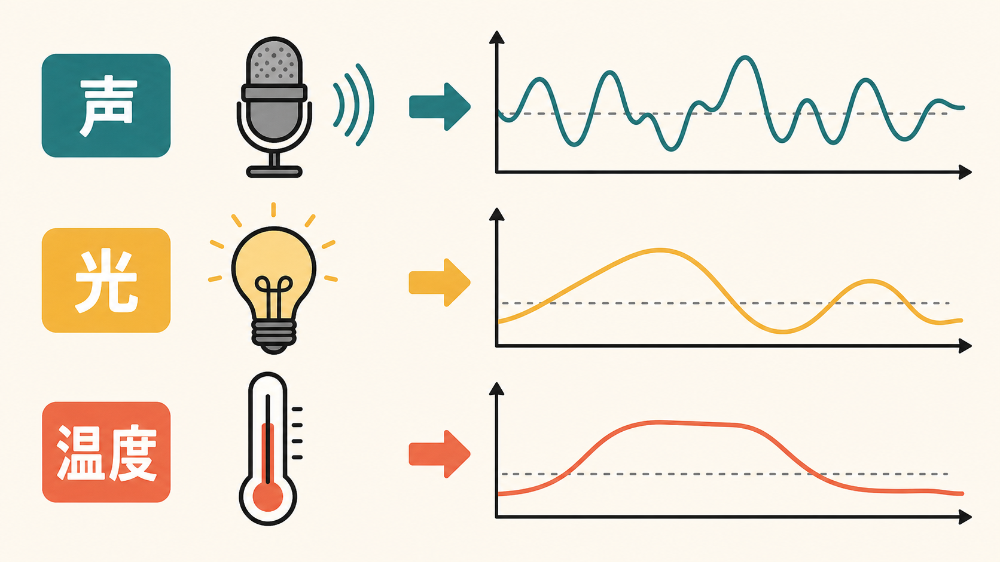

### いつ測るかを決める

信号は、そのままだとなめらかです。

波のように、途中がずっとつながっています。

でも、コンピュータが持てるのは数字です。

そこで、まず測ります。

たとえば、気温を記録するとします。

ずっと空気を持ち帰るわけではありません。

1分ごと、1秒ごと、もっと細かい間隔で、その瞬間の値を読みます。

音の波でも同じです。

一定の間隔で、今の高さを取ります。

このように、ところどころを取り出すことを標本化と呼びます。

標本は、サンプルという意味です。

なめらかな変化から、点をサンプルとして取るわけです。

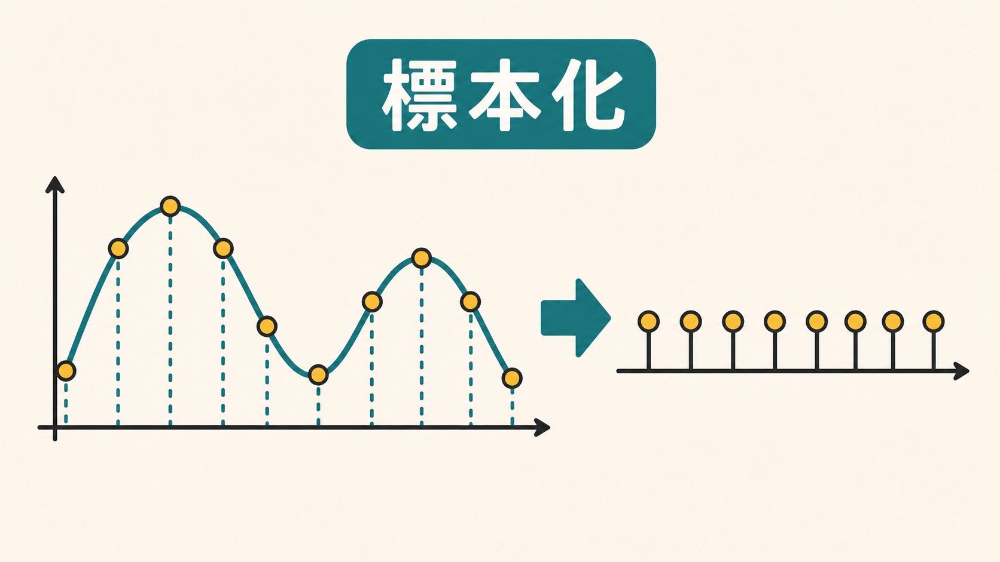

### どの目盛りで読むかを決める

測る時刻を決めても、まだ値の読み方が残っています。

体温計を考えます。

36.7度と表示されるとき、本当の変化はもっと細かく揺れているかもしれません。

でも、表示は0.1度の目盛りで出ます。

ものさしも同じです。

1ミリ目盛りなら、1ミリ単位で読みます。

もっと細かい目盛りなら、もっと細かく読めます。

コンピュータでも、使える数字の段階を決めます。

本当の値にいちばん近い段階を選びます。

この作業を、量子化と呼びます。

言葉はかたいですが、やっていることは丸めです。

細かすぎる値を、決められた目盛りに合わせるのです。

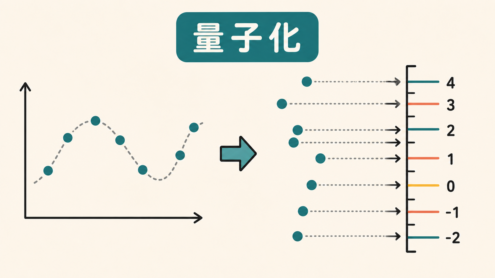

### 細かく残すほど重くなる

標本化は、いつ測るかを決めます。

量子化は、どの目盛りで読むかを決めます。

横方向の細かさを決めるのが標本化です。

縦方向の細かさを決めるのが量子化です。

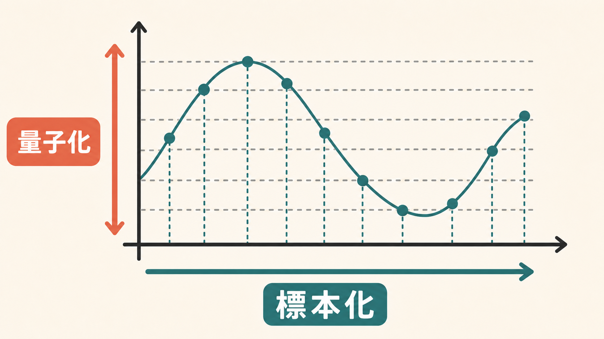

この2つで、なめらかな信号が数字の並びになります。

短い間隔で測れば、速い変化も追いやすくなります。

細かい目盛りで読めば、小さな違いも残せます。

そのかわり、データは増えます。

粗い間隔で測れば、データは軽くなります。

粗い目盛りで読めば、必要な数字も少なくなります。

そのかわり、細かい変化は落ちます。

たとえば、速く点滅する光をゆっくり測ると、点滅の途中を見落とします。

なめらかな音量を粗い目盛りで読むと、階段のような変化になります。

きれいに残すほど重くなります。

軽くするほど、どこかを大ざっぱにします。

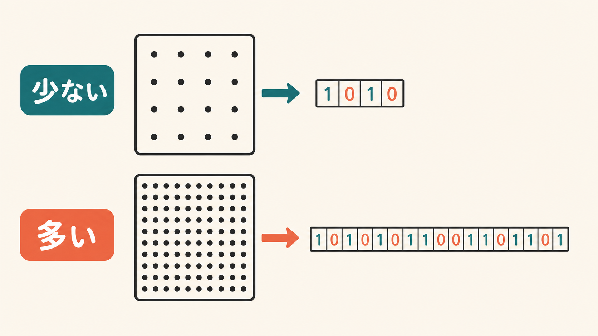

### 世界の変化を数字に切り分ける

信号を数字にするとは、ただ0と1に置きかえることではありません。

どの間隔で測るのか。

どの細かさで数値にするのか。

そこを先に決めます。

現実のなめらかな変化を、時刻と目盛りで切り分ける。

そうして、コンピュータで扱える数字の列にするのです。

---

## 5ページ目：音声データ：波形を時間ごとの数値として記録する

### 音は空気のゆれから始まる

音は、空気のゆれです。

人が声を出すと、空気が細かく押されたり戻ったりします。

そのゆれが耳に届くと、声として聞こえます。

マイクは、そのゆれを電気の変化に変えます。

時間にそって上下する変化です。

その形を、波形と呼びます。


### 波形を時刻ごとの数字にする

波形は、なめらかにつながっています。

でも、コンピュータに保存するには数字にします。

ここで、4ページ目の標本化を使います。

一定の間隔で、波形の高さを測ります。

今はこの高さ。

少しあとでは、この高さ。

さらに少しあとでは、この高さ。

そうやって、時刻ごとの数値を並べます。

音声データは、この数値の列として持てます。

数字の列だけを見ると、波の絵は出ていません。

でも、数字は時刻の順番に並んでいます。

どの時刻に、どの高さだったか。

それを順番に持っているので、あとで波形に戻せます。


### 測る回数と目盛りの細かさ

1秒に何回測るかを、サンプリング周波数と呼びます。

音楽では、1秒に何万回も測ることがあります。

測る回数が多いほど、波形の動きを細かく追えます。

そのかわり、並ぶ数字の数も増えます。

波形の高さは、決められた段階の数値で持ちます。

その段階の細かさを、ビット深度と呼びます。

目盛りが細かいほど、小さな音量の違いまで残せます。

ここでも、4ページ目の量子化が出てきます。

たとえば、音楽データで見かける44.1kHzは、1秒に44100回測るという意味です。

16bitは、波形の高さを65536段階で読むという意味です。

スペック表の数字も、波形をどの細かさで測ったかを表しています。

音声のきれいさは、耳のよさだけで決まる話ではありません。

どれだけ細かく測るか。

どれだけ細かい目盛りで読むか。

そこに、データとしての設計があります。


### 数字から音へ戻す

音量も、音の高さも、波形の形として表れます。

大きな音は、波形のふれ幅が大きくなります。

高い音は、波のくり返しが速くなります。

数字を見れば、その違いも扱えます。

再生するときは、逆のことをします。

保存してある数値を順番に読みます。

その数値に合わせて、スピーカーを動かします。

スピーカーが空気を押したり戻したりします。

すると、また音として聞こえます。

録音は、波形を数値にすることです。

再生は、数値から波形を作ることです。


### 早回しで声が高く聞こえる理由

動画を早回しすると、声が高く聞こえることがあります。

これは、同じ波形の変化を短い時間に押し込むからです。

波の山と山の間隔が短くなります。

耳には、より高い音として届きます。


アプリによっては、声の高さを変えずに速く再生できます。

その場合は、ただ急いで読むだけではありません。

音の数値を計算し直して、聞こえ方を調整しています。

便利な機能の下には、波形と数字の扱いがあります。

### 音も約束どおりに読み戻す

音声ファイルは、声を箱に入れたものではありません。

空気のゆれを波形にし、波形を時刻ごとの数値にします。

その数値を、決めた回数と目盛りで保存します。

再生するときは、同じ約束で数値から波形を作ります。

音も、約束どおりに読み戻しているのです。

---

## 6ページ目：動画データ：フレームと音声を時間軸で束ねる

### 動画は画像の連続から始まる

動画は、動いている絵に見えます。

でも、中身を考えると、まずは画像の連続です。

パラパラ漫画で考えます。

少しずつ違う絵を、すばやくめくります。

すると、絵が動いて見えます。

動画でも、同じ考え方を使います。

1枚1枚の画像を、フレームと呼びます。


### 1秒に何枚見せるか

フレームは、1枚の画像です。

だから、3ページ目のRGBの考え方がそのまま使えます。

1枚のフレームには、ピクセルの色の数字があります。

動画は、そのフレームを時間の順番に並べます。

1秒に何枚のフレームを見せるかも決めます。

これをフレームレートと呼びます。

たとえば、1秒に30枚なら30fpsです。

fpsは、frames per secondの略です。

1秒あたりのフレーム数、という意味です。

枚数が少なすぎると、動きがカクカク見えます。

枚数が多いと、動きはなめらかに見えます。

そのかわり、必要なデータは増えます。


### 音声と字幕を時間で合わせる

動画には、音も入っています。

人が話す動画なら、口の動きと声が合う必要があります。

音楽動画なら、映像と音のタイミングが大事です。

つまり動画ファイルは、画像の列だけでは足りません。

フレームの列があります。

音声の数値列があります。

字幕が入ることもあります。

それらを、時間の上でそろえる必要があります。

動画は、いくつものデータを時間軸で束ねたものです。


時間軸があるので、ただ並べるだけでは足りません。

このフレームは、何秒目に出すのか。

この音は、何秒目から鳴らすのか。

そういう時刻の情報も必要です。

もし音が少し遅れると、違和感が出ます。

口はもう閉じているのに、声だけがあとから聞こえます。

逆に、声が先に聞こえることもあります。

このズレは、見る人にはすぐわかります。

動画では、データの中身だけでなく順番と時刻も重要です。

何秒目に、どのフレームを出すのか。

何秒目に、どの音を鳴らすのか。

そこまで含めて、動画として成り立ちます。


### 動画は大きくなりやすい

動画は、写真を何十枚も毎秒使います。

そのため、データ量は増えます。

そこに音声も加わります。

長い動画なら、さらに増えます。

だから動画では、保存の形式や圧縮がとても大事になります。

圧縮とは、同じ内容をできるだけ短く表す工夫です。

詳しくは8ページ目で扱います。

何度も似たようなフレームが続くこともあります。

似ているフレームを毎回まるごと持つと、すぐ重くなります。

そこで、基準になるフレームを置き、次のフレームでは変わった部分だけを持つ考え方を使います。

基準になるフレームを、キーフレームと呼びます。

変わった部分だけを見る考え方を、差分と呼びます。

パラパラ漫画でも、全ページを描き直すかわりに、「腕だけ少し上げる」と書ければ短くなります。

どのように入れるか。

どのように小さくするか。

どのように再生時刻を合わせるか。

### 形式と圧縮へつながる

動画データは、文字、画像、音声の考え方が重なった場所にあります。

---

## 7ページ目：ファイル形式とコーデック：データには読み方の説明がいる

### 拡張子は入口の目印

パソコンやスマホでは、いろいろなファイルを見ます。

`.txt`、`.png`、`.jpg`、`.mp3`、`.mp4`。

名前の最後についている部分を、拡張子と呼びます。

拡張子は、そのファイルの種類を表す目印です。

ただし、拡張子そのものが中身を作るわけではありません。

ここで見るのは、ファイル形式です。

ファイル形式は、データの入れ方の約束です。

ファイルの中には、種類を示す情報が入ることもあります。

どこから画像データが始まるのか。

横幅や縦幅はいくつなのか。

そうした手がかりも、形式の一部です。


### ファイル形式は中身の読ませ方

文字のページでは、読み方の約束がずれると文字化けしました。

画像や音声でも、同じことが起こります。

0と1の列だけを見ても、何のデータかわかりません。

これは文字なのか。

画像なのか。

音声なのか。

動画なのか。

さらに、どんな順番で入っているのか。

どんな方法で小さくしてあるのか。

それを知る必要があります。


### アプリは形式に合わせて読む

ファイル形式は、その手がかりを与えます。

PNGなら、画像をこの約束で読む。

MP3なら、音声をこの約束で読む。

MP4なら、動画や音声をこの約束でまとめて読む。

アプリは、形式に合わせて読み方を変えます。

だから、対応していない形式は開けません。

中身が消えたのではありません。

そのアプリが読み方を知らないのです。


人間なら、紙を見て「これは写真だ」とわかります。

でもコンピュータは、約束を知らないと判断できません。

どこをどう読めば画像になるのかを、形式からたどります。

### コーデックは戻し方の方法

ここで、コーデックという言葉も出てきます。

コーデックは、符号化と復号をする方法です。

英語のcodecは、coderとdecoderを合わせた言葉です。

入れる方法と、読み戻す方法の組です。

音声や動画を戻す説明で出てくる言葉です。

動画ファイルを開くとき、再生アプリは中身をほどきます。

圧縮された映像を、画面に出せるフレームへ戻します。

圧縮された音声を、鳴らせる波形へ戻します。

そのときに使うのがコーデックです。


### 箱と中身は分けて見る

MP4のような形式は、箱に近い働きをすることがあります。

箱の中に、映像データがあります。

音声データもあります。

字幕や時刻の情報が入ることもあります。


箱の形と、中身のたたみ方は別です。

だから、同じMP4でも使っているコーデックが違う場合があります。

たとえば、MP4という箱の中に、映像はH.264、音声はAACという方法で入っていることがあります。

この場合、MP4は箱です。

H.264は映像のたたみ方と戻し方です。

AACは音声のたたみ方と戻し方です。

そのせいで、ある機器では再生できないこともあります。

### データには読み方の説明がいる

0と1は材料で、ファイル形式は箱の作り方、コーデックは中身のたたみ方と戻し方です。こうした約束がそろうと、データとして読めます。

---

## 8ページ目：圧縮：同じ情報を少ないビットで表す

### 大きなデータを短くする

写真や動画は、そのままではとても大きなデータになります。

画像は、たくさんのピクセルを持っています。

動画は、その画像を毎秒何枚も持っています。

音声も、時間ごとの数値を大量に持っています。

このまま送ると、時間がかかります。

保存する場所もたくさん使います。

そこで使われるのが、圧縮です。

スマホで写真を送れるのも、動画を流せるのも、圧縮のおかげです。

旅行カバンに荷物を詰める場面で考えると、少し見えやすくなります。

服をきれいに畳めば、同じ服を小さく入れられます。

これは、戻したときに同じ服が出てくる圧縮です。

一方で、見返す予定のない紙袋やタグを置いていけば、荷物はもっと軽くなります。

こちらは、元の荷物を全部そのまま持っていく方法とは違います。


### くり返しを短く言う

圧縮は、同じ内容を短く表す工夫です。

たとえば、同じ文字が続くとします。

`ああああああああああ`

これを、そのまま10文字持つ方法もあります。

でも、「あが10個」と書けば短くなります。

戻すときは、「あ」を10個並べれば元に戻ります。

これは、くり返しを短く言う考え方です。


### 辞書で置き換える

実際の圧縮は、くり返しだけを見ているわけではありません。

長いデータの中には、何度も出てくる並びがあります。

そのたびに長く書くかわりに、短い番号へ置き換えます。

たとえば、長い名前を毎回書くかわりに、名簿番号で呼ぶようなものです。

読む側も同じ名簿を持っていれば、番号から元の長い名前へ戻せます。

ZIPファイルのような圧縮では、このように、よく出る並びを短く表す考え方が使われます。

ここで大事なのは、戻したときに元と同じになることです。

このように、完全に元へ戻せる圧縮を、可逆圧縮と呼びます。

書類やプログラムでは、1文字でも変わると困ります。

だから、完全に戻せることが大事です。

PNG画像も、この考え方に近い例です。


### 見えにくい差を減らす

写真や音楽では、少し違う考え方も使えます。

人間の目や耳には、気づきやすい差と気づきにくい差があります。

細かすぎる色の違い。

聞き取りにくい音の成分。

動きの中で目立ちにくい差。

こうした部分を減らすと、データを大きく減らせます。

ただし、完全に元へ戻す圧縮とは性質が違います。

減らした情報は、あとから完全には戻りません。

このような圧縮を、非可逆圧縮と呼びます。

JPEG画像やMP3音声では、この考え方が使われます。

動画のコーデックでも、人間の見え方や聞こえ方を使ってデータを減らします。


### 何を短くし、何を残すか

圧縮には、いくつもの方法があります。

くり返しを短くする。

よく出る並びを辞書で置き換える。

人間に目立ちにくい差を減らす。

目的は同じです。

少ないビットで、扱いやすいデータにすることです。


強く圧縮しすぎると、目に見えて荒れます。

写真に四角いにじみが出ることがあります。

音がこもることもあります。

動画がにじんだり、細部がつぶれたりすることもあります。

ここで出てくるのが、設計です。

完全に戻すのか。

人間に目立ちにくい部分を減らすのか。

どれくらい軽くするのか。

圧縮は、何を短くし、何を残すかを決める技術なのです。

---

## 9ページ目：マークアップと構造化データ：文字は構造も表せる

### 文字で役割を伝える

文字は、人が読む文章を表せます。

けれど、文字の使い道はそれだけではありません。

「ここは見出しです」。

「ここはリンクです」。

「これは商品名で、これは価格です」。

そういう役割も、文字で伝えられます。

文章として読める文字が、画面やデータの部品にもなるのです。

文字に役割の印をつける書き方を、マークアップと呼びます。

文字に名前やまとまりをつける考え方を、構造化データと呼びます。

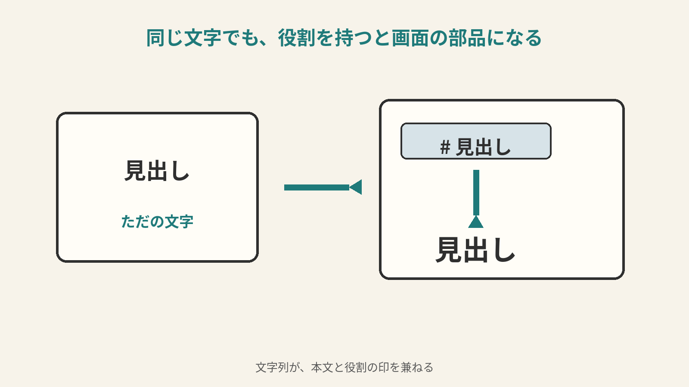

### 印をつけると見出しになる

まず、マークアップです。

マークアップは、文章の中に印をつけることです。

たとえば、見出しがあります。

太字にしたい言葉もあります。

箇条書きにしたい部分もあります。

ただの文字だけでは、どこが見出しか見分けにくいです。

そこで、印をつけます。

Markdownなら、`# 見出し` のように書きます。

`# 見出し` は、本文の文字です。

同時に、「ここは見出しだ」という印にもなっています。

HTMLなら、見出しや段落をタグで囲みます。

人間にも読めて、コンピュータにも役割が伝わります。

ここで文字は、内容そのものと、内容の説明を兼ねています。

「ここは見出しです」という印まで、文字で書けるのです。

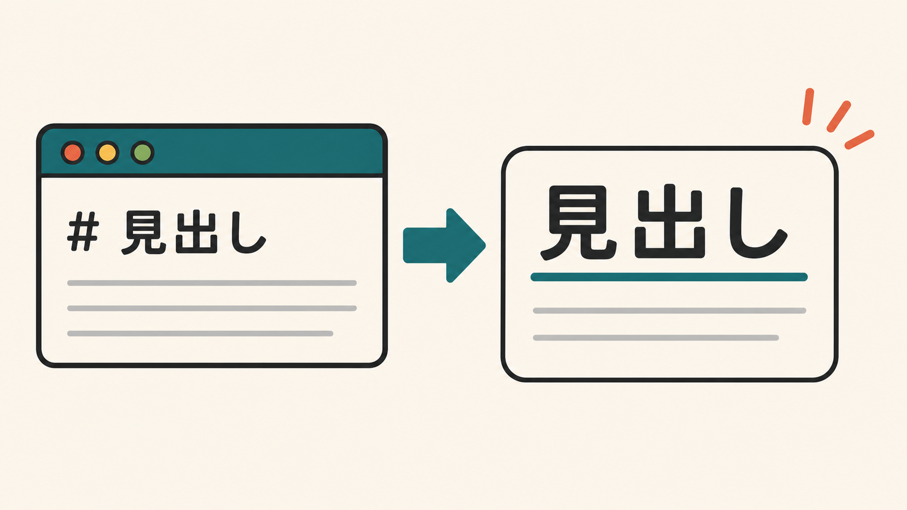

### ブラウザは印から画面を作る

Webページも、この考え方でできています。

画面では、見出し、本文、リンク、画像が並んで見えます。

でも中身には、部品の役割が書かれています。

これは見出しです。

これは段落です。

これはリンクです。

これは画像を表示する場所です。

ブラウザは、その印を読んで画面を組み立てます。

見た目を直接しまっているのではありません。

役割を書いた文字を読んで、表示を作っているのです。

ここで、CSSやフォントも関わります。

HTMLは、ここが見出し、ここが段落、ここがリンクだと役割を伝えます。

CSSは、色や余白や大きさなどの見た目を指定します。

フォントは、文字をどんな形で描くかを決めます。

同じ文章でも、HTML、CSS、フォントの役割が分かれることで、画面のページになります。

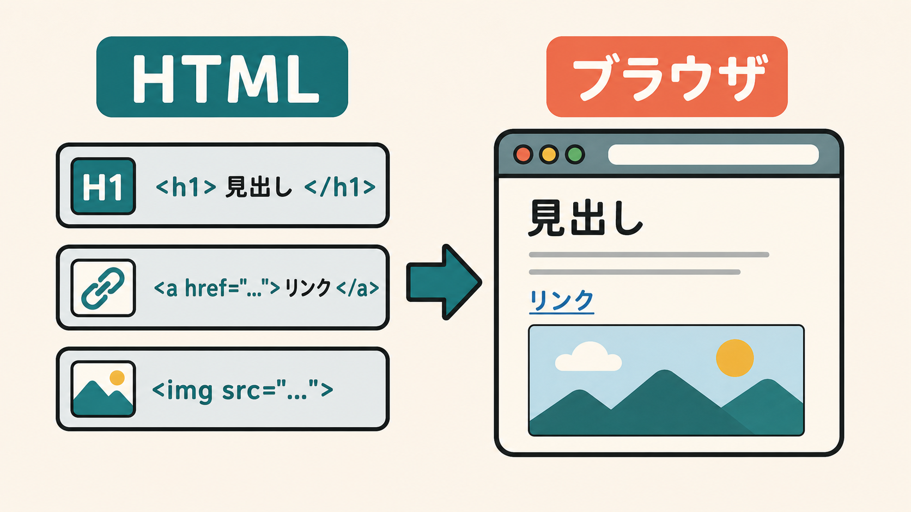

### 名前をつけるとデータになる

次に、構造化データです。

これは、データに名前やまとまりをつける考え方です。

たとえば、商品データを考えます。

商品名、価格、在庫数。

この3つがただ並んでいるだけでは、意味があいまいです。

でも、`name`、`price`、`stock` のような名前をつければ読めます。

数字の300が、価格なのか在庫数なのか区別できます。

JSONでは、名前と値の組でデータを書きます。

文字で書かれていますが、中身はきちんとしたデータの形です。

表計算のCSVも、近い考え方で読めます。

カンマで区切るという約束があるから、表として戻せます。

ただ並んだ文字でも、区切り方を決めれば形が生まれます。

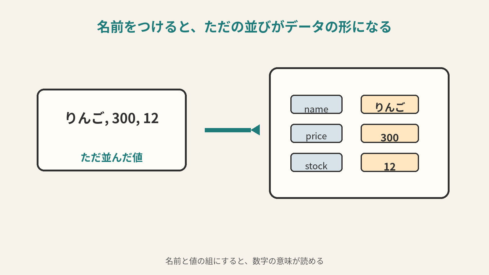

文字は、見出しやリンク、商品名や価格のような役割も運べます。約束を決めれば、文字列はデータの形まで表せます。

---

## 10ページ目：マルチメディアとマルチモーダル：異なるデータを同じ土俵に乗せる

### どれも数値として扱える

ここまで、いろいろなデータを見てきました。

文字、画像、音声、動画。

画面で見ると、まったく別のものです。

文字は読めます。

画像は見えます。

音声は聞こえます。

動画は、動きと音を持っています。

でも、コンピュータの中では、どれも数値として扱われます。

最後には、0と1の並びになります。

この共通点があるから、同じ機械で扱えます。

スマホ1台で、文章も写真も音楽も動画も扱える理由です。

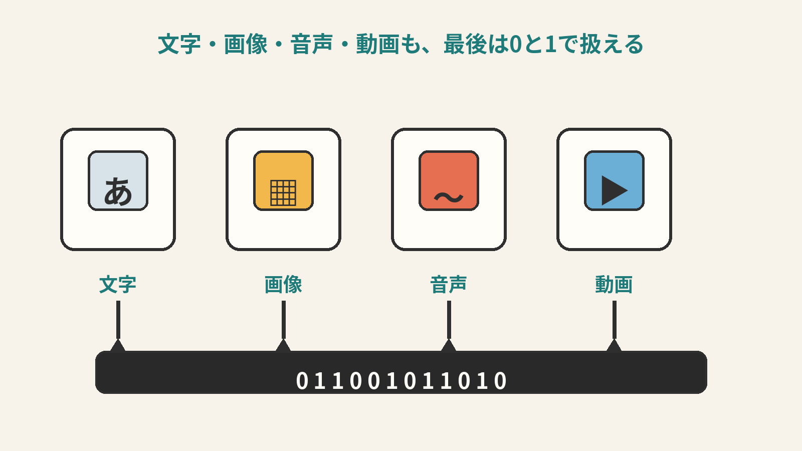

### 0と1だけでは意味が決まらない

ただし、全部が同じという意味ではありません。

文字には文字コードがあります。

画像にはピクセルとRGBがあります。

音声には標本化と量子化があります。

動画にはフレームと時間軸があります。

ファイル形式やコーデックもあります。

0と1だけでは、意味は決まりません。

どんな約束で入れたのか。

どんな約束で読むのか。

そこまでそろって、データとして使えます。

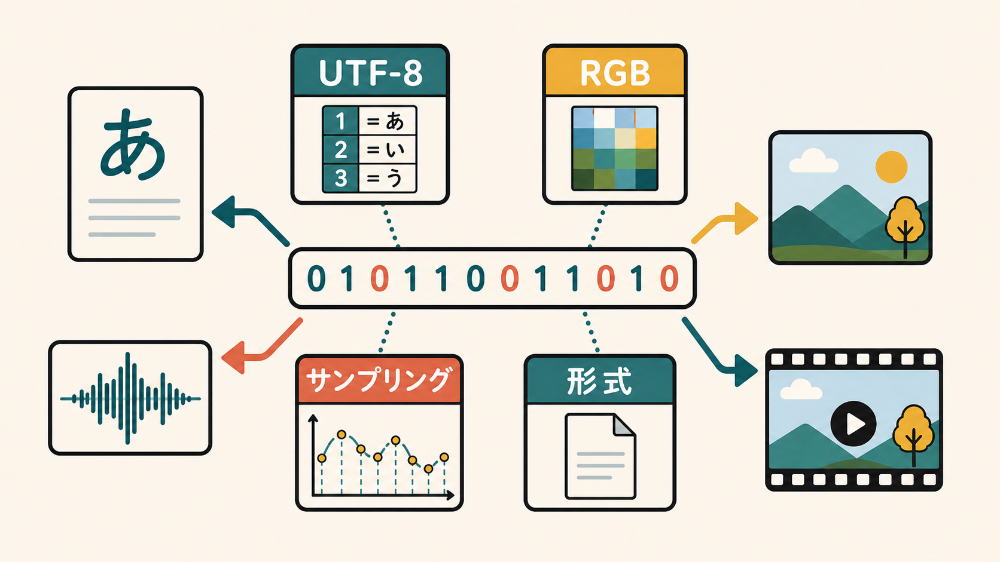

### 複数のメディアを組み合わせる

文字、画像、音声、動画をまとめて扱うことを、マルチメディアと呼びます。

Webページは、マルチメディアの身近な例です。

見出しがあります。

本文があります。

画像があります。

動画が埋め込まれることもあります。

スマホの投稿も同じです。

文章を書き、写真を載せ、音楽や動画をつけることがあります。

いくつものメディアが、同じ画面の中で組み合わさっています。


### 種類をまたいで処理する

最近は、マルチモーダルという言葉もよく聞きます。

ここでは、モードを情報の種類として扱います。

文章というモード。

画像というモード。

音声というモード。

動画というモード。

マルチモーダルとは、複数の種類の情報をまたいで扱うことです。

たとえば、画像を見て文章で説明する。

声で質問して、画面の内容について答える。

そういう処理では、違う種類のデータを同じ場所で扱います。

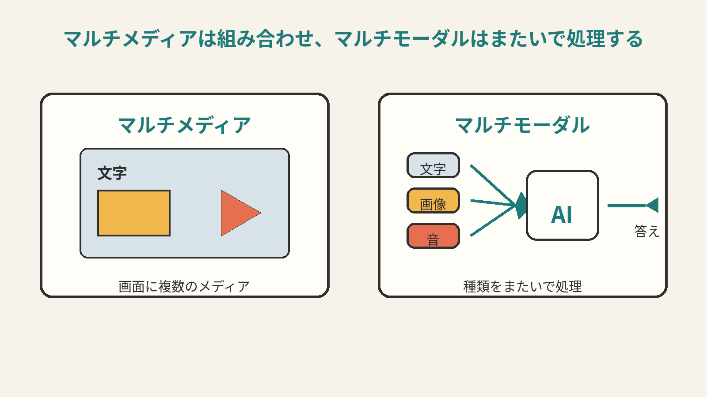

マルチメディアは、複数のメディアを組み合わせる言葉です。

マルチモーダルは、複数の種類の情報をまたいで処理する言葉です。

### 約束を重ねるとデータになる

0と1にできることは、意味を理解する手前の話です。

文字も、画像も、音声も、動画も、まず数値として扱える形にし、それぞれの読み方の約束を決めます。

形式を決め、必要なら圧縮します。

映像や音声では、コーデックで戻せる形にします。

そうして初めて、アプリやAIが扱える材料になります。

0と1はただの記号ではなく、約束を重ねることで、文字にも、画像にも、音にも、動画にもなるのです。
