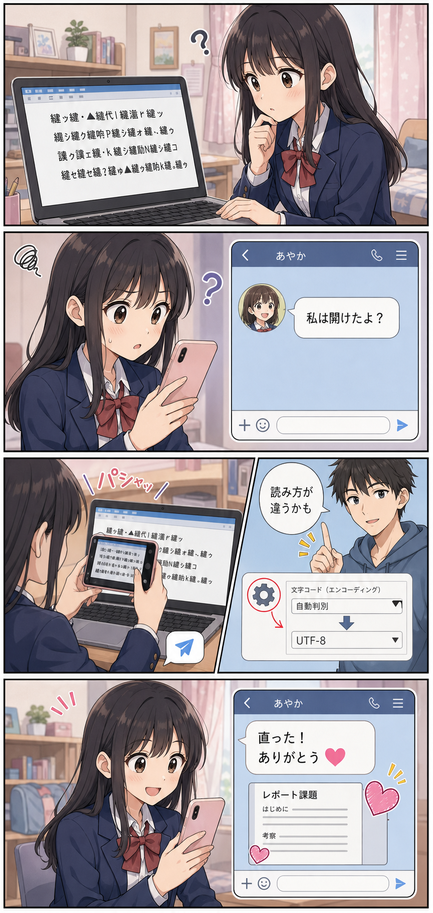

## はじめに

こんなシーンを想像してみてください。

> 学校から届いた宿題ファイルを開いたら、文字化けしていた。
>
> 友だちにメッセしたら、「私は開けたよ？」との返事。同じファイルなのに。
>
> 文字化けした画面をスマホで撮って送ったら、友達のお兄さんが直し方を教えてくれた。
>
> 直った画面をもう一度スマホで撮って写真に「ありがとう」とハートマークを乗せて送った。

このシーンのように、私達は普段何気なく文字や画像や動画などのデジタルデータを使っていますが、スマホやパソコンの中ではどのような仕組みで動いてるのでしょうか？

この巻では、デジタルデータの裏側をわかりやすく説明します。
