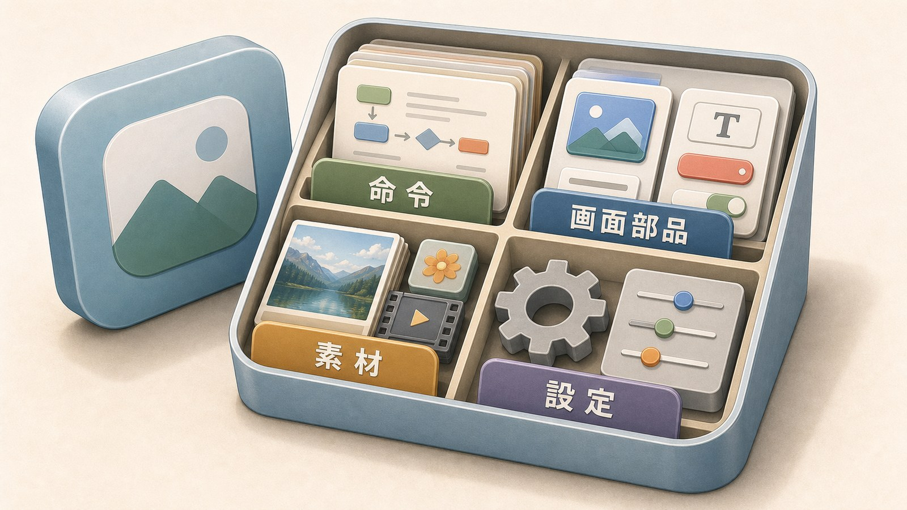
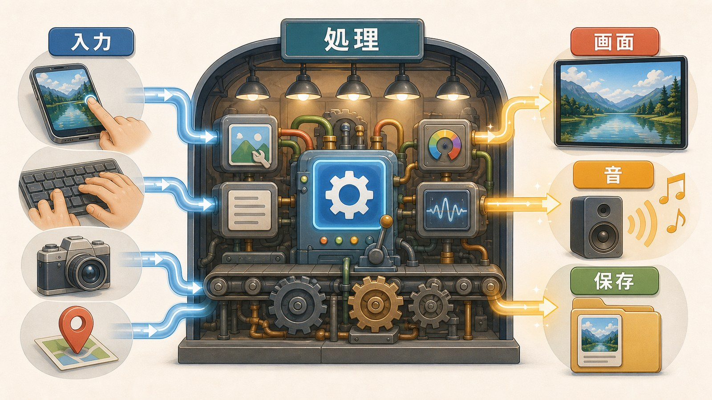
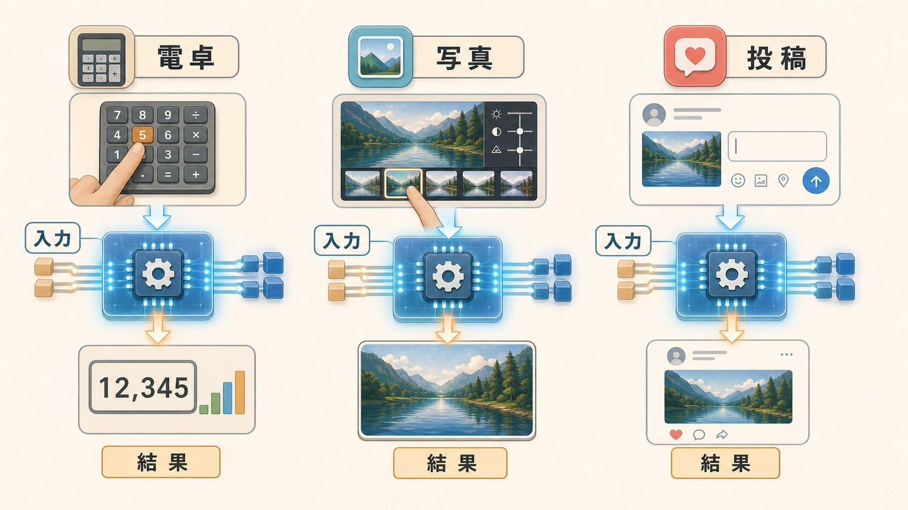
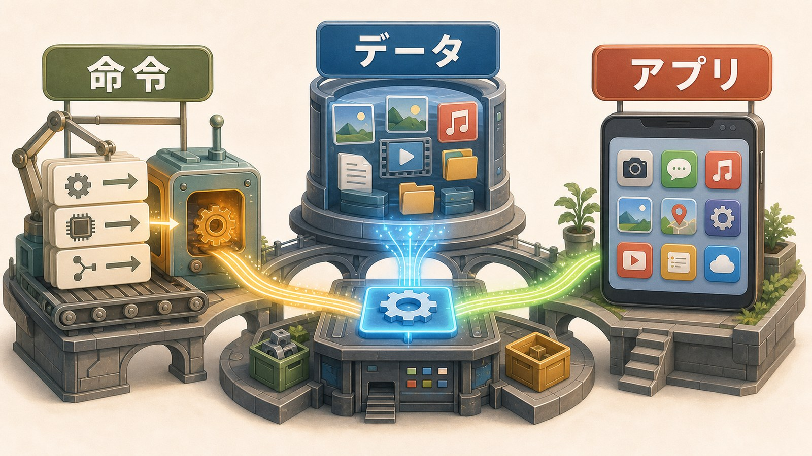

# 1ページ目：アプリとは何か：アイコンの奥にある命令とデータ

## アイコンは入口

スマホのホーム画面には、たくさんのアイコンが並んでいます。

電卓、写真、地図、SNS。

どれも、アイコンを押すと画面が開きます。

でも、アイコンそのものがアプリ本体ではありません。

アイコンは、アプリを開くための入口です。

画面に見えている絵の奥に、命令とデータのまとまりがあります。

そのまとまりが、端末の保存場所に置かれています。

アイコンを押すと、そのまとまりをOSが見つけます。

そして、使える状態へ読み込みます。

## アプリは命令とデータのまとまり

アプリは、ソフトウェアです。

ソフトウェアとは、コンピュータにしてほしい手順や、その手順で使うデータのまとまりです。

電卓アプリなら、数字ボタンを押したときに計算する命令があります。

写真アプリなら、画像データを読み、明るさや色を変える命令があります。

SNSアプリなら、文字や写真を投稿画面に並べる命令があります。

命令だけでは、画面はできません。

画面の部品、アイコン画像、音、設定情報も必要です。

アプリは、それらをひとまとまりにして持っています。

## 入力を受け取り、処理して返す

アプリが動くとき、入口には入力があります。

人が数字を押す。

写真を選ぶ。

文字を打つ。

位置を知りたいと頼む。

アプリは、その入力を受け取ります。

そして、持っている命令に沿ってデータを処理します。

処理の結果は、画面、音、保存されたファイルとして返ります。

つまりアプリは、入力を受け、データを処理し、結果を返すものです。

## アプリだけでは端末全体を扱えない

ここで、一つ気になることがあります。

写真アプリは、写真ファイルを開きます。

地図アプリは、位置情報を使います。

SNSアプリは、キーボード入力を受け取ります。

どれも、端末の共通のものを使っています。

画面、保存場所、カメラ、キーボード、スピーカー。

これらを、アプリがそれぞれ勝手に取り合うと困ります。

どのアプリに画面を使わせるのか。

どの入力を、どのアプリへ渡すのか。

共通に決める係がいなければ、同じ端末の中でアプリ同士がぶつかります。

だから、間に管理する仕組みが必要になります。

その中心にいるのがOSです。

## 別々のアプリにも同じ型がある

電卓と写真アプリは、見た目がまったく違います。

地図アプリとSNSアプリも、使う目的は違います。

それでも、中の型は似ています。

電卓は、数字の入力を受けて計算結果を返します。

写真アプリは、画像データを受けて加工した画像を返します。

地図アプリは、場所の入力を受けて地図を返します。

アプリごとに命令は違います。

けれど、データを受け取って処理するという見方は共通しています。

## 第1巻と第2巻がここでつながる

第1巻では、コンピュータが命令を順番に実行することを見ました。

第2巻では、文字や画像や音がデータとして表せることを見ました。

アプリは、その二つが出会う場所です。

命令が、データを処理します。

処理されたデータが、画面や音として返ってきます。

いつものアイコンの奥には、命令とデータがあります。

その命令とデータが端末の共通部分を使うために、OSが必要になります。

