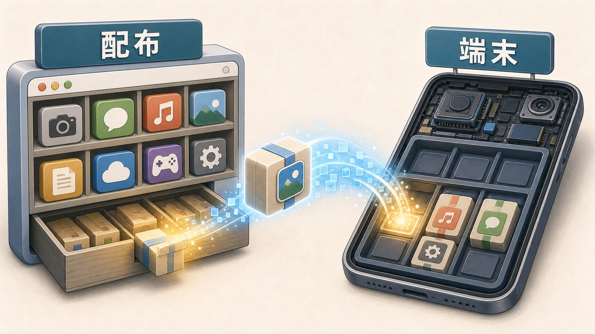
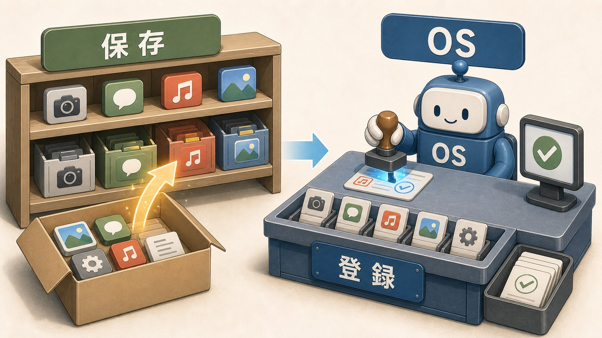
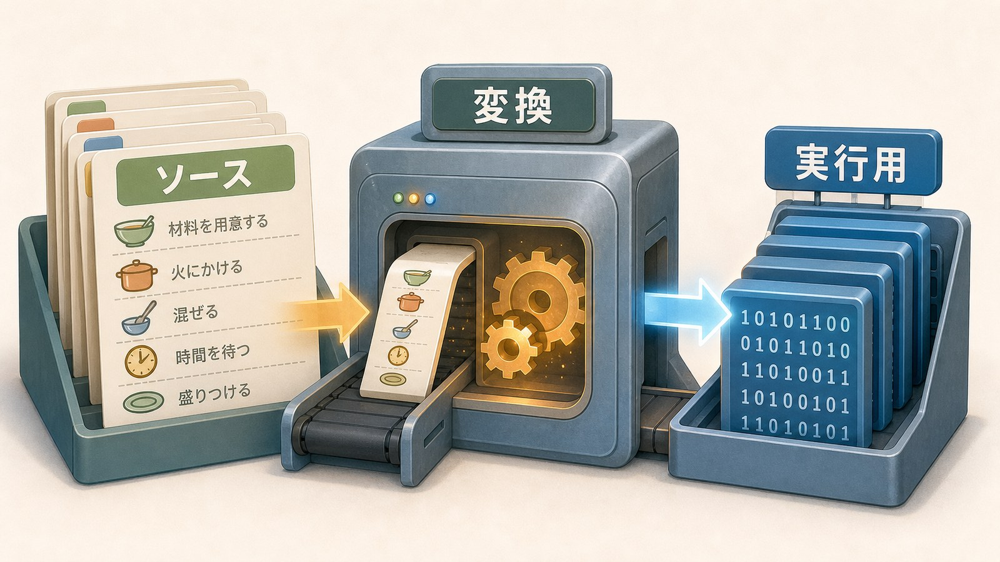
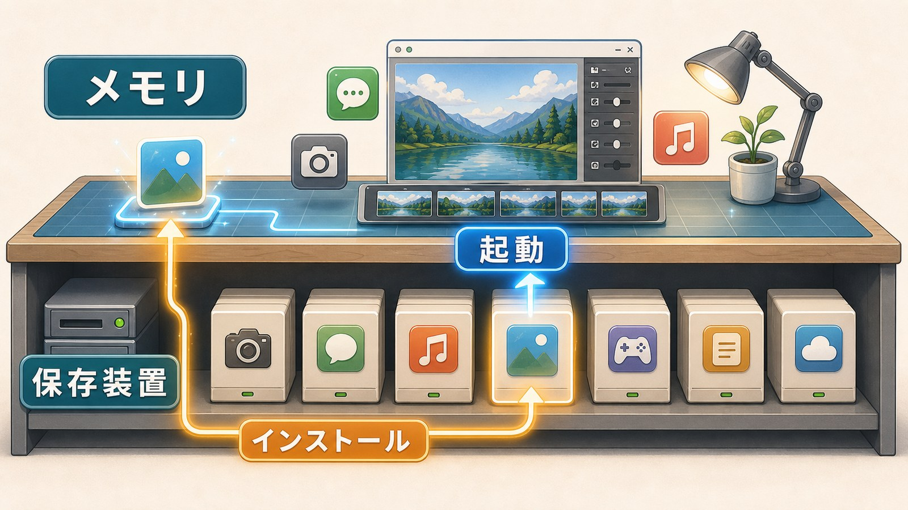
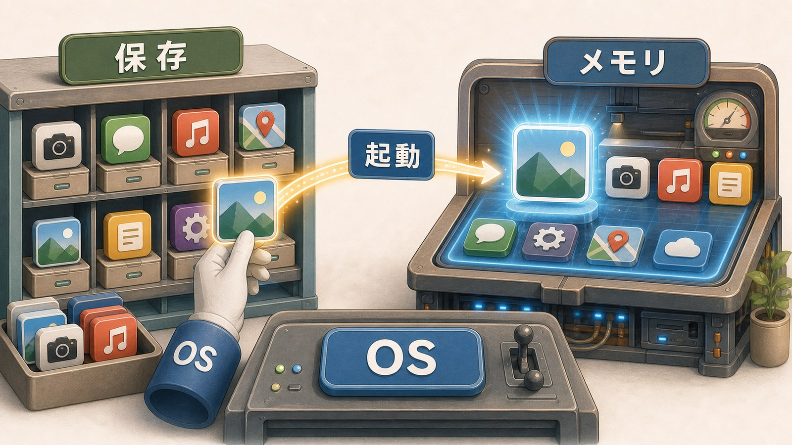

# 2ページ目：インストールと起動：置くことと動かすことは違う

## アプリストアから端末へ届く

アプリストアで「入手」や「インストール」を押します。

すると、アプリのデータが端末へ届きます。

この段階で届くのは、画面に出るアイコンだけではありません。

アプリ本体があります。

画面に使う素材があります。

設定情報もあります。

OSがあとで起動するときに読む情報も含まれます。

この受け取りが、ダウンロードです。

ダウンロードは、外にあるデータを端末へ持ってくることです。

まだ、この時点では使える状態とは限りません。

## インストールはOSへ登録する

インストールは、アプリを端末で使えるようにする作業です。

アプリ本体や素材を、保存場所に置きます。

設定や権限の情報も用意します。

OSは、そのアプリがどこにあり、どんな名前で、どう起動すればよいかを知っておく必要があります。

そのため、ただファイルを置くだけでは足りないことがあります。

この登録があると、OSはそのアプリを一覧に出せます。

起動方法も選びやすくなります。

保存場所にデータがあるだけでは、使えるアプリとして扱いにくいのです。

OSが使えるように登録されます。

ホーム画面やアプリ一覧に現れるのも、この登録と関係します。

この登録があるから、アイコンを押したときに目的のアプリへたどれます。

## 作ったプログラムは配れる形になる

アプリは、もともとは人が書いたプログラムから作られます。

そのままでは、端末で動かす形とは違うことがあります。

そこで、配ったり実行したりしやすい形へ変換します。

この変換の代表が、コンパイルです。

変換前の、人間が読んで編集しやすいプログラムをソースコードと呼びます。

変換後の、端末が実行しやすいデータをバイナリと呼ぶことがあります。

ここで大事なのは、作る形と、配る形と、動かす形が同じとは限らないことです。

## 保存装置とメモリ

端末には、保存する場所があります。

SSDやHDDのような記憶装置です。

ここには、アプリ本体や写真や文書が残ります。

一方で、起動中の作業に使う場所があります。

それがメモリです。

保存装置は、あとで取り出すための場所です。

メモリは、いま動かしている作業のための場所です。

インストールは、主に保存装置に置いてOSへ登録する話です。

起動は、保存装置から必要なものをメモリへ読み込む話です。

## 起動は読み込んで動かすこと

アイコンを押すと、OSがアプリを起動します。

OSは、登録された情報を使ってアプリ本体を見つけます。

そして、必要な命令やデータをメモリへ読み込みます。

読み込まれたアプリは、プロセスとして動き始めます。

プロセスは、起動中のアプリをOSが管理する単位です。

詳しくは次のページで見ます。

インストール済みでも、起動していないアプリは保存装置にあります。

起動したときに、OSが読み込み、動かし始めます。

## 置くことと動かすことは違う

ダウンロードは、外から端末へ受け取ることです。

インストールは、端末で使えるように置いて登録することです。

起動は、登録されたアプリを読み込み、動かし始めることです。

この三つを分けると、OSの役割が見えてきます。

OSは、保存場所を管理します。

アプリの登録を管理します。

起動時には、メモリへ読み込んで動かします。

置くことと、動かすことは違います。

その間をつないでいるのがOSです。

