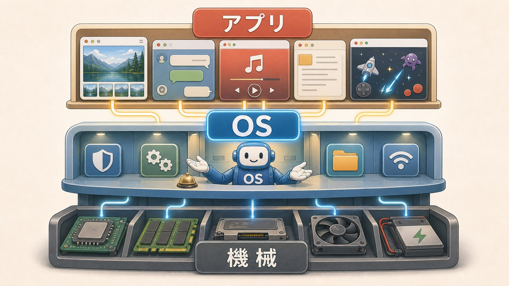
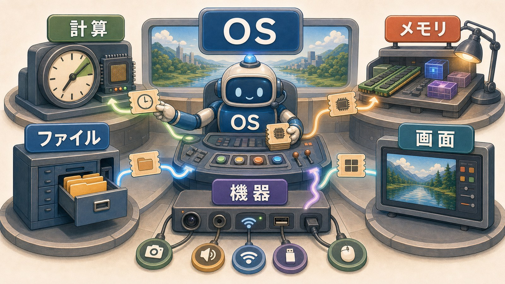
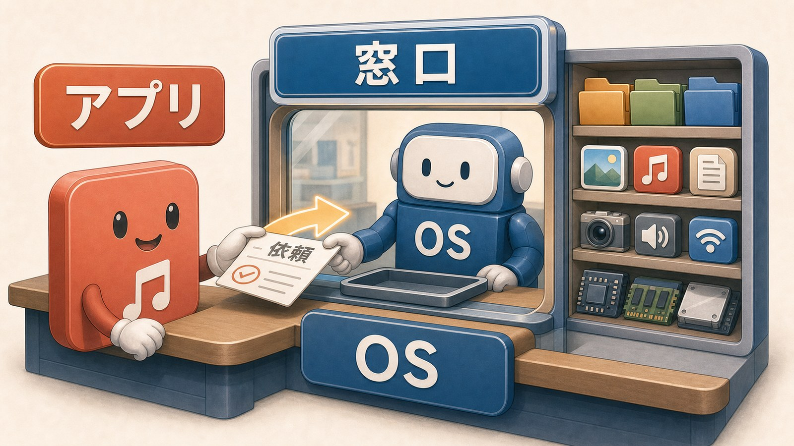
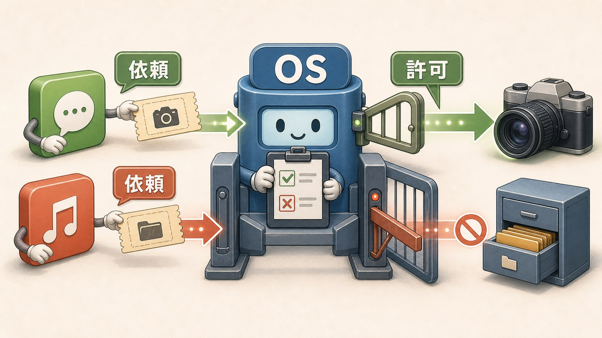
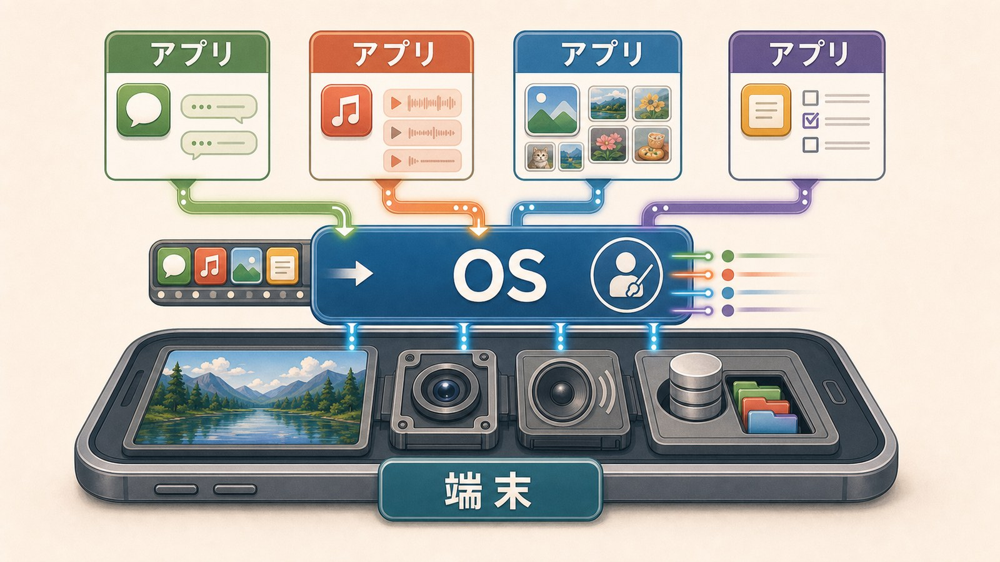

# 3ページ目：OSとAPI：アプリは窓口を通じてお願いする

## OSは間に立つ

アプリは、画面を出します。

ファイルを開きます。

音を鳴らします。

カメラを使います。

そう聞くと、アプリが端末の部品を直接動かしているように感じます。

実際には、一般的なスマホやPCでは、間にOSがいます。

OSは、オペレーティングシステムの略です。

アプリとハードウェアの間に立つ、基本ソフトウェアです。

## OSは端末の資源を管理する

端末の中には、CPU、メモリ、保存場所、画面、キーボード、タッチパネル、カメラがあります。

これらは、アプリが勝手に取り合うと困ります。

電卓アプリも、写真アプリも、SNSアプリも、同じ画面やメモリを使います。

同時に音を鳴らしたいアプリもあります。

共通の管理役がなければ、優先順位をアプリ同士で決めることになります。

それでは、画面も音も保存場所も衝突しやすくなります。

そこでOSが管理します。

OSは、どのアプリにどの資源を使わせるかを調整します。

ビルの管理人が、電気、水道、エレベーター、倉庫を管理するようなものです。

アプリは、そのビルの部屋を借りて仕事をする利用者です。

## APIはお願いの窓口

アプリは、OSに頼みごとをします。

ファイルを開きたい。

画面に文字を出したい。

音を鳴らしたい。

カメラを使いたい。

この頼みごとには、決まった呼び出し方があります。

その窓口をAPIと呼びます。

APIは、Application Programming Interfaceの略です。

ここでは、アプリがOSや他の機能にお願いするための決まった入口、と考えると十分です。

この入口があると、アプリは端末の細かい扱い方をすべて背負わずにすみます。

## システムコールという深い窓口

APIの中には、OSの深い部分へ依頼するものがあります。

ファイルを読む。

メモリを確保する。

別の処理を始める。

こうしたOSの中核に近い依頼を、システムコールと呼ぶことがあります。

名前は硬いですが、考え方は窓口です。

アプリが、直接倉庫の奥へ入るのではありません。

受付で必要な手続きをして、OS側に作業してもらいます。

この仕組みがあるから、アプリは端末ごとの細かい部品をすべて知る必要が減ります。

## 共存できる理由

同じ端末で、複数のアプリが動きます。

音楽を流しながら、地図を見て、メッセージも受け取れます。

それは、アプリが端末を丸ごと独占しているからではありません。

OSが間に立ち、順番や範囲を調整しているからです。

アプリは、やりたいことを決めます。

OSは、資源を管理し、許可し、実際の部品へつなぎます。

「アプリが保存する」「アプリがカメラを使う」という言い方は、日常の操作説明では十分に通じます。

仕組みとしては、アプリがOSの窓口へお願いしています。

そう見直すと、許可画面やOSアップデートの意味が少し見えてきます。

