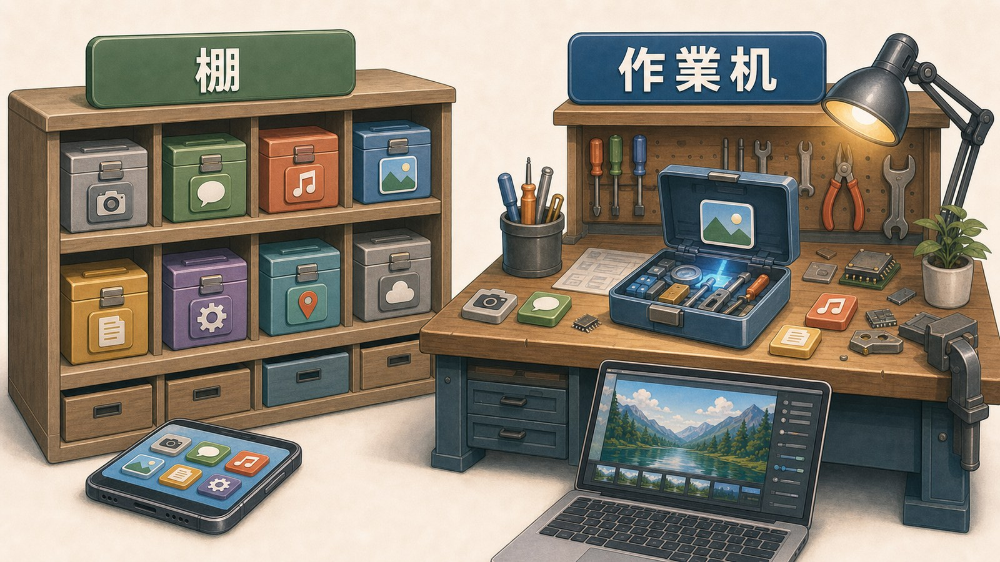
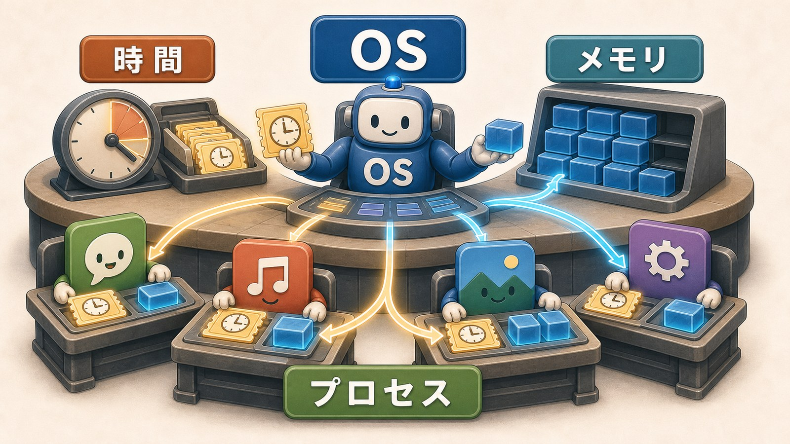
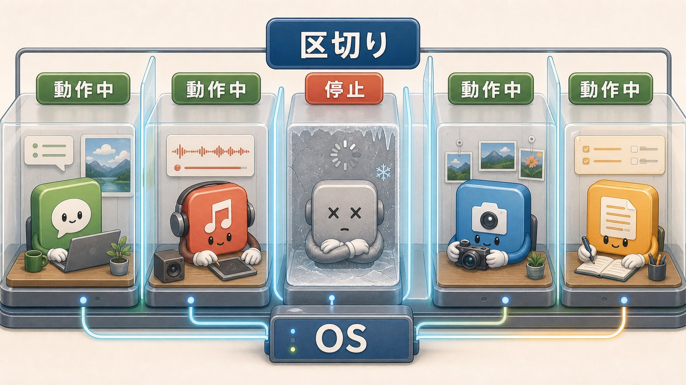

# 4ページ目：プロセスとメモリ：起動中のアプリには作業部屋がある

## 起動中のアプリを見る言葉

アプリを開くと、画面が出ます。

閉じると、画面は消えます。

裏で動き続けることもあります。

OSから見ると、起動中のアプリは管理する単位になります。

その単位を、プロセスと呼びます。

プロセスとは、OSから作業場所と実行の順番をもらって動いているプログラムです。

アプリそのものと完全に同じではありません。

アプリによっては、複数のプロセスを使うこともあります。

まずは、起動中のアプリをOSが扱う単位、と考えます。

## 保存場所は棚、メモリは机

前のページで、インストール済みのアプリは保存場所に置かれると見ました。

保存場所は、棚です。

アプリ本体や写真や文書を、あとで取り出せるようにしまいます。

一方、メモリは作業机です。

今使っている命令やデータを、一時的に広げます。

机の上は、作業が終われば片づけられます。

棚に保存することとは違います。

この違いが、ストレージとメモリの違いです。

ストレージは保存場所、メモリは作業中の場所です。

## OSが場所と順番を配る

スマホやPCでは、いくつものアプリが同時に動いているように見えます。

音楽を流しながら、ブラウザを開き、メッセージも受け取れます。

OSの割り当てがなければ、あるアプリが作業机を広げすぎるかもしれません。

CPUの時間を使い続けるかもしれません。

その裏で、OSはCPUの時間とメモリを配っています。

CPUは命令を実行する部品です。

メモリは、作業中のデータを置く場所です。

OSは、どのプロセスをどの順番で進めるかを調整します。

そして、どのプロセスがどれだけ作業場所を使うかも見ています。

作業場の係が、机と順番を割り当てるようなものです。

## 固まるときに何が止まるのか

アプリが重くなることがあります。

画面が反応しなくなることもあります。

それは、いつもメモリ不足だけが原因とは限りません。

処理に時間がかかっている。

入力への反応が詰まっている。

別の作業を待っている。

いろいろな原因があります。

ただし、プロセスとメモリの見方を持つと、何が止まっているのかを少し考えられます。

起動中の作業部屋で、命令の実行やデータの置き場に問題が起きているかもしれません。

## 区切ることで全体を守る

OSは、プロセスごとに作業場所を区切ります。

あるアプリが固まっても、端末全体を必ず巻き込むとは限りません。

区切りがあるから、他のアプリを守りやすくなります。

もちろん、OS自身や重要な処理が止まれば、端末全体に影響します。

それでも、アプリごとに管理する単位があることは大きな意味を持ちます。

「アプリを終了する」は、そのプロセスの作業を終えることに近い操作です。

「再起動する」は、作業部屋を作り直すことに近い操作です。

アプリが重い、固まった、開きすぎた。

そうした日常の言葉の裏に、プロセスとメモリの仕組みがあります。

