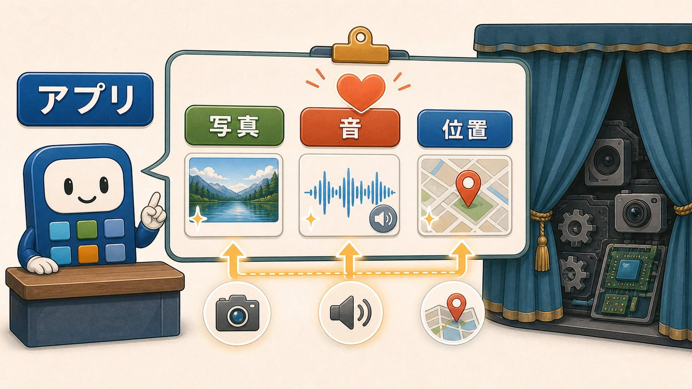
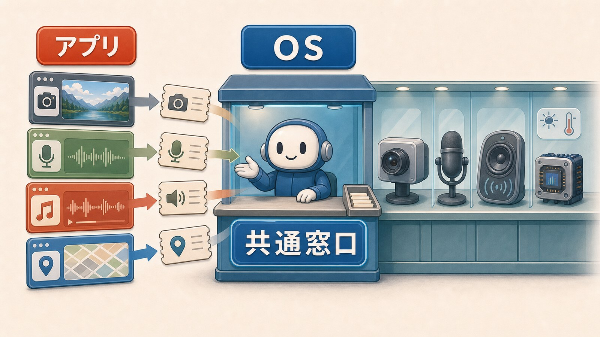
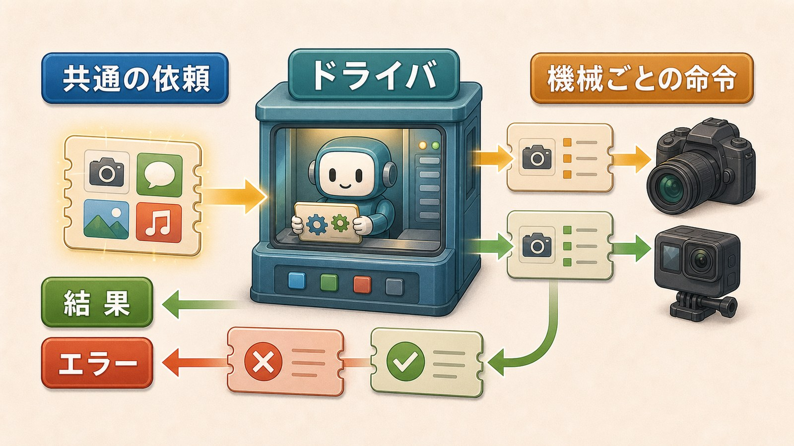
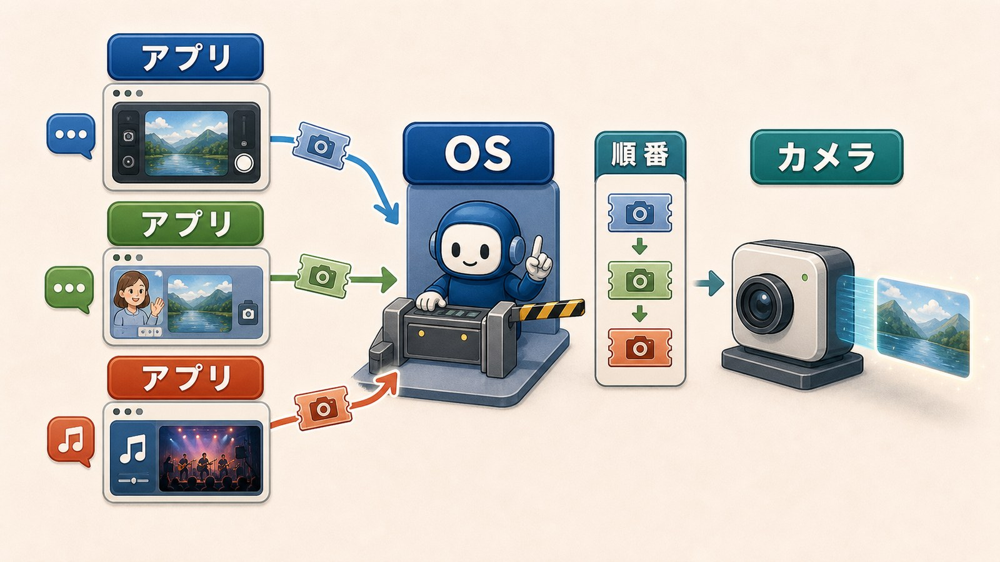
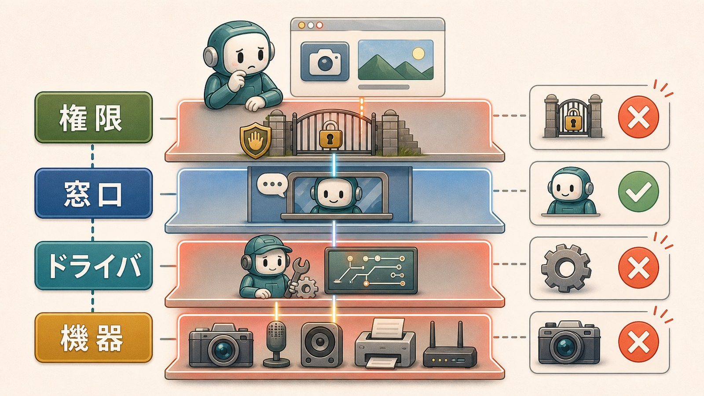

# 8ページ目：デバイスとドライバ：カメラやスピーカーを共通の窓口で使う

## アプリが欲しいのは、機械そのものではなく結果

スマホやPCには、カメラ、マイク、スピーカー、GPS、センサーのような機械がつながっています。

プリンタやイヤホンのように、あとからつなぐ機械もあります。

こうした機械を、デバイスと呼びます。

写真アプリに必要なのは、カメラから届く写真や映像です。

音楽アプリに必要なのは、スピーカーから出る音です。

同じ「使う」でも、デバイスごとに結果の作り方は違います。

## OSの窓口は、アプリの頼み方をそろえる

アプリは、OSの窓口へ目的を頼みます。

写真を撮りたい、音を鳴らしたい、位置を知りたい、印刷したい。

この窓口があると、アプリは機械ごとの細かな命令を全部持たずにすみます。

アプリ側の言葉は、目的です。

デバイス側の言葉は、機械ごとの命令、使える機能、返事の形です。

このずれをそのままアプリへ背負わせると、アプリは機械の種類ごとに作り分ける必要が出ます。

OSは、アプリに共通の頼み方を見せます。

## ドライバは機械ごとの扱い方をOSに足す

ドライバは、OSが特定のデバイスを扱うために読み込むソフトウェアです。

新しいプリンタやイヤホンをつないだとき、「ドライバ」「対応」「認識」という言葉を見ることがあります。

これは、OSにその機械の扱い方を足す話です。

たとえばプリンタなら、印刷開始の命令、紙のサイズ、両面印刷の有無、エラーの返し方が機種ごとに違います。

OSは「印刷する」という共通の依頼を受けます。

ドライバは、それをその機械に合う命令へ変えます。

さらに、その機械で使える機能や、返ってきた状態の読み方もOSへ伝えます。

ドライバは、機械ごとの命令表をOSに足す役目です。

## 結果やエラーも、戻ってくる

デバイスを使う流れは、行きだけではありません。

カメラなら、画像データが戻ります。

マイクなら、音声データが戻ります。

プリンタなら、印刷できたか、紙がないか、エラーが起きたかが戻ります。

OSは、ドライバを通じて、この返事を読める形にします。

アプリは、その結果を受け取って画面を更新します。

ビデオ通話なら、相手へ送る映像になります。

写真アプリなら、保存する写真になります。

ここまで含めて、アプリ、OS、ドライバ、デバイスの役割分担です。

## 同じデバイスを複数アプリが使える

同じカメラを、写真アプリ、ビデオ通話アプリ、QRコード読み取りアプリが使えます。

アプリごとにカメラを直接取り合う形だと、どのアプリが使っているのか管理しにくくなります。

OSが窓口を用意し、利用の順番や範囲を調整します。

必要なら、どのアプリに使わせるかも権限で確認します。

共通の窓口とドライバがあることで、アプリは目的に集中できます。

## 使えない原因を段で分ける

カメラが使えない、マイクが認識されない、イヤホンから音が出ない。

画面では、どれも「使えない」と見えます。

でも、疑う段は分けられます。

アプリに権限がないのか。

OSの窓口で止まっているのか。

ドライバがその機械に対応していないのか。

デバイスそのものが故障しているのか。

「アプリがカメラを動かす」という短い言い方の裏には、複数の段があります。

ドライバが見えると、機械の不調を一つの黒い箱ではなく、どの段で詰まっているのか考える足場にできます。

次のページでは、この中の権限を見ます。

