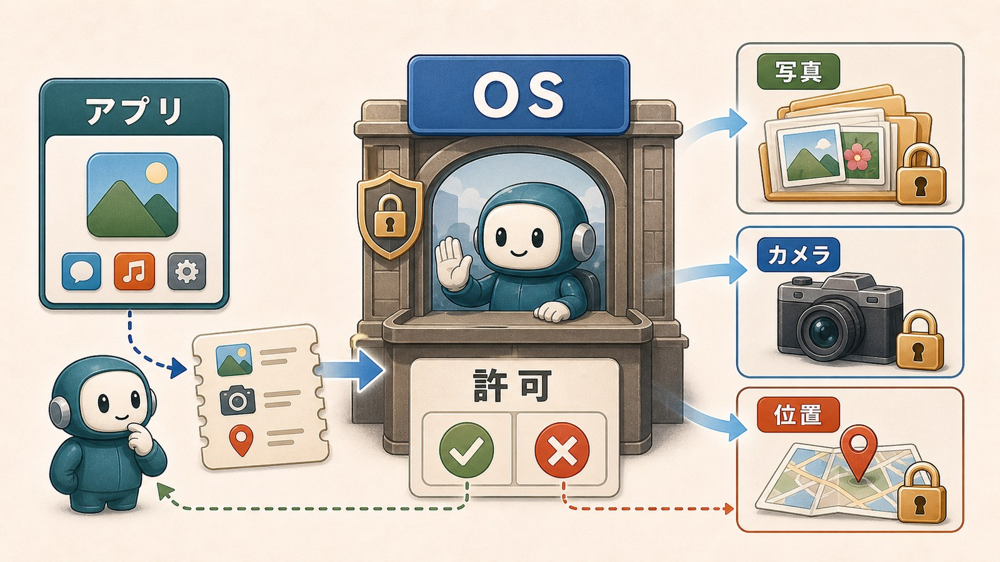
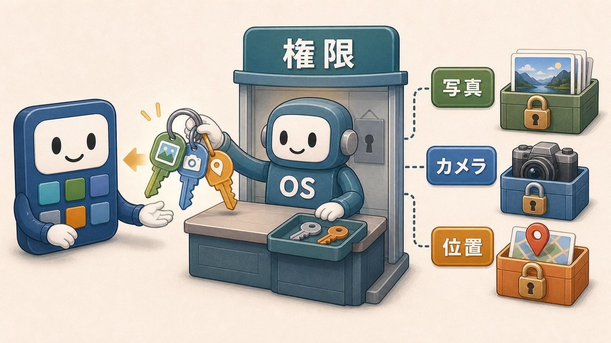
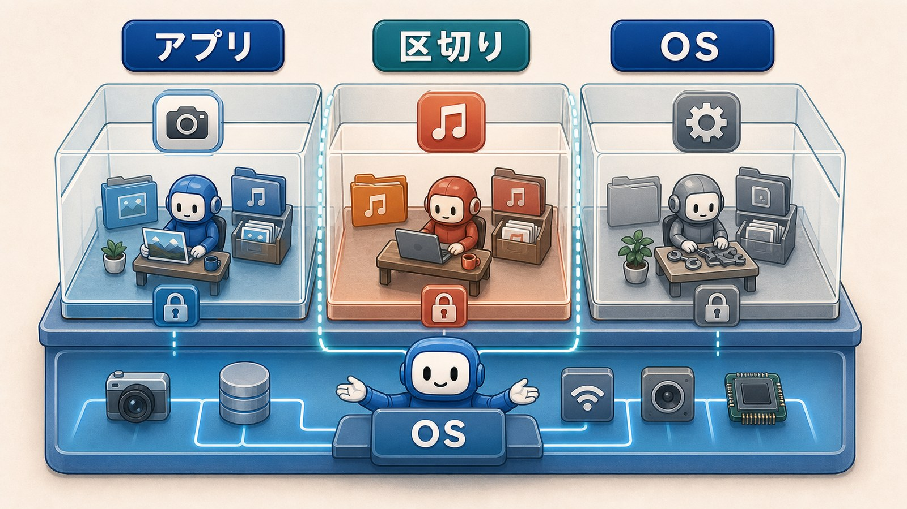
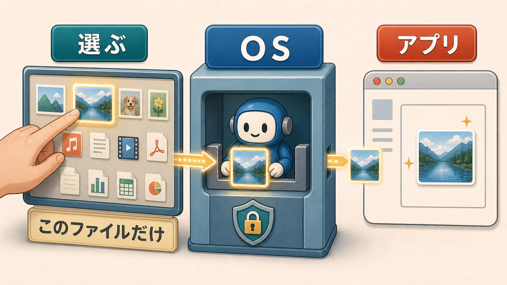

# 9ページ目：権限とサンドボックス：アプリの使える範囲を区切る

## 許可画面には意味がある

スマホでアプリを使うと、許可画面が出ることがあります。

写真へのアクセスを許可しますか。

カメラを使用してよいですか。

位置情報を使いますか。

マイクを使いますか。

この確認は、ただの邪魔な表示ではありません。

区切りがなければ、一度入れたアプリが写真へ広く触れやすくなります。

位置情報やマイクにも広く触れやすくなります。

アプリがどの機能やデータを使ってよいかを、OSが区切っている場面です。

その使ってよい範囲を、権限と呼びます。

## 権限は鍵のようなもの

権限は、部屋や倉庫に入るための鍵に似ています。

アプリが写真を選びたいなら、写真への鍵が必要です。

カメラを使いたいなら、カメラへの鍵が必要です。

位置情報を使いたいなら、位置情報への鍵が必要です。

鍵がなければ、アプリはその場所や機能へ進めません。

もちろん、鍵を渡せば完全に安全という意味ではありません。

それでも、何でも自由に見られる状態より、範囲を区切れます。

権限は、便利さと安全の間に置かれた約束です。

## サンドボックスは区切られた作業場所

アプリが端末の中を何でも自由に見られると、便利ではあります。

でも、危険も大きくなります。

悪いアプリや壊れたアプリが、関係のないファイルまで触るかもしれません。

そこで、アプリごとに動ける範囲を区切る考え方があります。

それがサンドボックスです。

ここでは、柵で区切られた作業場所と考えます。

アプリは、自分の作業場所で動きます。

外のデータやデバイスが必要なときは、OSの窓口を通ります。

## OSが安全な受け渡しを用意する

写真を投稿するとき、アプリが写真フォルダ全体を自由に読むとは限りません。

OSが写真選択画面を出すことがあります。

そこでユーザーが選んだ写真だけを、アプリに渡します。

ファイル選択画面も似ています。

アプリが端末全体を探し回るのではなく、OSの画面を通して選んだものを受け取ります。

共有ボタンも、直接相手のアプリへ投げ込むというより、OSの受け渡しの仕組みを使うことがあります。

受付を通して、必要な荷物だけを渡すようなものです。

この仕組みが、便利さと安全を両立しやすくします。

## 区切るから不便に見えることもある

権限やサンドボックスは、完璧な安全を保証する魔法ではありません。

ユーザーが判断しにくい許可もあります。

アプリやOSに弱点があることもあります。

それでも、使える範囲を区切る考え方は大切です。

同じ写真でも、アプリによって見えたり見えなかったりすることがあります。

それは不具合ではなく、区切りの結果かもしれません。

許可画面は、アプリとOSの役割分担が表に出たものです。

アプリが何でもできるのではなく、OSが範囲を決め、必要なときに鍵を渡します。

そう見ると、いつもの確認画面が、端末を守る仕組みとして見え直します。

