# 10ページ大学 情報学部 第3巻

OSはスマホやPCの中で何をやっているのか

アプリ・画面・入力・ファイルの裏側を、10ページでつかむ

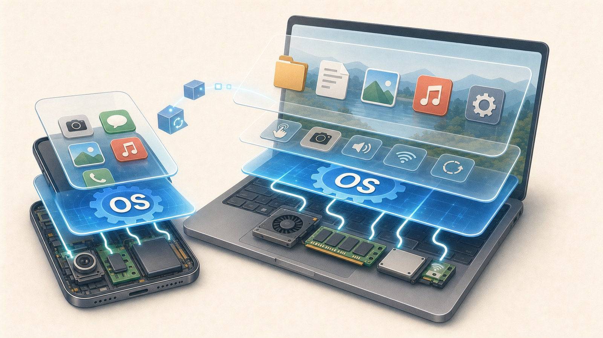

---

## はじめに

スマホで料理の写真を撮る。

写真アプリで明るさを少し変える。

SNSアプリを開いて、写真を選ぶ。

文字を入れようとすると、キーボードが出る。

投稿前に、写真へのアクセス許可を求められる。

あとで、アプリのアップデート通知も届く。

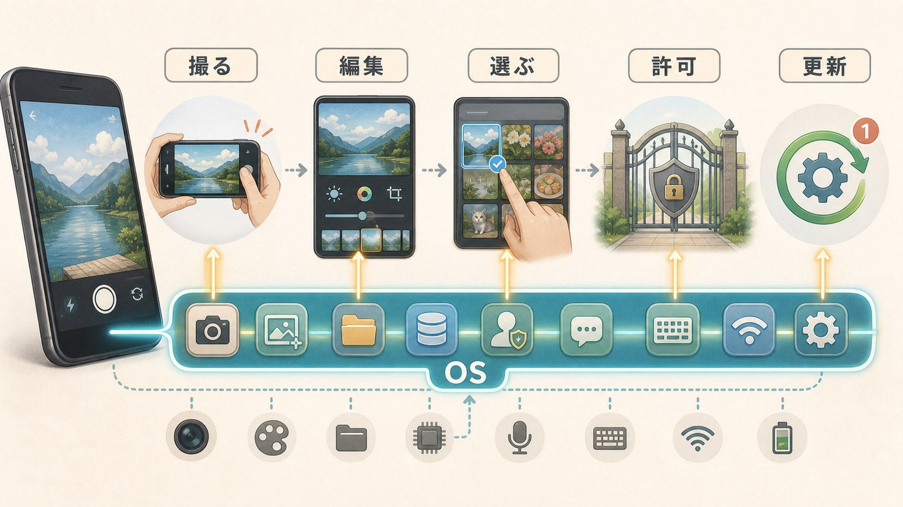

画面の上では、ただアプリを使っているだけに見えます。

間にOSのような仲介役がいないとします。

すると、アプリごとに写真の場所、画面の使い方、入力の受け取り方を自分で決めることになります。

けれど裏側では、OSがアプリを起動し、写真ファイルを探し、画面を描き、タップや文字入力を届け、カメラや写真へのアクセスを許可で区切っています。

第2巻では、文字、画像、音が0と1のデータとして表せることを見ました。

この巻では、そのデータを、アプリとOSがどう扱っているのかを見ていきます。

---

## 1ページ目：アプリとは何か：アイコンの奥にある命令とデータ

### アイコンは入口

スマホのホーム画面には、たくさんのアイコンが並んでいます。

電卓、写真、地図、SNS。

どれも、アイコンを押すと画面が開きます。

でも、アイコンそのものがアプリ本体ではありません。

アイコンは、アプリを開くための入口です。

画面に見えている絵の奥に、命令とデータのまとまりがあります。

そのまとまりが、端末の保存場所に置かれています。

アイコンを押すと、そのまとまりをOSが見つけます。

そして、使える状態へ読み込みます。

### アプリは命令とデータのまとまり

アプリは、ソフトウェアです。

ソフトウェアとは、コンピュータにしてほしい手順や、その手順で使うデータのまとまりです。

電卓アプリなら、数字ボタンを押したときに計算する命令があります。

写真アプリなら、画像データを読み、明るさや色を変える命令があります。

SNSアプリなら、文字や写真を投稿画面に並べる命令があります。

命令だけでは、画面はできません。

画面の部品、アイコン画像、音、設定情報も必要です。

アプリは、それらをひとまとまりにして持っています。

### 入力を受け取り、処理して返す

アプリが動くとき、入口には入力があります。

人が数字を押す。

写真を選ぶ。

文字を打つ。

位置を知りたいと頼む。

アプリは、その入力を受け取ります。

そして、持っている命令に沿ってデータを処理します。

処理の結果は、画面、音、保存されたファイルとして返ります。

つまりアプリは、入力を受け、データを処理し、結果を返すものです。

### アプリだけでは端末全体を扱えない

ここで、一つ気になることがあります。

写真アプリは、写真ファイルを開きます。

地図アプリは、位置情報を使います。

SNSアプリは、キーボード入力を受け取ります。

どれも、端末の共通のものを使っています。

画面、保存場所、カメラ、キーボード、スピーカー。

これらを、アプリがそれぞれ勝手に取り合うと困ります。

どのアプリに画面を使わせるのか。

どの入力を、どのアプリへ渡すのか。

共通に決める係がいなければ、同じ端末の中でアプリ同士がぶつかります。

だから、間に管理する仕組みが必要になります。

その中心にいるのがOSです。

### 別々のアプリにも同じ型がある

電卓と写真アプリは、見た目がまったく違います。

地図アプリとSNSアプリも、使う目的は違います。

それでも、中の型は似ています。

電卓は、数字の入力を受けて計算結果を返します。

写真アプリは、画像データを受けて加工した画像を返します。

地図アプリは、場所の入力を受けて地図を返します。

アプリごとに命令は違います。

けれど、データを受け取って処理するという見方は共通しています。

### 第1巻と第2巻がここでつながる

第1巻では、コンピュータが命令を順番に実行することを見ました。

第2巻では、文字や画像や音がデータとして表せることを見ました。

アプリは、その二つが出会う場所です。

命令が、データを処理します。

処理されたデータが、画面や音として返ってきます。

いつものアイコンの奥には、命令とデータがあります。

その命令とデータが端末の共通部分を使うために、OSが必要になります。

---

## 2ページ目：インストールと起動：置くことと動かすことは違う

### アプリストアから端末へ届く

アプリストアで「入手」や「インストール」を押します。

すると、アプリのデータが端末へ届きます。

この段階で届くのは、画面に出るアイコンだけではありません。

アプリ本体があります。

画面に使う素材があります。

設定情報もあります。

OSがあとで起動するときに読む情報も含まれます。

この受け取りが、ダウンロードです。

ダウンロードは、外にあるデータを端末へ持ってくることです。

まだ、この時点では使える状態とは限りません。

### インストールはOSへ登録する

インストールは、アプリを端末で使えるようにする作業です。

アプリ本体や素材を、保存場所に置きます。

設定や権限の情報も用意します。

OSは、そのアプリがどこにあり、どんな名前で、どう起動すればよいかを知っておく必要があります。

そのため、ただファイルを置くだけでは足りないことがあります。

この登録があると、OSはそのアプリを一覧に出せます。

起動方法も選びやすくなります。

保存場所にデータがあるだけでは、使えるアプリとして扱いにくいのです。

OSが使えるように登録されます。

ホーム画面やアプリ一覧に現れるのも、この登録と関係します。

この登録があるから、アイコンを押したときに目的のアプリへたどれます。

### 作ったプログラムは配れる形になる

アプリは、もともとは人が書いたプログラムから作られます。

そのままでは、端末で動かす形とは違うことがあります。

そこで、配ったり実行したりしやすい形へ変換します。

この変換の代表が、コンパイルです。

変換前の、人間が読んで編集しやすいプログラムをソースコードと呼びます。

変換後の、端末が実行しやすいデータをバイナリと呼ぶことがあります。

ここで大事なのは、作る形と、配る形と、動かす形が同じとは限らないことです。

### 保存装置とメモリ

端末には、保存する場所があります。

SSDやHDDのような記憶装置です。

ここには、アプリ本体や写真や文書が残ります。

一方で、起動中の作業に使う場所があります。

それがメモリです。

保存装置は、あとで取り出すための場所です。

メモリは、いま動かしている作業のための場所です。

インストールは、主に保存装置に置いてOSへ登録する話です。

起動は、保存装置から必要なものをメモリへ読み込む話です。

### 起動は読み込んで動かすこと

アイコンを押すと、OSがアプリを起動します。

OSは、登録された情報を使ってアプリ本体を見つけます。

そして、必要な命令やデータをメモリへ読み込みます。

読み込まれたアプリは、プロセスとして動き始めます。

プロセスは、起動中のアプリをOSが管理する単位です。

詳しくは次のページで見ます。

インストール済みでも、起動していないアプリは保存装置にあります。

起動したときに、OSが読み込み、動かし始めます。

### 置くことと動かすことは違う

ダウンロードは、外から端末へ受け取ることです。

インストールは、端末で使えるように置いて登録することです。

起動は、登録されたアプリを読み込み、動かし始めることです。

この三つを分けると、OSの役割が見えてきます。

OSは、保存場所を管理します。

アプリの登録を管理します。

起動時には、メモリへ読み込んで動かします。

置くことと、動かすことは違います。

その間をつないでいるのがOSです。

---

## 3ページ目：OSとAPI：アプリは窓口を通じてお願いする

### OSは間に立つ

アプリは、画面を出します。

ファイルを開きます。

音を鳴らします。

カメラを使います。

そう聞くと、アプリが端末の部品を直接動かしているように感じます。

実際には、一般的なスマホやPCでは、間にOSがいます。

OSは、オペレーティングシステムの略です。

アプリとハードウェアの間に立つ、基本ソフトウェアです。

### OSは端末の資源を管理する

端末の中には、CPU、メモリ、保存場所、画面、キーボード、タッチパネル、カメラがあります。

これらは、アプリが勝手に取り合うと困ります。

電卓アプリも、写真アプリも、SNSアプリも、同じ画面やメモリを使います。

同時に音を鳴らしたいアプリもあります。

共通の管理役がなければ、優先順位をアプリ同士で決めることになります。

それでは、画面も音も保存場所も衝突しやすくなります。

そこでOSが管理します。

OSは、どのアプリにどの資源を使わせるかを調整します。

ビルの管理人が、電気、水道、エレベーター、倉庫を管理するようなものです。

アプリは、そのビルの部屋を借りて仕事をする利用者です。

### APIはお願いの窓口

アプリは、OSに頼みごとをします。

ファイルを開きたい。

画面に文字を出したい。

音を鳴らしたい。

カメラを使いたい。

この頼みごとには、決まった呼び出し方があります。

その窓口をAPIと呼びます。

APIは、Application Programming Interfaceの略です。

ここでは、アプリがOSや他の機能にお願いするための決まった入口、と考えると十分です。

この入口があると、アプリは端末の細かい扱い方をすべて背負わずにすみます。

### システムコールという深い窓口

APIの中には、OSの深い部分へ依頼するものがあります。

ファイルを読む。

メモリを確保する。

別の処理を始める。

こうしたOSの中核に近い依頼を、システムコールと呼ぶことがあります。

名前は硬いですが、考え方は窓口です。

アプリが、直接倉庫の奥へ入るのではありません。

受付で必要な手続きをして、OS側に作業してもらいます。

この仕組みがあるから、アプリは端末ごとの細かい部品をすべて知る必要が減ります。

### 共存できる理由

同じ端末で、複数のアプリが動きます。

音楽を流しながら、地図を見て、メッセージも受け取れます。

それは、アプリが端末を丸ごと独占しているからではありません。

OSが間に立ち、順番や範囲を調整しているからです。

アプリは、やりたいことを決めます。

OSは、資源を管理し、許可し、実際の部品へつなぎます。

「アプリが保存する」「アプリがカメラを使う」という言い方は、日常の操作説明では十分に通じます。

仕組みとしては、アプリがOSの窓口へお願いしています。

そう見直すと、許可画面やOSアップデートの意味が少し見えてきます。

---

## 4ページ目：プロセスとメモリ：起動中のアプリには作業部屋がある

### 起動中のアプリを見る言葉

アプリを開くと、画面が出ます。

閉じると、画面は消えます。

裏で動き続けることもあります。

OSから見ると、起動中のアプリは管理する単位になります。

その単位を、プロセスと呼びます。

プロセスとは、OSから作業場所と実行の順番をもらって動いているプログラムです。

アプリそのものと完全に同じではありません。

アプリによっては、複数のプロセスを使うこともあります。

まずは、起動中のアプリをOSが扱う単位、と考えます。

### 保存場所は棚、メモリは机

前のページで、インストール済みのアプリは保存場所に置かれると見ました。

保存場所は、棚です。

アプリ本体や写真や文書を、あとで取り出せるようにしまいます。

一方、メモリは作業机です。

今使っている命令やデータを、一時的に広げます。

机の上は、作業が終われば片づけられます。

棚に保存することとは違います。

この違いが、ストレージとメモリの違いです。

ストレージは保存場所、メモリは作業中の場所です。

### OSが場所と順番を配る

スマホやPCでは、いくつものアプリが同時に動いているように見えます。

音楽を流しながら、ブラウザを開き、メッセージも受け取れます。

OSの割り当てがなければ、あるアプリが作業机を広げすぎるかもしれません。

CPUの時間を使い続けるかもしれません。

その裏で、OSはCPUの時間とメモリを配っています。

CPUは命令を実行する部品です。

メモリは、作業中のデータを置く場所です。

OSは、どのプロセスをどの順番で進めるかを調整します。

そして、どのプロセスがどれだけ作業場所を使うかも見ています。

作業場の係が、机と順番を割り当てるようなものです。

### 固まるときに何が止まるのか

アプリが重くなることがあります。

画面が反応しなくなることもあります。

それは、いつもメモリ不足だけが原因とは限りません。

処理に時間がかかっている。

入力への反応が詰まっている。

別の作業を待っている。

いろいろな原因があります。

ただし、プロセスとメモリの見方を持つと、何が止まっているのかを少し考えられます。

起動中の作業部屋で、命令の実行やデータの置き場に問題が起きているかもしれません。

### 区切ることで全体を守る

OSは、プロセスごとに作業場所を区切ります。

あるアプリが固まっても、端末全体を必ず巻き込むとは限りません。

区切りがあるから、他のアプリを守りやすくなります。

もちろん、OS自身や重要な処理が止まれば、端末全体に影響します。

それでも、アプリごとに管理する単位があることは大きな意味を持ちます。

「アプリを終了する」は、そのプロセスの作業を終えることに近い操作です。

「再起動する」は、作業部屋を作り直すことに近い操作です。

アプリが重い、固まった、開きすぎた。

そうした日常の言葉の裏に、プロセスとメモリの仕組みがあります。

---

## 5ページ目：ファイルとフォルダ：データには名前と場所がいる

### データはファイルとして扱われる

第2巻では、文字、画像、音声、動画がデータになることを見ました。

では、そのデータは端末の中でどう扱われるのでしょうか。

多くの場合、ファイルとして保存されます。

ファイルとは、データに名前をつけ、形式や場所と一緒に扱えるようにした単位です。

写真なら、画像データがあります。

文書なら、文字のデータがあります。

そこに名前や形式がつくことで、アプリやOSが探せる単位になります。

ただの数字の並びだけでは、あとから見つけるのが難しいのです。

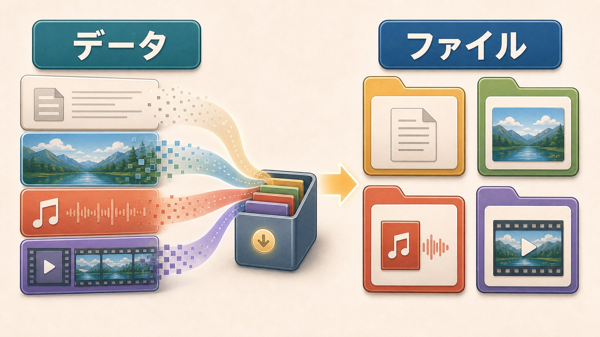

### ファイルには名前と形式がある

ファイルには、名前があります。

たとえば、`memo.txt` や `photo.jpg` のような名前です。

名前の後ろの部分は、形式の手がかりになることがあります。

`txt` なら文字中心のファイル。

`jpg` なら画像のファイル。

形式は、データをどう読むかの約束です。

第2巻で見たように、同じ0と1の並びでも、読み方の約束がなければ意味を戻せません。

ファイルは、データと名前と形式を結びつけます。

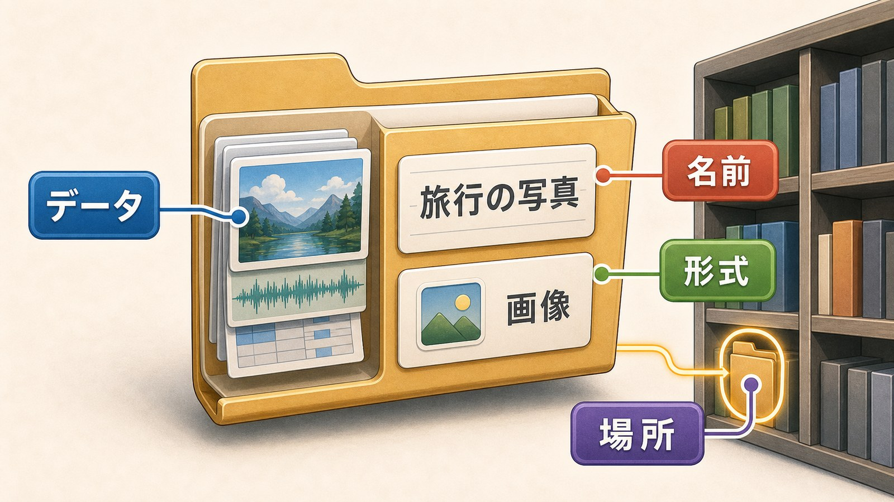

### フォルダとパスは場所を示す

ファイルには、あとでたどるための場所があります。

画面では、フォルダの中に入っているように見えます。

フォルダは、ファイルをまとめる入れ物として見える仕組みです。

技術的には、ファイルの名前や場所をたどるための管理情報です。

さらに、その場所を示す住所のようなものがあります。

それがパスです。

パスは、どのフォルダをたどれば目的のファイルへ行けるかを示します。

家の住所が、都道府県、市区町村、番地で場所を絞るようなものです。

ファイルの場所も、順番にたどれる形で表せます。

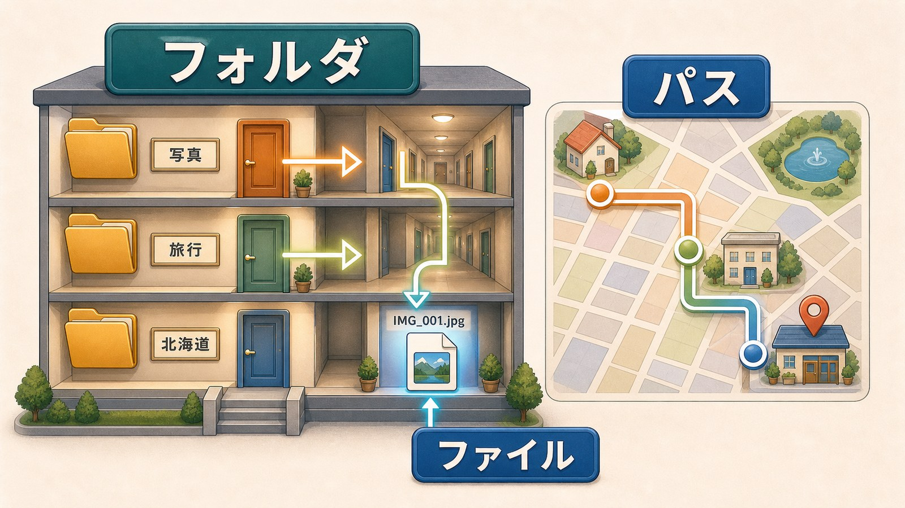

### ファイルシステムが管理する

ファイルの中身は、SSDやHDDのようなストレージに記録されます。

ストレージは、0と1を長く残しておくための記憶装置です。

ただし、ストレージの上に数字の並びがあるだけでは、人間には探せません。

共通の管理方法があると、名前の付け方をそろえられます。

場所の探し方もそろえられます。

そこで、OSはファイルシステムを使います。

ファイルシステムとは、データを保存し、名前や場所で探せるようにする仕組みです。

図書館を考えると近いです。

本そのものだけではなく、棚番号や目録があるから本を探せます。

ファイルも同じです。

中身のデータだけでなく、名前、場所、作成日時、サイズなどの情報が管理されます。

ファイルシステムは、名前と場所の情報を持ちます。

そして、そのファイルの中身がストレージのどこにあるかも管理します。

アプリがファイルを開くときも、多くの場合、OSの窓口を通じてこの仕組みに頼ります。

アプリが勝手に端末全体を歩き回るわけではありません。

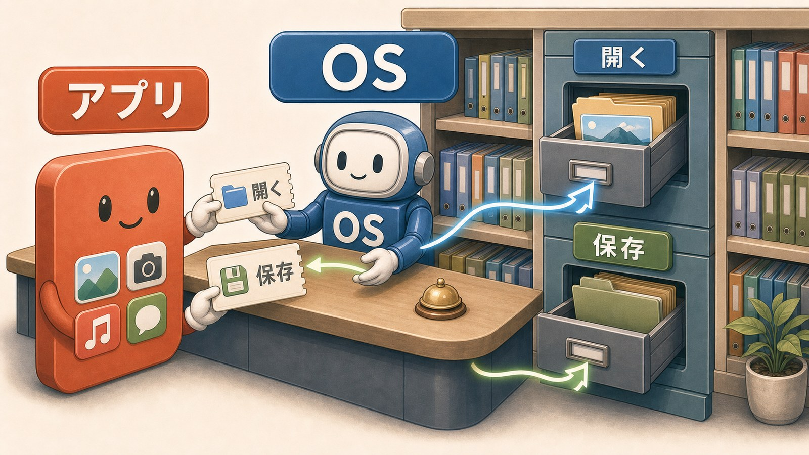

### 見つからないは、たどれないということ

「保存したはずなのに見つからない」ということがあります。

画面の上の「見つからない」は、ストレージ全体を目で探した結果ではありません。

OSやアプリは、名前、パス、形式、権限を手がかりにしてファイルを探します。

つまり、見つからないとは、今の手がかりではたどれないということです。

パスが違えば、住所違いです。

名前が違えば、検索の手がかりが外れます。

権限が違えば、そのアプリからは見えません。

形式が合わなければ、見つかっても開けません。

ファイルは、データ、名前、場所、形式、権限がそろって扱いやすくなります。

画面の「見つからない」や「開けない」は、このどこかを解決できていない表示です。

保存するとは、データを記録し、あとでたどれるようにすることです。

そう見ると、ファイルはただのアイコンではなく、OSが名前と住所を管理するデータに見えてきます。

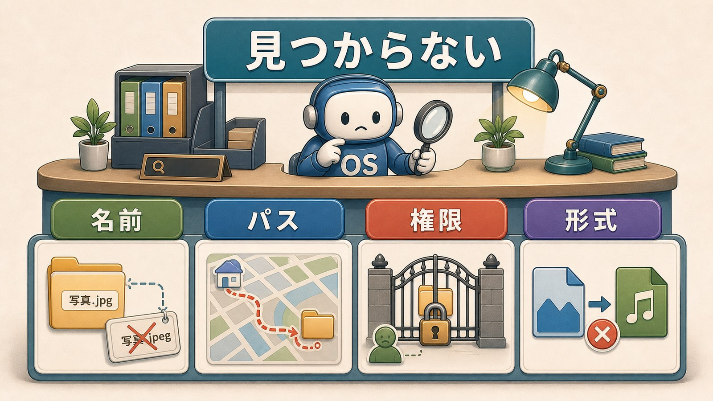

---

## 6ページ目：画面表示とGUI：ボタンは絵と状態と処理でできている

### 画面のボタンは、領域と約束で動く

スマホの画面には、ボタンが出ます。

送信ボタン、戻るボタン、再生ボタン。

押すと反応します。

画面のボタンには、押せそうに描かれた見た目があります。

アプリは、その絵が出ている場所を、押せる領域として持っています。

その領域にタップが届いたとき、送信する、戻る、再生する処理へ進む約束も持っています。

四角、文字、色、影は、人に「ここを押せる」と知らせる印です。

押せる領域は、コンピュータが「ここが押された」と判定するための範囲です。

処理への約束は、押されたあとに何をするかを決めます。

画面の部品は、見た目、領域、処理への入口が結びついています。

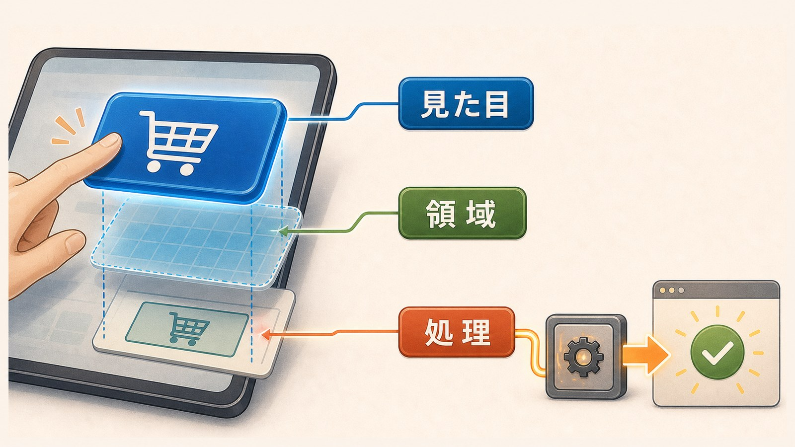

### GUIは見て操作する仕組み

GUIという言葉があります。

Graphical User Interfaceの略です。

グラフィカルな画面を使って、人がコンピュータを操作する仕組みです。

ボタン、メニュー、ウィンドウ、入力欄。

こうした部品を見て、押したり選んだりします。

文字だけで命令を打つ操作とは違います。

読者がふだん使うスマホやPCの多くは、このGUIを使っています。

GUIは、見た目がきれいな画面というだけではありません。

人が見て選べる部品で、操作を組み立てる仕組みです。

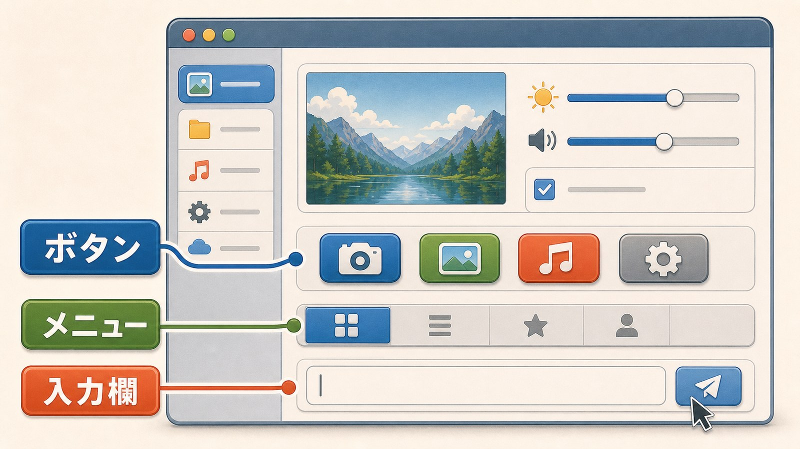

### アプリは部品の配置を決める

GUIの中身を組み立てるのは、主にアプリ側の仕事です。

アプリは、画面に何を出すかを決めます。

タイトルをどこに置くか。

写真をどの大きさで出すか。

ボタンをどこに置くか。

文字入力欄をどう見せるか。

その指示が、OSや描画の仕組みを通って画面に出ます。

OSは、アプリに画面を出す場所や描画の窓口を用意します。

この窓口があると、アプリは画面の出し方を共通の形で頼めます。

画面同士の重なり方もOS側で扱いやすくなります。

ディスプレイは、最後にピクセルとして表示します。

第2巻では、画面の最後はピクセルとして表示されると見ました。

ここでは、その手前を見ています。

アプリは、ピクセルを一つずつ手で塗るより、部品や状態を使って画面を組み立てます。

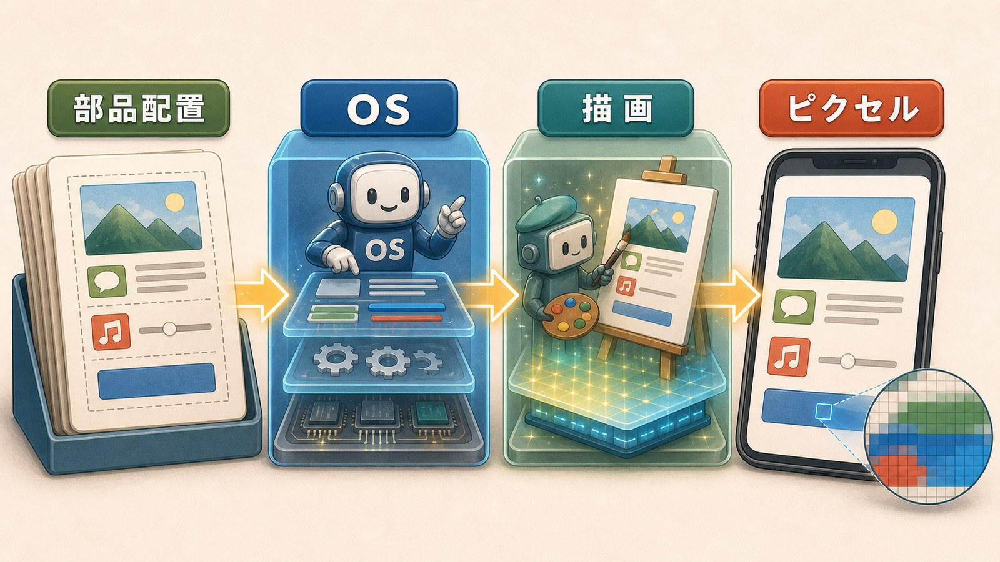

### 画面には状態がある

画面は、一度描いたら終わりではありません。

状態が変わるたびに、描き直されます。

入力欄に文字が入った。

チェックが入った。

スクロール位置が変わった。

写真の明るさが変わった。

こうした現在の値を、状態と呼ぶことがあります。

画面は、状態をもとに描かれます。

状態が変わると、見た目も変わります。

ホワイトボードに、今の状況を書き直していくようなものです。

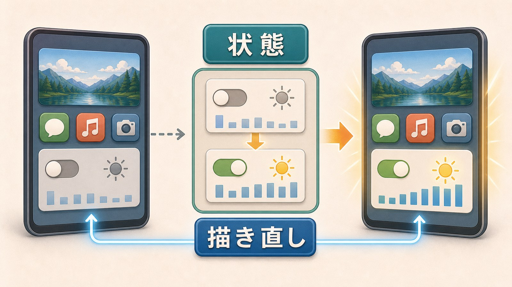

### ボタンは見た目、領域、役割、処理でできている

ボタンを一つ見ても、中にはいくつかの要素があります。

まず、見た目です。

押せそうな形、色、文字があります。

次に、押せる領域です。

画面のどの範囲を押したら、そのボタンとして扱うかが決まっています。

次に、役割です。

送信する、保存する、戻る、といった意味があります。

最後に、押されたときの処理です。

これらが結びついて、画面のボタンになります。

絵に押せる領域と処理が結びついて、はじめて操作できるボタンになります。

処理も、画面に見える形や押せる範囲と結びつくことで、人が使える操作になります。

画面が固まる、崩れる、読み込み中になる。

そうした現象も、状態や描画や処理のつながりで見ると、少し整理できます。

そして、ボタンが本当に動くには、もう一つ必要なものがあります。

押されたことが、アプリへ届く必要があります。

次のページでは、その知らせの流れを見ます。

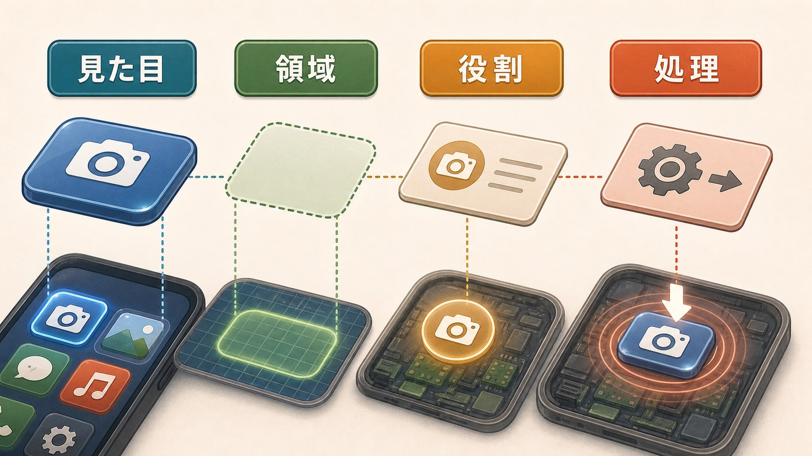

---

## 7ページ目：入力イベント：タップやキー入力は知らせとして届く

### タップは位置と時刻を持つ知らせになる

画面のボタンを指で押します。

すると、アプリが反応します。

端末の中では、まずタッチパネルが触れられた場所の変化を検出します。

OSが、その変化を入力として受け取ります。

そして、時刻などの情報を添えて、タップという出来事の知らせに整えます。

知らせには、種類、時刻、場所などの情報が入ります。

OSは、その知らせをどのアプリへ届けるかを決めます。

起動中のアプリは、プロセスとして管理されていました。

OSは、そのプロセスの中へ知らせを渡します。

この知らせを、イベントと呼びます。

イベントとは、何が、いつ、どこで起きたかを伝える情報です。

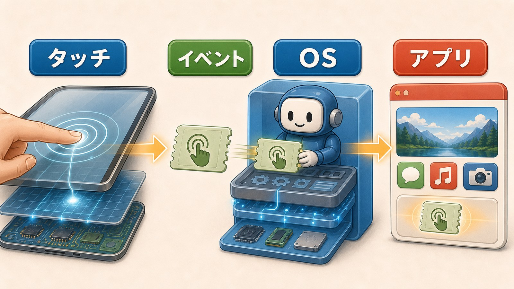

### イベントは出来事の注文票

予定表でイベントというと、予定のことです。

ここでは、アプリに届く出来事の知らせを指します。

店に注文票が届く場面を考えると近いです。

注文票には、何を注文したか、いつ来たか、どの席かが書かれています。

タップイベントにも、種類、時刻、場所、対象などの情報が入ります。

種類は、タップ、クリック、キー入力、ドラッグなどです。

場所は、画面上の座標です。

対象は、その場所にあるボタンや入力欄です。

OSは、タッチパネル、キーボード、マウスのような入力装置をまとめて扱います。

ここでOSが整理すると、アプリは入力を同じ知らせとして受け取れます。

タッチパネル、キーボード、マウスの違いを、アプリが一つずつ背負わずにすみます。

そのままの電気信号ではなく、アプリが受け取れる形のイベントへ整えます。

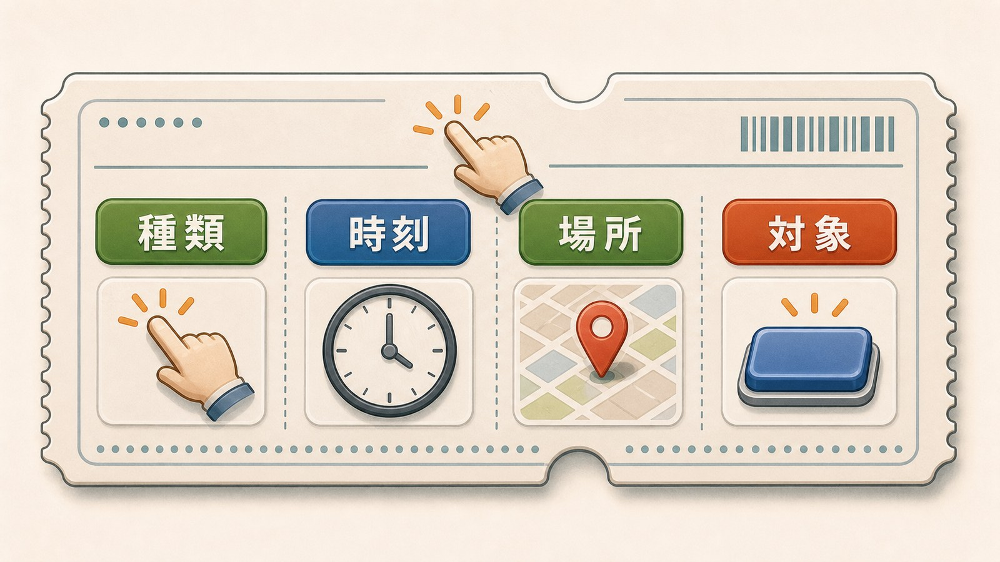

### 座標から押された部品を判断する

タップでは、押された場所が重要です。

画面には、いくつもの部品があります。

同じタップでも、場所が違えば意味が変わります。

送信ボタンの上なら送信です。

写真の上なら写真を選ぶ操作かもしれません。

余白なら何もしないこともあります。

OSやアプリの画面処理は、座標と部品の位置を照らし合わせます。

そして、どの部品に起きた出来事かを決めます。

OSは、まず画面上のどのアプリが操作対象かを見ます。

アプリは、自分のGUIの中で、どの部品が押されたかを判断します。

画面を押しただけで反応が変わるのは、この対応づけがあるからです。

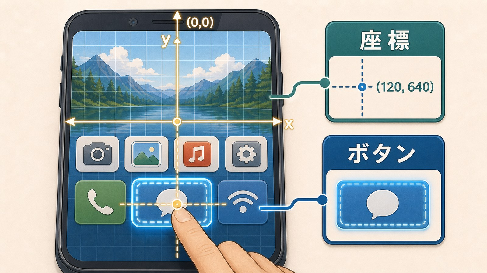

### アプリは待ち、処理し、更新する

多くのアプリは、入力を待っています。

イベントが届くと、それを受け取ります。

受け取ったイベントに応じて、処理をします。

必要なら、画面の状態を変えます。

そして、画面を更新します。

OSは入力を届け、アプリは意味を決めて処理します。

この分担があるから、同じタップでもアプリごとに違う反応になります。

この流れを何度も繰り返します。

イベントを待つ。

処理する。

画面を更新する。

また次のイベントを待つ。

この繰り返しを、イベントループと呼ぶことがあります。

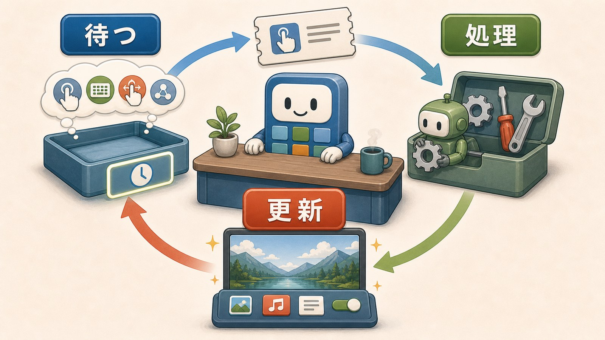

### 反応が遅いとき

ボタンを押したのに反応が遅いことがあります。

この原因は一つではありません。

通信を待っていることもあります。

重い計算をしていることもあります。

画面更新が詰まっていることもあります。

入力イベントの処理が滞ると、押したのに届いていないように見えます。

注文票が積み上がって、店の処理が追いつかない状態に近いです。

指で押すという日常の動作は、端末の中では位置、時刻、種類を持つイベントとして整理されます。

タップやキー入力は、出来事の知らせとしてアプリへ届く。

そう考えると、画面の反応が少し違って見えてきます。

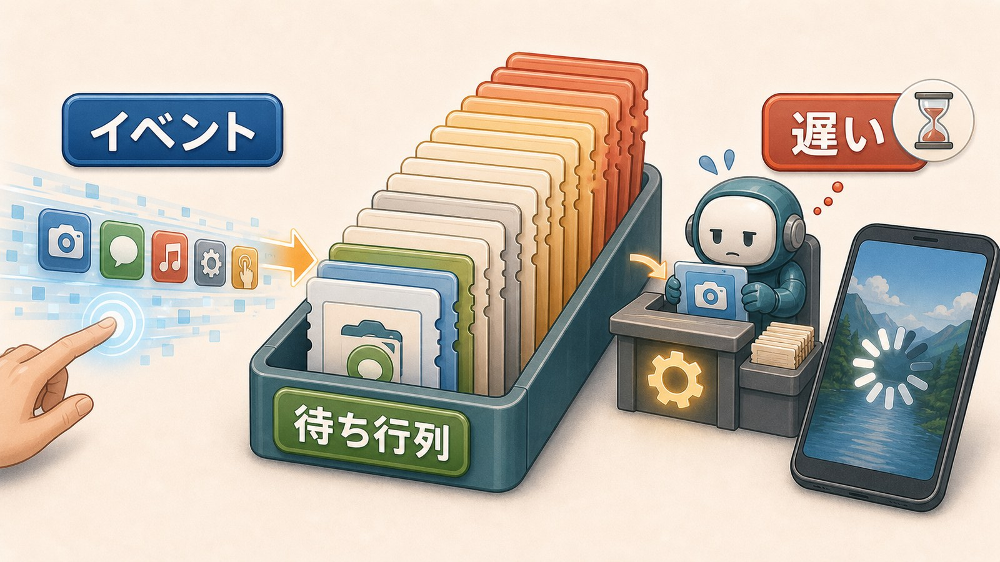

---

## 8ページ目：デバイスとドライバ：カメラやスピーカーを共通の窓口で使う

### アプリが欲しいのは、機械そのものではなく結果

スマホやPCには、カメラ、マイク、スピーカー、GPS、センサーのような機械がつながっています。

プリンタやイヤホンのように、あとからつなぐ機械もあります。

こうした機械を、デバイスと呼びます。

写真アプリに必要なのは、カメラから届く写真や映像です。

音楽アプリに必要なのは、スピーカーから出る音です。

同じ「使う」でも、デバイスごとに結果の作り方は違います。

### OSの窓口は、アプリの頼み方をそろえる

アプリは、OSの窓口へ目的を頼みます。

写真を撮りたい、音を鳴らしたい、位置を知りたい、印刷したい。

この窓口があると、アプリは機械ごとの細かな命令を全部持たずにすみます。

アプリ側の言葉は、目的です。

デバイス側の言葉は、機械ごとの命令、使える機能、返事の形です。

このずれをそのままアプリへ背負わせると、アプリは機械の種類ごとに作り分ける必要が出ます。

OSは、アプリに共通の頼み方を見せます。

### ドライバは機械ごとの扱い方をOSに足す

ドライバは、OSが特定のデバイスを扱うために読み込むソフトウェアです。

新しいプリンタやイヤホンをつないだとき、「ドライバ」「対応」「認識」という言葉を見ることがあります。

これは、OSにその機械の扱い方を足す話です。

たとえばプリンタなら、印刷開始の命令、紙のサイズ、両面印刷の有無、エラーの返し方が機種ごとに違います。

OSは「印刷する」という共通の依頼を受けます。

ドライバは、それをその機械に合う命令へ変えます。

さらに、その機械で使える機能や、返ってきた状態の読み方もOSへ伝えます。

ドライバは、機械ごとの命令表をOSに足す役目です。

### 結果やエラーも、戻ってくる

デバイスを使う流れは、行きだけではありません。

カメラなら、画像データが戻ります。

マイクなら、音声データが戻ります。

プリンタなら、印刷できたか、紙がないか、エラーが起きたかが戻ります。

OSは、ドライバを通じて、この返事を読める形にします。

アプリは、その結果を受け取って画面を更新します。

ビデオ通話なら、相手へ送る映像になります。

写真アプリなら、保存する写真になります。

ここまで含めて、アプリ、OS、ドライバ、デバイスの役割分担です。

### 同じデバイスを複数アプリが使える

同じカメラを、写真アプリ、ビデオ通話アプリ、QRコード読み取りアプリが使えます。

アプリごとにカメラを直接取り合う形だと、どのアプリが使っているのか管理しにくくなります。

OSが窓口を用意し、利用の順番や範囲を調整します。

必要なら、どのアプリに使わせるかも権限で確認します。

共通の窓口とドライバがあることで、アプリは目的に集中できます。

### 使えない原因を段で分ける

カメラが使えない、マイクが認識されない、イヤホンから音が出ない。

画面では、どれも「使えない」と見えます。

でも、疑う段は分けられます。

アプリに権限がないのか。

OSの窓口で止まっているのか。

ドライバがその機械に対応していないのか。

デバイスそのものが故障しているのか。

「アプリがカメラを動かす」という短い言い方の裏には、複数の段があります。

ドライバが見えると、機械の不調を一つの黒い箱ではなく、どの段で詰まっているのか考える足場にできます。

次のページでは、この中の権限を見ます。

---

## 9ページ目：権限とサンドボックス：アプリの使える範囲を区切る

### 許可画面には意味がある

スマホでアプリを使うと、許可画面が出ることがあります。

写真へのアクセスを許可しますか。

カメラを使用してよいですか。

位置情報を使いますか。

マイクを使いますか。

この確認は、ただの邪魔な表示ではありません。

区切りがなければ、一度入れたアプリが写真へ広く触れやすくなります。

位置情報やマイクにも広く触れやすくなります。

アプリがどの機能やデータを使ってよいかを、OSが区切っている場面です。

その使ってよい範囲を、権限と呼びます。

### 権限は鍵のようなもの

権限は、部屋や倉庫に入るための鍵に似ています。

アプリが写真を選びたいなら、写真への鍵が必要です。

カメラを使いたいなら、カメラへの鍵が必要です。

位置情報を使いたいなら、位置情報への鍵が必要です。

鍵がなければ、アプリはその場所や機能へ進めません。

もちろん、鍵を渡せば完全に安全という意味ではありません。

それでも、何でも自由に見られる状態より、範囲を区切れます。

権限は、便利さと安全の間に置かれた約束です。

### サンドボックスは区切られた作業場所

アプリが端末の中を何でも自由に見られると、便利ではあります。

でも、危険も大きくなります。

悪いアプリや壊れたアプリが、関係のないファイルまで触るかもしれません。

そこで、アプリごとに動ける範囲を区切る考え方があります。

それがサンドボックスです。

ここでは、柵で区切られた作業場所と考えます。

アプリは、自分の作業場所で動きます。

外のデータやデバイスが必要なときは、OSの窓口を通ります。

### OSが安全な受け渡しを用意する

写真を投稿するとき、アプリが写真フォルダ全体を自由に読むとは限りません。

OSが写真選択画面を出すことがあります。

そこでユーザーが選んだ写真だけを、アプリに渡します。

ファイル選択画面も似ています。

アプリが端末全体を探し回るのではなく、OSの画面を通して選んだものを受け取ります。

共有ボタンも、直接相手のアプリへ投げ込むというより、OSの受け渡しの仕組みを使うことがあります。

受付を通して、必要な荷物だけを渡すようなものです。

この仕組みが、便利さと安全を両立しやすくします。

### 区切るから不便に見えることもある

権限やサンドボックスは、完璧な安全を保証する魔法ではありません。

ユーザーが判断しにくい許可もあります。

アプリやOSに弱点があることもあります。

それでも、使える範囲を区切る考え方は大切です。

同じ写真でも、アプリによって見えたり見えなかったりすることがあります。

それは不具合ではなく、区切りの結果かもしれません。

許可画面は、アプリとOSの役割分担が表に出たものです。

アプリが何でもできるのではなく、OSが範囲を決め、必要なときに鍵を渡します。

そう見ると、いつもの確認画面が、端末を守る仕組みとして見え直します。

---

## 10ページ目：アップデートと脆弱性：ソフトウェアはあとから直せる

### アップデート通知の裏側

スマホやPCには、アップデート通知が出ます。

アプリを更新してください。

OSを更新してください。

忙しいときには、少し面倒に感じます。

でも、アップデートはソフトウェアの性質と深く関係しています。

ソフトウェアは、命令とデータのまとまりです。

命令や部品を入れ替えれば、あとから動きを変えられます。

アップデートとは、アプリやOSの命令、設定、素材、部品を新しいものへ入れ替えることです。

あとから直せなければ、見つかった不具合は端末に残り続けます。

安全性に関わる弱点も残り続けます。

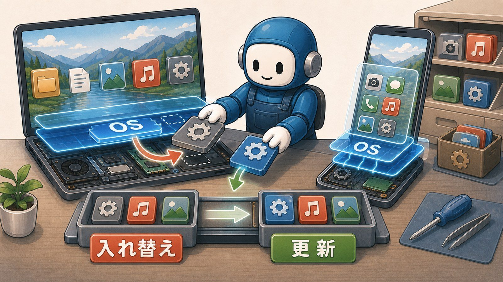

### 更新には種類がある

アップデートには、いくつかの目的があります。

新しい機能を追加することがあります。

画面の見た目を変えることがあります。

意図どおりに動かない不具合を直すことがあります。

安全性に関わる弱点をふさぐこともあります。

どれも「更新」と表示されるかもしれません。

しかし、中身は同じではありません。

新機能の追加と、安全のための修正では意味が違います。

更新通知を見るとき、この違いを知っていると受け取り方が変わります。

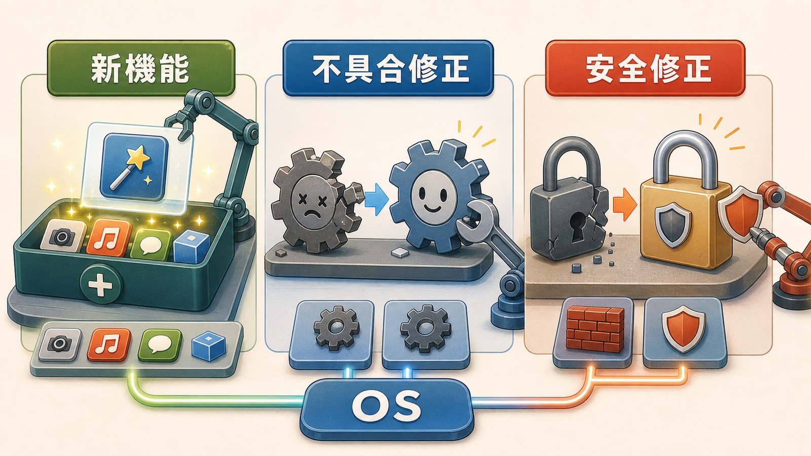

### バグと脆弱性

バグとは、ソフトウェアが意図どおりに動かない不具合です。

ボタンを押しても反応しない。

表示が崩れる。

保存した内容が正しく反映されない。

こうした問題は、バグと呼ばれることがあります。

脆弱性は、もう少し安全性に寄った言葉です。

攻撃や悪用につながる可能性のある弱点です。

バグの中には、脆弱性になるものもあります。

ただの見た目の不具合と、外から悪用される弱点では、緊急度が違います。

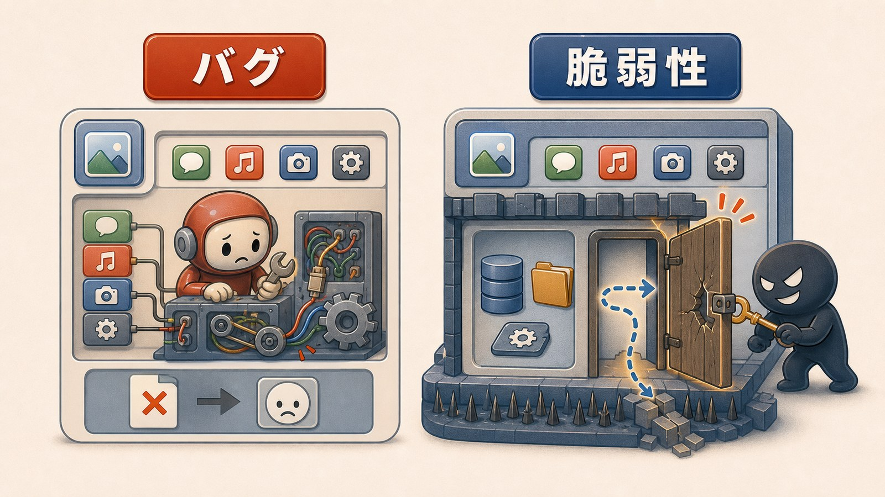

### ウイルスの被害もこの巻の範囲で見える

ウイルスや悪意のあるソフトウェアは、端末の中で望まない動きをします。

たとえば、ファイルを勝手に読もうとする。

写真や文書を外へ送ろうとする。

画面に偽の表示を出そうとする。

カメラやマイクを使おうとする。

別のプログラムを勝手に動かそうとする。

ここまでのページで見たように、それらはファイル、画面、入力、デバイス、プロセスに関わる動きです。

OSは、権限やサンドボックスで範囲を区切ります。

それでも弱点があると、その区切りを越えられることがあります。

その弱点が、脆弱性です。

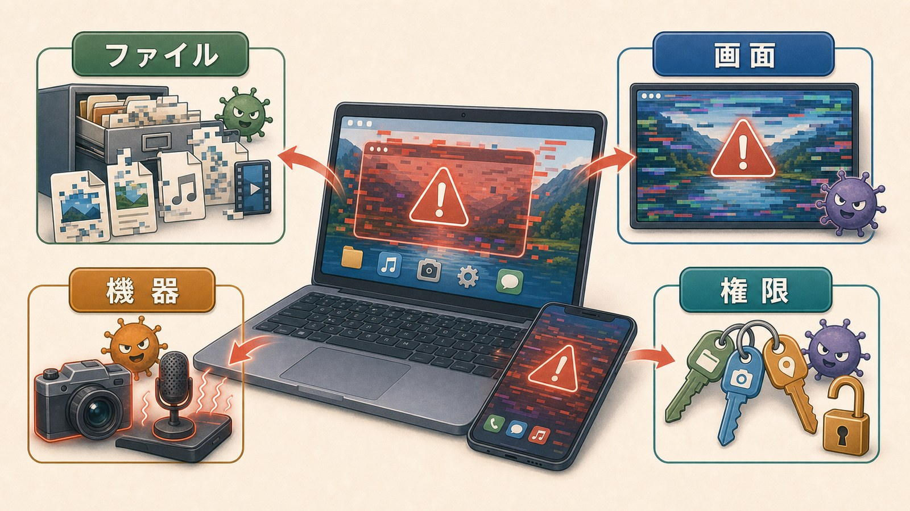

### パッチは弱点をふさぐ修正

パッチという言葉もあります。

もともとは、破れ目に当てる修理布のような意味で考えるとわかりやすいです。

ソフトウェアでは、不具合や弱点を直す修正を指すことがあります。

セキュリティパッチなら、安全性に関わる弱点をふさぐ修正です。

アプリやOSは、最初から完全ではありません。

多くの人が使い、さまざまな端末で動き、あとから問題が見つかります。

見つかった問題に対して、命令や部品を入れ替える。

更新には、あとから弱点をふさぐ役割があります。

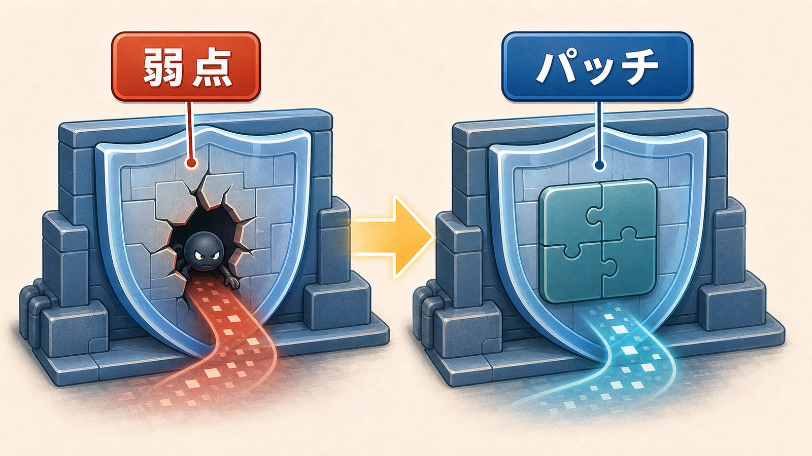

### 端末の中から外の世界へ

この巻では、アプリが端末の中でどう動くかを見ました。

アプリは、命令とデータのまとまりです。

OSに起動され、メモリ上でプロセスとして動きます。

ファイルを開き、画面を描き、入力イベントを受け取ります。

カメラやスピーカーなどのデバイスは、OSの窓口やドライバを通じて使います。

権限やサンドボックスで、使える範囲も区切られます。

そして、ソフトウェアはあとから更新できます。

入れ替えられるから、機能が増えます。

入れ替えられるから、弱点もふさげます。

次に気になるのは、端末の外です。

天気予報、SNS、クラウド写真。

アプリが外のサーバーとやり取りするとき、データはどこを通るのでしょうか。

第4巻では、インターネットとクラウドのつながりへ進みます。

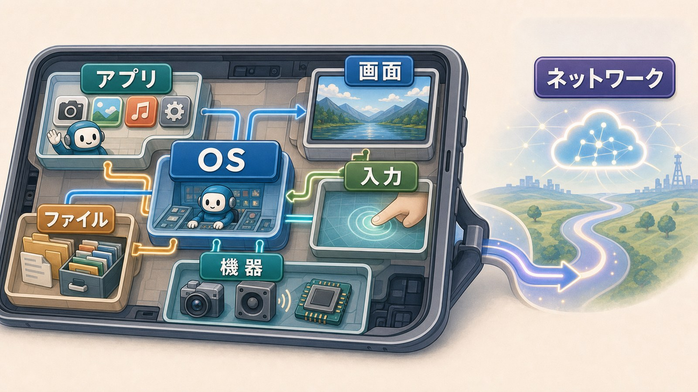
